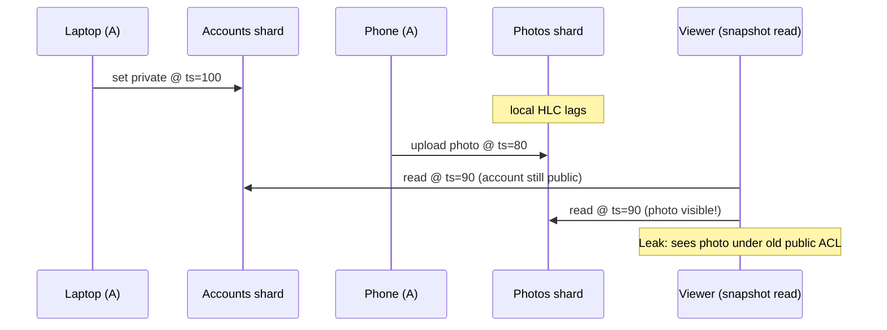

# Linearizable ID Generators

> **One-sentence summary.** A linearizable ID generator hands out timestamps that respect real wall-clock order — if request A finished before request B started, B's ID is strictly greater, even when A and B never talked to each other — which [[03-logical-clocks]] alone cannot guarantee.

## How It Works

Lamport clocks and hybrid logical clocks preserve *causal* order: if one event caused another, the timestamps agree. But causality is silent about events that never exchanged a message. Two shards running independent HLCs will happily assign a later real-time write a smaller timestamp than an earlier unrelated one. That is fine until a snapshot reader enters the picture.

The canonical broken scenario: user A flips their account to **private** from a laptop, then uploads a photo from their phone. The writes hit different shards (accounts, photos). A non-friend viewer then opens A's profile using MVCC snapshot isolation. If the photos shard's clock was running a bit behind, the upload gets a lower timestamp than the privacy flip. The viewer's snapshot can sit between them — seeing the old "public" account *and* the new photo — and leaks the private image.

The fix is an ID generator that is **linearizable** — one global order that matches real time. Two practical approaches dominate.

**Approach 1 — Single-node timestamp oracle.** One node owns an atomic counter. On every request it does `fetch_and_add`, persists the new value to disk for crash recovery, and replicates it via single-leader replication for fault tolerance. To cut the per-request cost, the oracle hands out IDs in **batches**: it persists and replicates only the batch boundary (say, "I have reserved IDs 1,000,000–1,000,999"), then dispenses individual IDs from memory. On crash or failover, some IDs in the current batch are skipped — but nothing duplicates or reorders. TiDB/TiKV's PD (Placement Driver) works exactly this way, inspired by Google Percolator.

The oracle cannot be sharded without losing linearizability (independent shards can't agree on order), and it cannot be spread across regions without making every ID request pay a cross-region round trip. A single node is enough for surprisingly high throughput because the work per request is tiny, but it remains a single chokepoint.

**Approach 2 — Synchronized physical clocks with uncertainty (Spanner's TrueTime).** Instead of one counter, every node reads a physical clock that returns an *interval* `[earliest, latest]`, not a point. To assign a timestamp, a node picks `latest`, then **waits out** the remaining uncertainty before returning. Once the wait finishes, every later request anywhere in the world reads a `latest` strictly greater than this transaction's timestamp. No coordination, no cross-region round trip, and correct across datacenters — but only if the uncertainty interval is honest, which requires GPS receivers and atomic clocks in every datacenter plus a disciplined time daemon.

## When to Use

- **Cross-shard snapshot isolation** where writes to different shards must be orderable by a reader (the private-photo case).
- **MVCC systems that span multiple nodes** and want external consistency — reads should reflect every write that "already happened" in wall-clock terms.
- **Globally distributed OLTP** where linearizable order is required but paying a cross-region RPC per transaction is unacceptable — that is exactly Spanner's target.

## Trade-offs: Timestamp Oracle vs TrueTime vs HLC

| Aspect | Single-node oracle | TrueTime (Spanner) | Hybrid Logical Clock |
|---|---|---|---|
| Real-time (linearizable) order | Yes | Yes (within uncertainty) | No — causal only |
| Coordination per ID | RPC to leader (batched) | None | None |
| Multi-region latency | Cross-region RPC | Local, plus `commit wait` (~7 ms) | Local |
| Hardware cost | Commodity | GPS + atomic clocks per DC | Commodity |
| Shardable / horizontal scale | No | Yes | Yes |
| Fault tolerance | Via leader replication | Via clock ensemble + Paxos | Trivially fault-tolerant |
| Reorders under clock skew | Never | Absorbed by uncertainty wait | Yes |

## Real-World Examples

- **TiDB / TiKV PD**: classic timestamp oracle with batched allocation, replicated via single-leader. Cross-region deployments route every transaction through the PD leader.
- **Google Spanner**: TrueTime with GPS + atomic clocks; transactions `commit wait` out the uncertainty before releasing locks. Enables globally consistent reads without a coordinator RPC.
- **Google Percolator**: the original paper that established the oracle pattern for cross-shard transactions on Bigtable.
- **FoundationDB**: uses a resolver/proxy layer with a single sequence source for commit versions — philosophically similar to an oracle, implementation differs.

## The Kicker: Still Not Enough for Fault-Tolerant Locks

A linearizable ID generator is close to consensus but falls short. Suppose several nodes race to register the same username: you could give each attempt a linearizable timestamp and let the lowest win. The catch — *how does a node know its timestamp is the lowest?* It has to hear from **every** other node that might have issued a smaller one. If any of them is partitioned or crashed, the system stalls. That is not fault tolerance. The book shows that fetch-and-add has *consensus number 2*, while the actual fault-tolerant primitives (locks, uniqueness, leader election) require CAS or total-order broadcast — i.e., full [[05-consensus-and-its-equivalent-forms]].

## Common Pitfalls

- **Assuming Snowflake / UUIDv7 are linearizable.** They are sortable and monotonic per-generator, but across machines they can reorder under clock skew. They give roughly-causal order, not real-time order.
- **Sharding the timestamp oracle "for scale."** The moment two shards hand out IDs independently, linearizability is gone — you have HLC-with-extra-steps. Use a single leader and batch aggressively instead.
- **Believing TrueTime is free.** Spanner's `commit wait` adds ~5–10 ms of stall to every read-write transaction, and the GPS/atomic-clock infrastructure is a capital-intensive operational commitment few teams can match.
- **Reading around an uncertainty interval.** If the clock's `[earliest, latest]` bound is wrong (NTP misconfigured, GPS jammed, leap-second bug), the whole guarantee collapses silently into stale snapshots.
- **Using the oracle for locks.** Even linearizable IDs don't give you fault-tolerant mutual exclusion — reach for a [[07-coordination-services]] built on consensus (ZooKeeper, etcd) instead.

## See Also

- [[01-linearizability]] — the recency property that ID generators try to provide for timestamps.
- [[03-logical-clocks]] — causal ordering; the weaker guarantee that motivates this whole section.
- [[05-consensus-and-its-equivalent-forms]] — the actual primitive needed for locks, leases, and uniqueness; ID generation is a stepping stone toward it.
- [[07-coordination-services]] — production systems (ZooKeeper, etcd) that deliver the full consensus-level guarantees.
