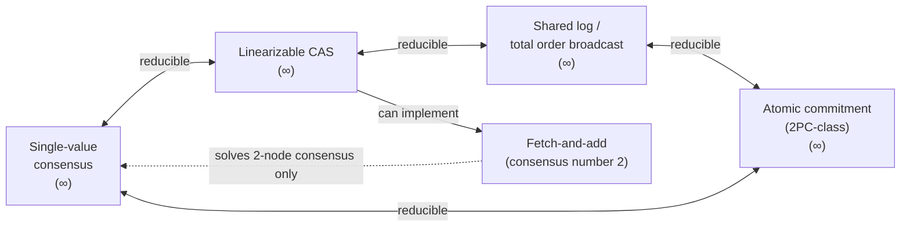

# Consensus and Its Equivalent Forms

> **One-sentence summary.** Consensus is the problem of getting a group of nodes to agree on a single value despite crashes and delays, and — surprisingly — linearizable CAS, shared logs, and atomic commitment are all the *same* problem in disguise: solve one, and you have solved them all.

## How It Works

Consensus, in its abstract form, is almost embarrassingly simple to state. One or more nodes **propose** values; the algorithm must **decide** on exactly one. A dictator node trivially satisfies this — until it crashes. Every subtlety in consensus comes from demanding that the group keeps deciding even when an arbitrary minority of nodes die, pauses, or drops off the network.

Formally, a consensus algorithm must satisfy four properties:

- **Uniform agreement** — no two nodes decide differently (safety).
- **Integrity** — once a node decides a value, it cannot change its mind (safety).
- **Validity** — the decided value must have been proposed by some node, ruling out trivial "always decide null" algorithms (safety).
- **Termination** — every non-crashed node eventually decides (liveness).

The **FLP impossibility result** (Fischer, Lynch, Paterson, 1985) proves that no deterministic asynchronous algorithm can guarantee all four properties if even a single node may crash. The escape hatch is the assumption: real systems have clocks, timeouts, or randomness, and any of those are enough to make consensus solvable in practice. FLP tells us termination is not *guaranteed* — not that real systems cannot agree.

The deeper insight of this chapter is that four apparently different problems are all **mutually reducible** to consensus. If you can solve one, you can solve the others.

- **CAS as consensus.** Initialise a register to null. Every proposer does a linearizable `CAS(x, null, my_value)`. Exactly one proposer wins — its value is the decision. Conversely, given consensus, you run one consensus instance per CAS invocation to choose which writer wins.
- **Shared log / total order broadcast.** A shared log is an append-only sequence in which multiple writers agree on the order of entries. Given a log, solving consensus is trivial: everyone proposes, and whichever value appears first is the decision. Given consensus, you run one instance per log slot.
- **Atomic commitment.** Two-phase-commit-style agreement, where participants must all commit or all abort. It is slightly *stronger* than plain consensus (an abort vote from any participant forces abort), but the two are still reducible to each other.
- **Fetch-and-add has consensus number 2.** One proposer reads 0 and "wins," but if it crashes before announcing its value, the others know they lost *without* knowing who won — so they cannot decide and cannot safely fall back. With only two proposers this is avoidable (each tells the other its value up front); with three or more it is not.

## When to Use

- **Leader election and locks.** Exactly one node must become the primary, hold the lease, or own the shard. Single-value consensus or CAS.
- **State machine replication.** Every replica applies the same writes in the same order. Shared log (Raft, Multi-Paxos, Zab).
- **Distributed transactions across shards.** All participants commit or all abort. Atomic commitment on top of consensus, rather than a naked 2PC coordinator.
- **Unique ID allocation and fencing tokens.** Monotonic counter built on top of a shared log.

## Trade-offs

| Formulation | Primitive | Consensus number | Typical use |
|---|---|---|---|
| Single-value consensus | Propose → decide once | ∞ | Leader election, lock ownership |
| Linearizable CAS | `CAS(expected, new)` | ∞ | Object-store conditional writes, locks, unique names |
| Shared log / TOB | `append` + `read` | ∞ | State machine replication, event sourcing, fencing tokens |
| Atomic commitment | `commit` ∨ `abort` across participants | ∞ (slightly stronger) | Cross-shard transactions |
| Fetch-and-add | Atomic counter | 2 | Single-node ID generation; cannot replace consensus |

| Aspect | Advantage | Disadvantage |
|---|---|---|
| Safety under partial failure | Survives up to `⌊n/2⌋` crashed or partitioned nodes without corrupting decisions | Needs a strict majority to make progress — a 3-node cluster blocks when 2 are gone |
| Adding nodes | More failure tolerance | Every write goes to a quorum; adding nodes slows the cluster, does not speed it up |
| Timeout tuning | Enables termination in practice (works around FLP) | Too-small timeouts cause leader churn; too-large timeouts lengthen outages |
| Pick the "right" formulation | Shared logs are the most ergonomic — state machine replication, counters, CAS, locks all fall out | Single-value and CAS are simpler to reason about but awkward for streaming workloads |

## Real-World Examples

- **CAS in object stores.** S3 conditional writes and Azure Blob `If-Match` headers give you a fault-tolerant linearizable CAS on a single key — a building block for locks and deduplication, backed by the vendor's internal consensus layer.
- **Shared logs.** Apache Kafka with KRaft, Apache BookKeeper, and Corfu all expose a shared-log abstraction. ZooKeeper's `zxid` and etcd's revision number are shared-log positions repurposed as fencing tokens.
- **Atomic commitment.** Classical 2PC (XA transactions, Postgres prepared transactions) is *not* a fault-tolerant consensus protocol — a coordinator crash leaves participants blocked. Systems like Spanner, CockroachDB, and FoundationDB instead run atomic commitment *on top of* Paxos/Raft groups, so the coordinator itself is replicated by consensus.
- **Fetch-and-add.** A CPU `LOCK XADD` on one machine, or a single-node counter — fine within a box, but not a substitute for consensus across a cluster.

## Common Pitfalls

- **Treating consensus as a performance primitive.** Consensus buys you *agreement*, not throughput. Every decision needs a quorum round-trip; adding nodes makes it slower, not faster.
- **"FLP means consensus is impossible."** FLP only rules out deterministic async algorithms that are *always* both safe and live under crashes. Real systems trade a tiny liveness risk (a stall during a pathological partition) for practical consensus — safety is preserved regardless.
- **Using fetch-and-add where CAS is needed.** Atomic counters feel powerful, but they cannot tell the losers who won. If you need more than two proposers to agree, reach for CAS or a shared log.
- **Relying on 2PC for fault tolerance.** Plain two-phase commit with a single coordinator is a blocking protocol, not fault-tolerant consensus. To make it fault-tolerant, the coordinator state itself must live in a consensus group.
- **Assuming safety dies with the majority.** Consensus algorithms are carefully designed so that safety (agreement, integrity, validity) holds even if a majority crashes — you just lose *liveness* until quorum is restored. Data is not corrupted by an outage; it is merely unavailable.

## See Also

- [[01-linearizability]] — the consistency model that consensus makes fault-tolerant.
- [[04-linearizable-id-generators]] — why fetch-and-add falls short of full consensus.
- [[06-consensus-algorithms]] — Paxos, Raft, Zab, Viewstamped Replication.
- [[07-coordination-services]] — ZooKeeper, etcd, Consul packaging consensus as a product.
