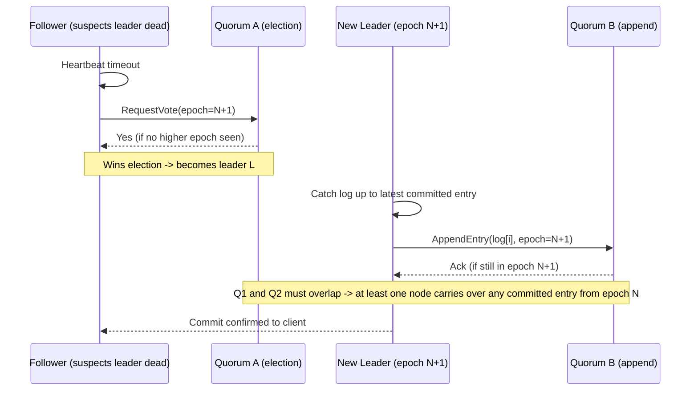

# Consensus Algorithms (Raft, Paxos, Zab, VR)

> **One-sentence summary.** Consensus algorithms are "single-leader replication done right" — they use epoch numbers and two rounds of quorum voting (one to elect a leader, one per log append) to give you a fault-tolerant, linearizable, split-brain-free replicated state machine.

## How It Works

Single-leader replication is easy to reason about: one node serialises writes, everyone else follows. The hard part is what happens when that leader dies. Classical primary/backup systems punt the problem to a human operator, which is slow and routinely produces *split brain* when two nodes each believe they are the leader. Consensus algorithms — Raft, Multi-Paxos, Zab, and Viewstamped Replication (VR) — fix this by building automatic, provably safe leader election on top of the same log-replication idea. In practice they all expose the same abstraction: a **shared log** (equivalent to total order broadcast). Every write becomes a log entry, every replica applies entries in the same order, so every replica ends up in the same state — the *state machine replication* recipe.

The trick is the **epoch number** (called *term* in Raft, *ballot* in Paxos, *view* in VR, *epoch/zxid* in Zab). Within any single epoch, at most one leader exists; across epochs, the one with the higher epoch wins. Two rounds of voting enforce this:

1. **Leader election.** A follower that hasn't heard from the leader within a timeout starts an election with an epoch strictly greater than any it has seen. Other nodes vote yes only if they have not acknowledged a higher epoch. Winning requires a quorum (usually a strict majority).
2. **Log append.** Before a leader declares an entry committed, it must collect a quorum of acknowledgements for that entry. If any acknowledging node reports a higher epoch, the leader knows it has been deposed and stands down.

The safety property hinges on **quorum overlap**: any two majority quorums share at least one node, so any entry committed under epoch *N* will be seen by the election quorum of epoch *N+1*. That shared node forces the new leader to honour old committed entries.

The subtle bit is what a new leader does with entries the old leader had partially replicated. **Raft** only lets a node become leader if its log is at least as up-to-date as a majority's — so the winner already has every committed entry. **Paxos** lets any node win the election but then forces it to query peers and fill in gaps before accepting new writes. Zab and VR sit between the two.

**Linearizable reads** need the same treatment as writes: before returning a value, the putative leader must run a quorum round to confirm it is still the leader in the current epoch. Otherwise a partitioned-off stale leader will cheerfully serve ancient data. This is exactly how etcd's linearizable reads (and Raft's "ReadIndex") work.

## When to Use

- **Metadata and control planes** — Kubernetes' state in etcd, service discovery in Consul, Kafka controller elections in KRaft. Small, slowly-changing data that *must* be consistent across the cluster.
- **Distributed databases that want linearizability** — CockroachDB, TiDB, Spanner, and YugabyteDB run one Raft/Paxos group per shard (range) so correctness scales horizontally even though a single group does not.
- **Fault-tolerant leader election for other systems** — ZooKeeper (Zab) elects HMaster in HBase, job masters in Flink HA, and so on. You get automatic failover without writing your own protocol.

## Comparison

| Algorithm | Epoch name | Leader constraint | Log catch-up | Typical use | Implementation difficulty |
|---|---|---|---|---|---|
| **Raft** | term | Only up-to-date nodes can win | Leader already has everything | etcd, Consul, CockroachDB, TiDB, KRaft, MongoDB-like | Deliberately approachable |
| **Multi-Paxos** | ballot | Any node can win | New leader pulls missing entries from quorum before serving | Google Chubby, Spanner (per group), Megastore | Famously slippery |
| **Zab** | epoch / zxid | Only nodes with highest zxid can win | Leader syncs followers from its log | ZooKeeper | Comparable to Raft |
| **Viewstamped Replication** | view | Primary chosen deterministically per view | New primary reconstructs log from `f+1` replicas | VoltDB lineage, early Harp | Academic, fewer prod impls |

## Trade-offs

| Aspect | Advantage | Disadvantage |
|---|---|---|
| Safety | No split brain, no committed-data loss under minority faults | Requires a strict majority — 3 nodes for 1 failure, 5 for 2 |
| Throughput | Linearizable writes & reads out of the box | Every op needs quorum round-trip; adding nodes *slows* the algorithm |
| Failover | Automatic, within one election timeout | Timeouts are brittle — too short = election storms, too long = dead-cluster pauses |
| Network assumptions | Tolerates asynchronous delays for liveness | Raft's pre-vote pathology: one consistently flaky link can bounce leadership forever; EPaxos is a leaderless alternative |
| Topology | Simple, well-understood protocol | Fixed membership by default; reconfiguration features exist but are subtle |
| Geography | Works across regions if you size timeouts for RTT | Cross-region quorum latency kills p99; most deployments pin quorums to one region |

## Real-World Examples

- **etcd, Consul, CockroachDB, TiDB, Kafka KRaft, MongoDB** (replica-set protocol v1 is Raft-like) — all chose **Raft** for its approachable spec.
- **ZooKeeper** uses **Zab**, which predates Raft and is optimised around primary-backup with guaranteed FIFO client ordering.
- **Google Chubby** is the original **Paxos** lock service; **Spanner** runs **Multi-Paxos** per tablet group so writes in different shards proceed independently.
- **VoltDB** and its H-Store ancestry descend from **Viewstamped Replication**.

## Common Pitfalls

- **Rolling your own leader election.** Anything that does automatic failover without a proven consensus core is "likely unsafe" — it will eventually let two leaders commit different values.
- **Aggressive election timeouts.** Tuning heartbeat/election timeouts below your p99 network latency produces election storms; the cluster spends more time electing than serving.
- **Reading from the leader without a quorum check.** A leader that lost its majority in the last second still thinks it is leader — it must re-confirm via a round of acks (or a valid lease) before returning a linearizable read.
- **Unclean leader election.** Kafka's `unclean.leader.election.enable=true` lets a stale replica take over when all in-sync replicas are dead; availability improves, but silently drops committed data. Know which side of that trade-off you are on.
- **Cross-region deployments without latency budgeting.** Consensus over 100 ms RTT means every write pays 100 ms — fine for config, fatal for OLTP.

## See Also

- [[05-consensus-and-its-equivalent-forms]] — why shared logs, CAS, and atomic commit are all the same problem under the hood.
- [[01-linearizability]] — the guarantee that consensus-backed reads must deliver, and why they need a quorum round.
- [[07-coordination-services]] — ZooKeeper/etcd/Consul package Raft/Zab plus leases, fencing, and watches for external systems to use.
- [[02-cap-theorem-and-cost-of-linearizability]] — why consensus stalls during network partitions rather than serving stale data.
