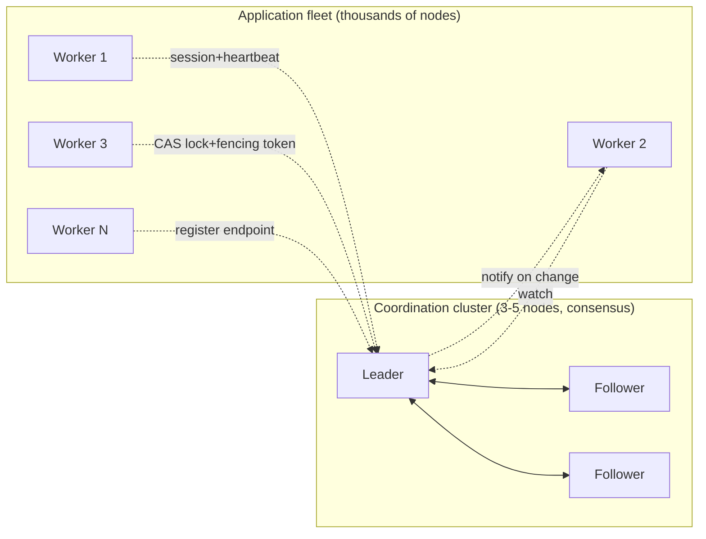

# Coordination Services (ZooKeeper, etcd, Consul)

> **One-sentence summary.** Coordination services are tiny consensus-backed key-value stores — ZooKeeper, etcd, Consul — that expose locks, leases, fencing tokens, failure detection, and change notifications so a *much larger* distributed system can make hard decisions (who is leader? which node owns which shard?) without every component rolling its own consensus.

## How It Works

A coordination service looks, from the outside, like a small hierarchical key-value store. What makes it different from a database is scale and purpose: the whole dataset is expected to fit in memory on every node, writes are rare (minutes-to-hours cadence), and every write goes through a fault-tolerant consensus algorithm so readers see a linearizable view of the agreed-upon state. The lineage traces back to Google's **Chubby** (built on Paxos); its open-source descendants are **ZooKeeper** (using the Zab atomic broadcast protocol), **etcd** (Raft), and **Consul** (Raft).

On top of the consensus log, coordination services bundle four primitives that together solve most distributed-coordination problems:

1. **Atomic compare-and-set** — the basis of distributed locks and leases. Only one client can claim a given key at a time.
2. **Fencing tokens** — every log entry gets a monotonically increasing ID (ZooKeeper's `zxid`/`cversion`, etcd's `revision`). A lock holder hands that token to any downstream resource; if a slow/paused process returns with an old token, the resource rejects it, avoiding zombie-writer corruption.
3. **Failure detection** via long-lived sessions and heartbeats. If a client stops heartbeating, its session expires and its leases are released — in ZooKeeper, *ephemeral znodes* created inside that session automatically disappear.
4. **Change notifications / watches** so clients react to state changes instead of polling.

Of these, only (1) and (2) actually need consensus; (3) and (4) are cheap bookkeeping that comes along for the ride and makes the service dramatically more useful.

The defining architectural pattern is that the coordination cluster is **small and fixed** (usually 3 or 5 nodes) regardless of how big the system it coordinates is. Running Raft/Zab over thousands of nodes would be prohibitively slow — so the large system *outsources* its hard coordination decisions to a tiny consensus cluster.

## When to Use

- **Leader election / single-primary selection.** HDFS NameNode HA, Spark/Flink HA masters, HBase master, Kafka controller pre-KRaft, and countless custom schedulers all elect a leader by racing to acquire an ephemeral lock in the coordination service.
- **Work allocation and sharding.** A scheduler writes the assignment "shard 7 → node 10.1.1.23" into the store; workers watch their assigned keys and react when rebalancing happens because a peer's ephemeral node vanished.
- **Dynamic configuration.** Feature flags, thread-pool sizes, rate limits — write them as keys, let every process subscribe to changes instead of polling a file or URL.
- **Service discovery.** On startup each service registers its endpoint; consumers watch the registry and adjust as instances come and go. (See the caveat below.)

## Trade-offs

| Aspect | Advantage | Disadvantage |
|---|---|---|
| Outsource consensus to fixed 3/5-node cluster | Scales coordination to thousands of app nodes; don't re-implement Paxos/Raft per team | Extra infrastructure to operate, upgrade, back up |
| Small in-memory dataset | Low latency, linearizable writes feasible | Not a database — hard limit on value size; wrong tool for fast-changing data |
| Ephemeral nodes + sessions | Automatic failure detection, no stuck locks | Tuning session timeouts is subtle; GC pauses can cause false failovers |
| Watches instead of polling | Reactive, low overhead | One-shot in ZooKeeper (must re-register); clients must handle race between read and watch setup |
| Fencing tokens | Safe against zombie lock holders after process pause | Downstream resources (DBs, storage) must actually check and reject stale tokens |
| Library-backed recipes (e.g. Apache Curator) | Proven patterns for leader election, locks, barriers | Still easy to misuse primitives directly; subtle bugs likely when hand-rolled |

## Real-World Examples

- **Kubernetes** — the entire cluster state (nodes, pods, secrets, configmaps, leader leases for controllers) lives in **etcd**. kube-apiserver is essentially a typed API in front of etcd watches.
- **Kafka (pre-KRaft)** — used **ZooKeeper** for controller election, broker membership, and topic/partition metadata. KRaft replaced it with a built-in Raft log.
- **HBase, Hadoop, Solr, Druid** — coordinate masters, track live region servers, and store cluster metadata in **ZooKeeper**, typically via Apache Curator.
- **Spark, Flink** — use **ZooKeeper** for HA master election when running outside YARN/Kubernetes.
- **Consul** — pitched more as a service-mesh control plane: Raft-backed KV store plus a gossip-based health-checking layer and DNS/HTTP service discovery interface.

| | ZooKeeper | etcd | Consul |
|---|---|---|---|
| Consensus algorithm | Zab (Paxos-family atomic broadcast) | Raft | Raft |
| Default read linearizability | Linearizable writes; reads may be stale | Linearizable reads by default (v3+) | Tunable (default, consistent, stale) |
| Data model | Hierarchical znodes, ephemeral + sequential | Flat KV with revisions and leases | KV + service catalog + health checks |
| Client ergonomics | Java-first; Apache Curator recipes | gRPC/HTTP, strong Go ecosystem | HTTP/DNS; built-in service mesh |
| Primary users | Kafka (pre-KRaft), HBase, Spark, Flink, Druid | Kubernetes, CoreDNS, rook | HashiCorp stack, service-mesh deployments |

## Common Pitfalls

- **Storing fast-changing data.** Counters bumped thousands of times a second, per-request metrics, or user sessions belong in a real database. For fast-changing *internal* service state, tools like Apache BookKeeper are a better fit.
- **Using strongly consistent reads for service discovery.** Availability and speed matter much more than linearizability here — a stale endpoint is usually harmless, a ZooKeeper outage is catastrophic. Prefer caches with TTLs, or **ZooKeeper observers** / etcd followers that serve stale-but-available reads.
- **Using leases without fencing tokens.** A paused-then-resumed lease holder is a zombie; if the storage layer doesn't check the monotonic `zxid`/`revision`, the zombie silently overwrites data.
- **Deploying a 2-node cluster.** Quorum is `⌊N/2⌋+1`, so two nodes tolerate zero failures. Always run 3 or 5 — and never an even number.
- **Reinventing locks with plain key writes.** Subtle correctness bugs are the rule, not the exception. Use tested library recipes (Curator, `etcdctl lock`, Consul `lock`) rather than hand-rolling.

## See Also

- [[01-linearizability]] — the consistency model coordination services expose to clients, and why it enables safe lock handoff.
- [[05-consensus-and-its-equivalent-forms]] — locks, leader election, and atomic broadcast are all equivalent to consensus, which is why a single service offers all three.
- [[06-consensus-algorithms]] — Raft (etcd, Consul) and Zab (ZooKeeper) are the engines underneath.
