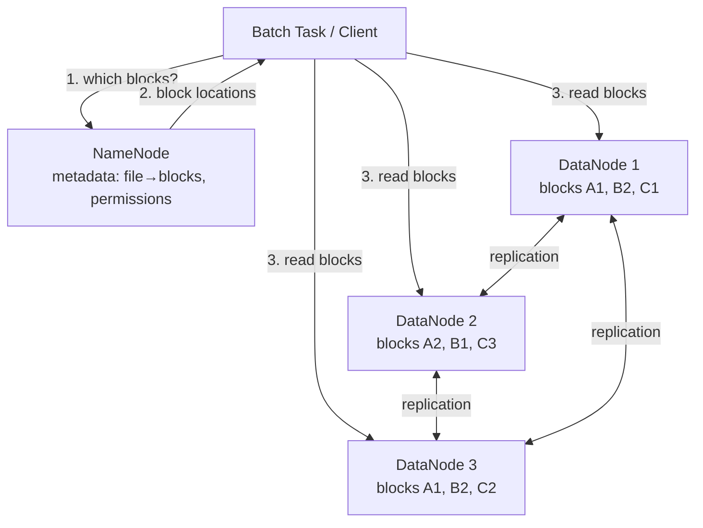

# Distributed Storage for Batch: DFS vs Object Stores

> **One-sentence summary.** Batch pipelines draw input from either a distributed filesystem (HDFS-style: large blocks, shared-nothing replication, a NameNode for metadata, locality-aware scheduling) or an object store (S3-style: immutable keyed objects, no real directories, storage decoupled from compute) — and modern pipelines overwhelmingly favor object stores because separating storage from compute lets each scale on its own axis.

## How It Works

A single-machine filesystem is a stack: a **block driver** talks to the disk, a **page cache** keeps hot blocks in RAM, the **filesystem** (ext4, XFS) maps files to blocks, and the **VFS** gives applications a uniform `open`/`read`/`seek` API. A distributed filesystem (DFS) stretches every layer across a cluster.

In HDFS, files are chopped into large blocks — 128 MB default versus 4 KB on ext4 — and scattered across many machines. Each machine runs a daemon (HDFS calls them **DataNodes**) exposing an RPC API for block reads and writes. A separate **metadata service** tracks block locations, file-to-block maps, permissions, and directory trees: HDFS uses the **NameNode**, while DeepSeek's 3FS persists metadata to a key-value store such as FoundationDB. Each DataNode's OS page cache doubles as the distributed cache; JuiceFS layers client-side and local-disk tiers on top. The VFS analogue is the DFS's **wire protocol** — S3's HTTP API, FUSE, NFS — which is why any system implementing the S3 API (MinIO, Cloudflare R2, Backblaze B2) slots under Hadoop-era frameworks unchanged.

Object stores like Amazon S3, Google Cloud Storage, Azure Blob Storage, and OpenStack Swift throw away the filesystem abstraction. Each object has a URL like `s3://my-photo-bucket/2025/04/01/birthday.png`: the host is the globally-unique **bucket** and the rest is the **key**. Objects are read with `get` and written with `put`, and are **immutable** once written — updates rewrite the whole object (S3 Express One Zone and Azure Blob Storage support appends; most others don't). No file handles, no `fopen`, no `fseek`. Directories don't exist; slashes are just bytes in the key. Listing by prefix behaves like `ls -R` — it recurses.

## Replication and Fault Tolerance

Distributed filesystems embrace the **shared-nothing** principle: no central appliance, no special interconnect — just commodity machines on a normal datacenter network. This is the opposite of the **shared-disk** model used by NAS and SAN, which rely on custom hardware and Fibre Channel to expose one logical volume to many hosts. Shared-nothing scales horizontally on cheap disks, but those disks fail often, so redundancy is mandatory.

**Replication** keeps N copies of every block on different nodes (HDFS defaults to three): fast recovery at 3x overhead. **Erasure coding** with Reed–Solomon splits data into k shards plus m parity shards so any k of k+m can reconstruct the original; a 10+4 layout gives 1.4x overhead but reconstruction fans out across many nodes and burns CPU. The single-machine analogue is RAID; the difference is that a DFS runs the protocol over a commodity LAN, not a dedicated storage controller.

## Comparison Table

| Aspect | Distributed Filesystem (HDFS) | Object Store (S3) |
|---|---|---|
| Block size | Large (128 MB typical) | Small chunks (4 MB) or whole-object |
| Mutability | Files mutable, supports appends and in-place edits | Objects immutable; update = full `put` rewrite |
| Directory semantics | Real directories, including empty ones | Prefixes only; empty directories cannot exist |
| Rename | Atomic metadata op on the NameNode | Non-atomic: copy to new key, delete old |
| Listing | `ls` (one level) and `ls -R` (recursive) | Prefix list behaves like `ls -R` only |
| Scheduling | Locality-aware — run task on a node holding a replica | Storage and compute decoupled; everything is network I/O |
| POSIX features | Hard links, symlinks, file locks typically supported | Not supported |
| Pricing | Cost scales with provisioned cluster | Pay per GB-month + per-request + egress |
| Typical use case | Legacy Hadoop; latency-sensitive HPC; AI training clusters | Modern cloud lakehouses, Spark/Flink on S3, archival |

## Why Modern Pipelines Use Object Stores

MapReduce's 2000s-era optimization was **data locality**: ship the task (small) to the machine holding the block (big), because commodity NICs of the era couldn't feed CPUs fast enough otherwise. That assumption drove the tight coupling between HDFS and YARN. Two decades later, datacenter networks run at 100–400 Gbps per host and have made locality largely optional. Object stores exploit this by **decoupling storage from compute** entirely, so you can spin up 500 Spark executors for a four-hour job and then shut them all down without touching the data layer. Storage and compute scale on independent axes, which matches cloud billing models and also means data outlives any particular cluster.

## Trade-offs

| Aspect | Advantage | Disadvantage |
|---|---|---|
| DFS locality | Saves bandwidth when code is smaller than data | Couples compute cluster lifetime to storage cluster |
| Object store decoupling | Independent scaling, cheaper at rest | Every byte traverses the network |
| Replication | Fast recovery, simple | 2–3x storage overhead |
| Erasure coding | 1.2–1.5x overhead at petabyte scale | Expensive reconstructions, higher CPU cost |
| POSIX compliance (DFS) | Drop-in for existing code | Complex metadata service (NameNode bottleneck) |
| Object store simplicity | Scale to exabytes with no metadata choke point | No atomic rename, no real directories, no locks |

## Real-World Examples

- **HDFS**: Still the default at legacy Hadoop-on-prem sites and large AI training clusters where GPU-to-storage bandwidth matters.
- **S3 / GCS / Azure Blob / OpenStack Swift**: The modern default for cloud batch processing; Spark, Flink, Trino, and cloud warehouses all read and write them natively.
- **JuiceFS and Ceph**: Expose **both** object-storage and filesystem APIs over the same backend, useful when some tools demand POSIX and others want S3.
- **S3 Express One Zone**: Single-millisecond-latency S3 variant with a pricing model closer to a key-value store, for workloads that outgrew key-value stores but can't tolerate vanilla S3 latency.
- **Amazon EFS / Archil**: NFS-compatible distributed filesystems for teams that need POSIX semantics in AWS without standing up HDFS.

## Common Pitfalls

- **Assuming atomic rename in S3**: The `FileOutputCommitter` from Hadoop moves `_temporary/` to final paths via rename. On S3 this is a copy-then-delete per object, which is slow and non-atomic — readers can see partial results. Use the S3A committer or a table format (Iceberg, Delta, Hudi) that handles commits explicitly.
- **Treating empty "directories" as real**: Delete every object under `s3://bucket/2025/04/01/` and the prefix silently vanishes from listings. Pipelines that check for directory existence as a sentinel will break. Write a zero-byte marker object if you need one.
- **Using `list` like `ls`**: Prefix listing is recursive, so listing a top-level prefix on a billion-object bucket is a very expensive operation, not the cheap `readdir` it looks like. Paginate and narrow the prefix.
- **Carrying MapReduce locality assumptions to S3**: Code that tries to schedule tasks on the "node holding the data" has no meaning on S3 — there is no such node. Tune for network throughput and parallelism instead, and rely on modern columnar formats (Parquet, ORC) with predicate pushdown to reduce bytes read.

## See Also

- [[01-unix-tools-as-batch-foundation]] — the single-machine filesystem and pipeline model the DFS generalizes.
- [[03-distributed-job-orchestration]] — the scheduler that decides which machine runs a task, with or without locality.
- [[04-mapreduce]] — the batch model whose design assumes a DFS-like input with locality.
- [[07-serving-derived-data-from-batch]] — how the outputs written back to DFS or object storage become the inputs to downstream systems.
