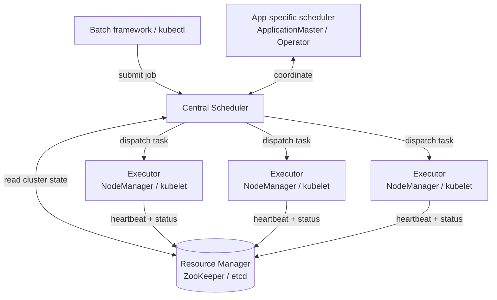

# Distributed Job Orchestration and Workflow Scheduling

> **One-sentence summary.** A cluster orchestrator is a distributed operating system — executors run tasks on nodes, a resource manager tracks global state, and a scheduler pairs work with hardware using fairness heuristics — while a workflow scheduler sits above it, chaining many such jobs into DAGs that fire as upstream data arrives.

## How It Works

A single-machine OS owns three jobs: launching processes, tracking CPU/memory, and deciding who runs next. A cluster orchestrator such as **Hadoop YARN** or **Kubernetes** projects that kernel across every box in the datacenter via three components:

- **Task executors** run as a daemon on every node — YARN's *NodeManager*, Kubernetes's *kubelet*. They fetch executable code (usually a container image), launch the process, heartbeat liveness, and enforce CPU/memory/I/O isolation via Linux **cgroups** so one runaway task cannot starve its neighbours.
- **The resource manager** holds the global view: per-node CPU/GPU/memory, task assignments, network topology, liveness. Because this state is centralized, it is a scalability and availability bottleneck — YARN persists it in **ZooKeeper**, Kubernetes in **etcd**.
- **The scheduler** accepts requests ("run 10 tasks using this Docker image on GPU nodes"), consults the resource manager, and dispatches to executors. Application-specific schedulers sit above it for framework concerns like autoscaling: YARN calls them **ApplicationMasters**, Kubernetes calls them **operators**.

## Resource Allocation and Scheduling Heuristics

Consider a five-node cluster with 160 CPU cores and two jobs each asking for 100 cores. Three classic strategies, each with a flaw:

- **Even split (80/80 with overflow)**: give each job 80 cores, queue the remaining 20 tasks per side. Good utilization, but neither job gets its requested parallelism — bad for synchronization-sensitive workloads.
- **Gang scheduling**: reserve cores until a full 100 are free, then launch atomically. Right for tightly-coupled jobs (MPI, distributed training) but risks **deadlock** when two jobs each hoard half the cluster, and leaves cores idle while reservations accumulate.
- **Preemption**: kill some of job A's tasks to make room for higher-priority job B. Avoids starvation but wastes the CPU time the killed tasks already consumed — they restart from scratch.

Finding a truly optimal allocation over hundreds of jobs is **NP-hard** (multi-dimensional bin-packing). Production schedulers therefore use heuristics:

- **FIFO**: simple, but a big job at the queue head starves small fast ones.
- **Dominant Resource Fairness (DRF)**: for each job, find the resource (CPU, GPU, memory) it uses the highest *share* of, then equalize those dominant shares across users — handles heterogeneous workloads without a single "currency".
- **Priority queues** with aging to prevent starvation of low-priority tasks.
- **Capacity / quota scheduling**: guarantee team A 30% of the cluster, team B 20%, share the rest.
- **Bin-packing**: pack CPU-hungry and memory-hungry tasks onto the same node to keep both dimensions utilized.

## Fault Tolerance for Long-Running Batch Jobs

Batch jobs run for hours on hundreds of machines, so task failure is the rule. Two properties make it tolerable: jobs regenerate output from scratch each run, and parallel tasks stay independent so failure is local — the orchestrator deletes partial output and reschedules on another node.

This makes batch an excellent fit for **spot / preemptible instances** (AWS spot, Azure spot VMs, GCP preemptible VMs), which are dramatically cheaper but killable at any moment. In Google's Borg, preemptions occur more frequently than hardware faults, yet batch throughput is unaffected because every task is retryable.

Engines differ on intermediate-data fault tolerance: MapReduce writes every intermediate result to the DFS (robust but expensive); Spark uses in-memory RDDs plus lineage to recompute lost partitions; Flink uses periodic checkpointing. Details live in [[05-dataflow-engines-spark-flink]].

## Workflow Schedulers

Cluster schedulers dispatch *one job at a time*. Real pipelines chain 50–100 jobs — a MapReduce extract, a Spark transform, a Snowflake load, a Flink quality check. **Workflow schedulers** like **Airflow**, **Dagster**, and **Prefect** model these as DAGs and add the glue the cluster layer does not provide:

- **Dependency resolution**: a downstream job fires only after every upstream output lands in the distributed filesystem or object store — see [[02-distributed-storage-for-batch]].
- **Retry policies, backoff, and alerting** with visibility into which DAG node broke.
- **Pluggable operators** for MySQL, PostgreSQL, Snowflake, BigQuery, Spark, Flink, dbt, etc., so each node speaks the right protocol without bespoke code.
- **Backfill and reruns** when a late schema fix invalidates a week of output.

Older Hadoop-era tools (Oozie, Azkaban) have been replaced by these framework-agnostic DAG runners because modern stacks mix warehouses, lakes, and streaming systems.

## Trade-offs

| Aspect | Advantage | Disadvantage |
|--------|-----------|--------------|
| Gang scheduling | Tasks launch simultaneously, ideal for tightly-coupled jobs | Idle reservations; deadlock risk when multiple jobs half-reserve |
| Incremental allocation (even split) | High utilization | Violates all-or-nothing jobs; slow ramp-up |
| Preemption | Keeps high-priority jobs responsive | Killed work is rerun from scratch |
| Cluster orchestrator (YARN / K8s) | Per-task resource packing and isolation | No knowledge of job-to-job dependencies |
| Workflow scheduler (Airflow / Dagster) | DAG dependencies, retries, cross-system operators | Does not handle low-level CPU/memory allocation |
| Spot / preemptible instances | Up to ~80% cheaper, boosts cluster utilization | Killed frequently; only safe for retryable, non-urgent work |

## Real-World Examples

- **Hadoop + YARN**: legacy on-prem clusters, still common in regulated data lakes.
- **Kubernetes + operators**: the cloud-native default; Spark-on-K8s, Flink-on-K8s, and ML training operators plug in here.
- **Google Borg**: Kubernetes's ancestor; preemption rates exceed hardware failure rates as batch jobs are evicted for latency-critical services.
- **Apache Airflow**: ubiquitous for nightly ETL DAGs at data-heavy orgs.
- **Dagster and Prefect**: modern alternatives emphasizing typed data assets and local ergonomics.

## Common Pitfalls

- **Gang-scheduling deadlock**: two jobs each hold half the cluster waiting for the other half; neither progresses until a timeout or admin intervenes.
- **FIFO starvation**: a huge job at the queue head blocks every quick task behind it — mitigate with DRF or priority queues with aging.
- **Confusing the two scheduler layers**: Airflow does not pack CPU cores; YARN does not wait for upstream output. Each DAG node needs its own cluster-level request.
- **Running time-sensitive jobs on spot instances**: preemption rates exceed hardware-fault rates, so SLA-bound work belongs on on-demand capacity.
- **Treating the resource manager as stateless**: its failure freezes the whole cluster — back it with ZooKeeper or etcd and monitor it as tier-0.

## See Also

- [[02-distributed-storage-for-batch]] — where workflow steps hand off intermediate data between jobs.
- [[04-mapreduce]] — the batch framework that popularized retry-at-task-granularity on YARN.
- [[05-dataflow-engines-spark-flink]] — how Spark and Flink extend orchestration with in-memory lineage and checkpointing.
