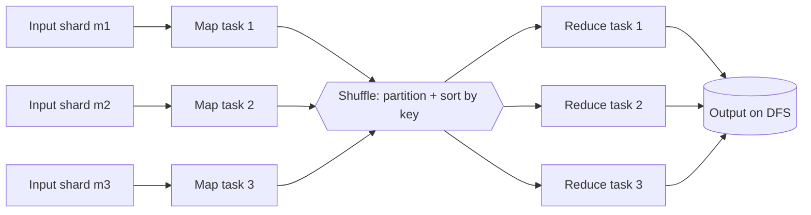

# MapReduce

> **One-sentence summary.** MapReduce is a two-callback programming model — a stateless mapper that emits key-value pairs and a reducer that consumes all values per key — glued together by a framework-managed shuffle that sorts intermediates on the distributed filesystem, trading speed for bulletproof fault tolerance.

## How It Works

A MapReduce job is a four-step pipeline that generalises the Unix log-analysis example (see [[01-unix-tools-as-batch-foundation]]) to a cluster. Only steps 2 and 4 are your code; the framework owns the rest.

1. **Read records.** The input lives on a distributed filesystem such as HDFS or an object store like S3, typically as Parquet or Avro files. An input-format parser splits each file into records and hands them to mappers.
2. **Map.** The mapper runs once per record and emits zero or more key-value pairs — the programmatic equivalent of `awk '{print $7}'` in the log example. Mappers are **stateless across records**, which is why the framework can parallelise them.
3. **Sort (implicit shuffle).** The framework sorts all mapper output by key and routes every record with a given key to the same reducer. This is the distributed analogue of the first `sort` in the Unix pipeline — the step you never write, but the step that defines MapReduce. See [[06-shuffle-and-distributed-joins]].
4. **Reduce.** The reducer is called once per key with an iterator over all its values. Because sort made identical keys adjacent, the reducer never holds the full grouping in memory. `uniq -c` is the degenerate reducer: count occurrences per key.

The number of map tasks is fixed by the number of input shards; the number of reducers is configured by the job author and determines output parallelism.

## The Functional-Programming Connection

The names come straight from Lisp's `map` and `fold`/`reduce` higher-order functions, now mainstream in Python, Rust, and Java. The inheritance is not cosmetic — it is the correctness story. Because mappers and reducers are pure functions of the arguments the framework passes them, with no state between invocations, the framework is free to **parallelise** independent calls across nodes, **repartition** intermediate data as it sees fit, and **retry** a failed task elsewhere — the same input yields the same output. User code never sees the wiring, which is what lets MapReduce survive preemption on a shared cluster (see [[03-distributed-job-orchestration]]).

## Fault Tolerance and the DFS Intermediate Pattern

MapReduce's signature design choice is that **every intermediate stage writes its output to the distributed filesystem** and the framework waits for that write to complete successfully before any consumer reads it. A reducer does not start until every feeding mapper has finished and its output is durable.

This is why retries are cheap and local: if a task dies, the scheduler deletes its partial output and reruns just that task elsewhere — no job or stage restart. The cost is real I/O: mapper-to-reducer data is materialised on a replicated filesystem when it could have been streamed. But the design works even under aggressive preemption. [[05-dataflow-engines-spark-flink]] flip this trade-off; understanding why MR made this choice is the key to understanding why its successors did not.

## Multi-Stage Pipelines with MapReduce

Only one sort is implicit per job. To rank URLs by request count — the Unix pipeline's second `sort` — you write a **second MapReduce job** that consumes the first one's output. Through this lens, the mapper *prepares data for sorting* and the reducer *processes sorted data*.

Joins are worse. Raw MapReduce has no `JOIN` operator; every join algorithm — reduce-side, broadcast, map-side merge — is coded by hand on top of two mappers feeding one reducer. That friction drove the entire post-MR era; see [[06-shuffle-and-distributed-joins]].

## Comparison with Unix and Dataflow Engines

| Aspect              | Unix pipeline          | MapReduce                          | Dataflow engine (Spark/Flink)      |
|---------------------|------------------------|------------------------------------|------------------------------------|
| Programming model   | Composable tools + stdin/stdout | Two callbacks: map + reduce | DAG of operators (map, filter, join, groupBy) |
| Intermediate state  | In-memory pipe         | Replicated files on DFS            | Memory or local disk; recomputed on failure |
| Fault tolerance     | None — rerun the pipeline | Task-level retry via DFS         | Stage-level recompute from lineage |
| Pipelining          | Yes (streaming bytes)  | No — stages block until writes finish | Yes across most operators        |
| Joins               | Manual (`sort | join`) | Hand-coded per job                 | First-class operator               |

## Trade-offs

| Aspect | Advantage | Disadvantage |
|--------|-----------|--------------|
| Model  | Two-function API is simple and teachable | Rigid — complex work needs many chained jobs |
| Fault tolerance | Task-level retries survive preemption on shared clusters | DFS writes on every boundary cost real bandwidth and disk |
| Scheduling | Horizontally scales to petabyte inputs on commodity hardware | A new JVM per task adds seconds of startup per stage |
| Data flow | Stateless callbacks make parallelism trivially safe | No cross-stage pipelining; stage N+1 waits for stage N to fully finish |
| Ecosystem | Any language (via streaming), any DFS format | Joins, secondary sort, and iteration are hand-rolled |

## Real-World Examples

- **Google (2004–2019):** The original MapReduce paper kicked off the batch-processing era; in 2019 Google announced the last internal MapReduce codebase had been deleted ("RIP MapReduce"), replaced by Flume, Dataflow, and BigQuery.
- **Hadoop MapReduce:** The open-source reimplementation that *was* "big data" for most of the 2010s. Still shipped in Hadoop distributions; rarely the first choice for new work.
- **MongoDB and CouchDB:** Exposed a MapReduce API for aggregations before richer pipeline operators existed. Both effectively deprecated it once better query languages landed.
- **Industry trajectory:** MapReduce catalysed the move to commodity-hardware analytics, but its successors ([[05-dataflow-engines-spark-flink]], BigQuery, Snowflake) own the mindshare today. It is still worth learning because the shuffle, task-level retries, and "job as DAG of stages" were all born here.

## Common Pitfalls

- **Hand-writing joins in raw MR.** If your problem is a join, you almost certainly want a dataflow engine or a SQL-on-Hadoop engine. Hand-rolling reduce-side joins in MapReduce is a standard way to waste a quarter.
- **Chaining five-plus MR jobs.** Each hop pays the full DFS-write penalty and a JVM cold-start. A dataflow engine can fuse the same DAG into one job with in-memory pipelining.
- **Assuming MR's fault tolerance is free.** The task-level retry story only works because every intermediate byte is replicated to disk. On a fast network with short jobs, that overhead often dwarfs the actual computation.
- **Forcing the map-then-reduce shape.** Modern engines do not require strict alternation; multiple maps can feed a single join, and reducers need not materialise between them. Thinking in rigid map/reduce pairs leads to contorted designs on systems that no longer need them.

## See Also

- [[01-unix-tools-as-batch-foundation]] — the single-machine pipeline whose structure MapReduce generalises to a cluster
- [[03-distributed-job-orchestration]] — how MR tasks are scheduled, preempted, and retried on shared clusters
- [[05-dataflow-engines-spark-flink]] — the successor model that keeps the shuffle but drops the DFS-intermediate tax
- [[06-shuffle-and-distributed-joins]] — the framework-managed sort that makes MR work, and how joins are implemented on top of it
