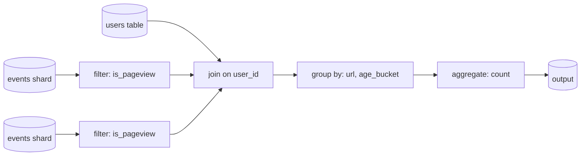

# Dataflow Engines: Spark, Flink, and High-Level APIs

> **One-sentence summary.** Dataflow engines replace MapReduce's rigid map-then-reduce alternation with a freely assembled DAG of relational operators that pipeline in memory, skip unnecessary sorts, and expose SQL and DataFrame APIs so the same query idioms work on a laptop and on a cluster.

## How It Works

A dataflow engine treats an entire workflow as a single job. The user describes the job as a directed acyclic graph (DAG) whose nodes are operators — `filter`, `map`, `join`, `group-by`, `aggregate`, `sort` — and whose edges are sharded streams of records. The engine plans that DAG, schedules tasks across the cluster, copies intermediate data over the network, and applies user functions to each partition. The same shuffle algorithm that powers [[04-mapreduce]] moves records between operators that regroup data, but the engine decides when to shuffle rather than forcing it after every step (see [[06-shuffle-and-distributed-joins]]).

The lineage is research — Dryad and Nephele first showed that general DAG scheduling could subsume MapReduce — and Spark and Flink brought the idea into production. Both expose a low-level record-at-a-time API, but most real pipelines use higher-level relational operators because they compose cleanly and can be optimized automatically.

A single Spark or Flink job expresses that whole graph. The engine fuses `filter` with the scan into one task, shuffles only once for the `join`, reuses the partitioning for the `group-by`, and writes the final counts to storage.

## Why It Beats MapReduce

MapReduce forces every computation into rigid map-shuffle-reduce stages, each reading from and writing to the distributed filesystem. Dataflow engines drop that rigidity and win in six concrete ways:

- **Sort only when needed.** MapReduce sorts between every map and reduce. A dataflow engine sorts only for operators that require it (sort-merge join, ordered aggregation) and uses hash-based shuffles otherwise.
- **Fuse pipelineable operators.** A `map` followed by a `filter` followed by another `map` doesn't change sharding, so the engine collapses them into one task and the record never crosses a task boundary.
- **Locality-aware scheduling.** Because the scheduler sees the whole DAG, it can co-locate a consumer with its producer so intermediate data moves through a shared memory buffer instead of the network.
- **Intermediate state stays local.** MapReduce writes between-stage data to HDFS, which means replication and disk I/O. Dataflow engines keep intermediate state in memory or spill to local disk; only the final result lands in the distributed store.
- **Pipelined execution.** An operator starts consuming as soon as its upstream begins producing. There is no barrier waiting for the previous stage to fully finish.
- **Process reuse.** MapReduce launches a fresh JVM per task. Spark and Flink keep long-lived executors and reuse them across operators, amortizing startup cost.

These optimizations add up to order-of-magnitude speedups on identical workloads — the same computation, expressed as a dataflow DAG, usually runs far faster than its MapReduce equivalent.

## Fault Tolerance: Lineage vs Checkpointing

Dropping MapReduce's "write every stage to DFS" habit creates a fault-tolerance problem: if a task fails partway, its inputs may no longer be on disk. Spark and Flink solve it differently, and the difference is the most important architectural distinction between them.

| Engine | Mechanism | On failure |
|--------|-----------|------------|
| Spark | Records the **lineage** (the DAG of deterministic transformations) that produced each RDD/DataFrame partition | Re-executes the lineage for the lost partitions only, re-reading from stable inputs |
| Flink | Periodically **checkpoints** a consistent snapshot of every task's state | Restores the last checkpoint and resumes from there |

Both replace MR's "materialize everything to DFS" with something cheaper while keeping tasks preemption-safe. Lineage shines when transformations are pure and deterministic but gets expensive on deep DAGs. Checkpointing is simpler operationally and unlocks Flink's unified stream-and-batch story, at the cost of coordinated distributed snapshots.

## High-Level APIs: SQL and DataFrames

Once operational concerns settled, the engines competed on usability. Two interfaces won: SQL and DataFrames.

**SQL is the lingua franca.** Analysts already know it, legacy warehouses already spoke it, and ETL tooling already integrates. Crucially, SQL is declarative, which lets cost-based optimizers in Hive, Spark Catalyst, Flink, and Trino reorder joins, pick join algorithms, push predicates down into columnar Parquet scans, and minimize intermediate state — often improvements a hand-written job would miss. Niche languages like Pig, Morel, jq, and Gremlin persist for pipeline-style or graph workloads, but SQL dominates.

**DataFrames** bring the Pandas/R idiom to the cluster. A DataFrame is essentially a relational table with a method-chain API, and Spark, Flink's Table API, and Daft all expose distributed versions. There is a subtle trap: local DataFrames (Pandas) are **indexed and ordered** and execute eagerly, while distributed DataFrames are generally **unordered** and execute **lazily** after a Catalyst-style query-plan optimization. Code that depends on row order silently produces different results when lifted from a laptop to a cluster.

Daft pushes this further with a **client/server hybrid**: small in-memory ops run locally, large datasets ship to a server, and Apache Arrow acts as the shared columnar format so both sides speak the same bytes without serialization friction.

## Convergence with Cloud Data Warehouses

The wall between "batch framework" and "data warehouse" has almost dissolved. Spark and Flink adopted SQL and columnar Parquet; BigQuery and Snowflake adopted DataFrames (BigQuery DataFrames, Snowpark), distributed scheduling, fault-tolerant shuffles, and shared distributed filesystems. Orchestrators like Airflow and Dagster sit above both as interchangeable execution targets (see [[07-serving-derived-data-from-batch]]). The choice now comes down to cost, workload fit, and what is already in the stack.

## Trade-offs

| Aspect | Choice A | Choice B |
|--------|----------|----------|
| Engine class | Dataflow framework (Spark/Flink): cheaper at scale, flexible code | Cloud warehouse (BigQuery/Snowflake): turnkey SQL, higher $/job |
| API surface | Low-level (RDD, DataStream): full control, escape hatches | SQL / DataFrames: declarative, optimizable, less boilerplate |
| Fault tolerance | Spark lineage: re-compute from inputs, stateless-friendly | Flink checkpointing: restore snapshot, stateful-friendly |
| Storage format | Columnar (Parquet, Arrow): fast analytics, vectorized | Row-wise: better for per-row ML inference and multimodal blobs |

## Real-World Examples

- **Apache Spark**: RDD lineage for fault tolerance, first-class Python and Scala APIs, MLlib for distributed ML, Catalyst optimizer for SQL and DataFrame queries.
- **Apache Flink**: periodic checkpoints, unified stream-and-batch engine, Table API, FlinkML, Gelly for graph processing.
- **Trino / Presto**: interactive SQL over data-lake files; cost-based optimizer, no persistent storage of its own.
- **Apache Hive**: legacy SQL-on-Hadoop, still runs on MapReduce or Tez; notable for pioneering cost-based optimization on the JVM.
- **Daft**: distributed DataFrames on Arrow; client/server hybrid lets the same code scale from a notebook to a cluster.

## Common Pitfalls

- **Assuming order in distributed DataFrames.** Shards are unordered; sort explicitly before any window, cumulative sum, or head/tail operation.
- **Row-by-row inference inside a columnar warehouse.** Per-row scoring thrashes column-oriented storage; push it to Spark or a serving layer.
- **Expecting Pandas-style eager execution on Spark.** DataFrame calls build a plan; nothing runs until an action (`.show()`, `.collect()`, `.write`) triggers it, so debug by reading the plan.
- **Forcing iterative graph algorithms into pure SQL.** PageRank wants a fixed-point loop; use GraphX, Gelly, or BSP/Pregel instead of recursive CTEs.
- **Treating all shuffles as equal.** Wide transformations like `groupByKey` and skewed joins still dominate job time — see [[06-shuffle-and-distributed-joins]].

## See Also

- [[04-mapreduce]] — the model dataflow engines replaced; still worth understanding because the shuffle and sort-merge-join ideas carry over.
- [[06-shuffle-and-distributed-joins]] — the algorithm every operator that regroups data depends on, regardless of engine.
- [[07-serving-derived-data-from-batch]] — how the DataFrames and DAGs discussed here feed indexes, ML features, and warehouse tables downstream.
