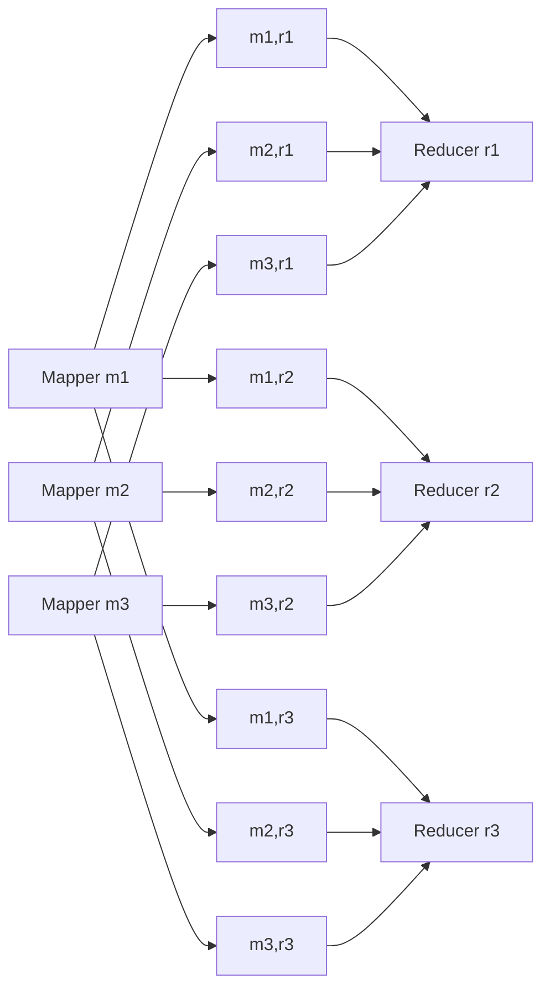
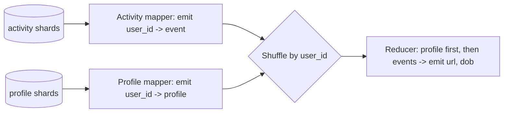

# Shuffle and Distributed Joins

> **Shuffle is a distributed sort that routes every key-value pair to the reducer responsible for its hashed key, letting sort-merge joins, group-by aggregations, and secondary sort all fall out of the same primitive at petabyte scale.**

## Shuffle Is Not Random

The name is a false friend. Shuffling a deck of cards randomizes; shuffling in a batch processor *sorts*. The "shuffle" step in [[04-mapreduce]], Spark, Flink, Daft, Dataflow, and BigQuery is a distributed sorting algorithm — no randomness anywhere. A more accurate name would be "distributed sort with per-key colocation": it sorts each shard of output *and* guarantees all records with the same key land on the same downstream task. Every operator you think of as distributed — `JOIN`, `GROUP BY`, `DISTINCT`, window functions — is ultimately this one primitive in disguise.

## How Shuffle Works

A job begins with `M` input shards (files on a distributed filesystem or objects in a bucket) and the framework launches one map task per shard. The *number of reducer tasks `R` is configurable by the job author and independent of `M`*: a job with 10,000 input files might run with 200 reducers, or 10.

Each mapper emits key-value pairs. To decide where a pair goes, the framework computes `hash(key) % R` and appends the record to a local, on-disk file dedicated to that target reducer — so every mapper `m_i` produces `R` output files, one per reducer (`m_i,r_1`, `m_i,r_2`, …, `m_i,r_R`). The total number of intermediate files is therefore `M * R`.

While writing those files, each mapper *also sorts its output by key*, using the same trick as log-structured storage: a small in-memory sorted structure buffers incoming pairs, spills to disk as a sorted segment when full, and background merges combine smaller segments into larger ones. So each per-reducer file leaves the mapper already sorted.

When a mapper finishes, reducers pull their slice — reducer `r_j` fetches `m_1,r_j`, `m_2,r_j`, … from every mapper. The reducer then performs a mergesort-style streaming merge across those already-sorted inputs. Because all files are sorted on the same key, records with equal keys become consecutive in the merged stream. The framework calls the reducer function once per key with an *iterator* over that key's values — crucially, the reducer never has to materialize all values for a key in memory.

Every mapper's arrow into a reducer carries a *sorted* stream; the reducer's job is to merge `M` sorted streams into one.

## Sort-Merge Join

The cleanest payoff is a distributed join. Consider a log of user *activity events* (fact table) and a database of *user profiles* (dimension table). You want to annotate every click with the clicker's date of birth; both tables are petabytes.

Run *two mappers in the same job*, one per input. The activity mapper emits `(user_id, activity_event)`; the profile mapper emits `(user_id, profile_row)`. Shuffle routes all records — from both inputs — with the same `user_id` to the same reducer. For a given `user_id`, the reducer receives the profile row first (via *secondary sort*, below) followed by activity events in timestamp order. The join logic becomes trivial: stash the one profile row in a local variable, iterate activity events, emit `(url, dob)` for each. Memory is O(1) per user and no network requests happen during reduction — all remote I/O already happened in the shuffle.

This is a **sort-merge join**: mapper output is sorted by the join key, and the reducer merges the two sorted sides in one streaming pass.

## Secondary Sort

Within a single key, records still need to arrive in a *predictable* order — the reducer wants the profile before the events. You get this by *augmenting the shuffle key with a tiebreaker*: sort on `(user_id, record_type)` where `record_type = 0` for profile and `1` for activity. Partitioning still uses only `user_id` (so all a user's records land on one reducer), but sorting uses the composite key. Extend to `(user_id, record_type, timestamp)` for activity ordering. Partition on a prefix, sort on the whole — this is how every streaming reducer imposes arrival order without building in-memory structures.

## Group-By and Aggregations

The second job in a typical pipeline computes, for each URL, the distribution of viewer ages. Mapper emits `(url, dob)` from the previous job's output. Shuffle routes all `(url, ...)` pairs for the same URL to one reducer. The reducer walks the stream, maintains a small counter-per-age-group dictionary, increments on each record, and emits an aggregate row when the key changes. Any `GROUP BY key AGGREGATE(...)` at arbitrary scale is this pattern — shuffle + streaming fold.

## Hash Partitioning vs Broadcast Joins

Shuffling both sides of a join is general but expensive. A cheaper alternative exists when one side is small.

| Strategy | How it works | When it wins |
|---|---|---|
| Sort-merge / hash-partitioned | Shuffle both sides by join key; reducer joins streams | Both sides large; any-to-any sizes |
| Broadcast / map-side | Ship full small side to every mapper of the large side; lookup in memory | Small side fits in RAM on each node |
| Bucketed / partitioned | Both sides pre-shuffled on disk by the same key | Repeated joins on same key; amortizes shuffle |

Modern query optimizers (Spark Catalyst, Flink, Trino) pick automatically using table statistics — a broadcast threshold like "if side < 10 MB, broadcast" is typical.

## Modern Shuffle Optimizations

Classic MapReduce materializes every intermediate file to local disk, then pulls over the network — robust but slow. [[05-dataflow-engines-spark-flink]] keep shuffle state in memory or on local SSDs and avoid writing intermediates to the distributed filesystem. BigQuery offloads shuffle to an *external in-memory sorting service* that also replicates shuffled data for resilience — disaggregating shuffle from compute so each scales independently.

## Trade-offs

| Dimension | Option A | Option B |
|---|---|---|
| Partitioning | Hash-shuffle both sides (general) | Broadcast small side (cheap when it fits) |
| Intermediate storage | DFS-backed shuffle, MapReduce-style (durable, fault-tolerant) | In-memory / local-disk shuffle, Spark/Flink (fast, requires re-compute on failure) |
| Merge algorithm | Sort-merge join (low memory, streams sorted input) | Hash join (fast if one side fits in a hash table) |
| Shuffle service | Embedded in workers | External (BigQuery) — replicated, decoupled |

## Real-World Examples

- **Hadoop MapReduce**: original reference implementation; mappers spill to local disk, reducers pull over HTTP.
- **Apache Spark**: multiple shuffle implementations over its lifetime (hash, sort, tungsten-sort); today uses a sort-based shuffle with in-memory buffers and optional external shuffle services.
- **Apache Flink**: pipelined shuffles that stream records between operators without materializing full intermediates when possible.
- **Google BigQuery / Dataflow**: external in-memory shuffle service with replication.
- **Dask, Daft, Ray**: Python-native frameworks that implement shuffle for DataFrame operations, with varying memory and disk-backed strategies.

## Common Pitfalls

- **Data skew** — one hot key (a celebrity `user_id`, a viral URL) overwhelms a single reducer while others idle. Mitigations: salting the key, two-stage aggregation, or isolating skewed keys.
- **Shuffling when you could broadcast** — defaulting to a hash join on a 1 TB × 5 MB join wastes an entire cluster of network bandwidth.
- **Forgetting the iterator contract** — calling `list(values)` inside a reducer loads all of a key's values into memory and negates the streaming design.
- **No secondary sort** — if you need the profile row before the events, don't rely on insertion order; augment the sort key.
- **Reducer count by intuition** — too few and each reducer drowns; too many and per-file overhead and the `M * R` intermediate file count explode.

## See Also

- [[04-mapreduce]] — the programming model that introduced shuffle to the mainstream.
- [[05-dataflow-engines-spark-flink]] — how successors keep shuffle in memory instead of on DFS.
- [[07-serving-derived-data-from-batch]] — what happens to the partitioned output once the shuffle is done.
