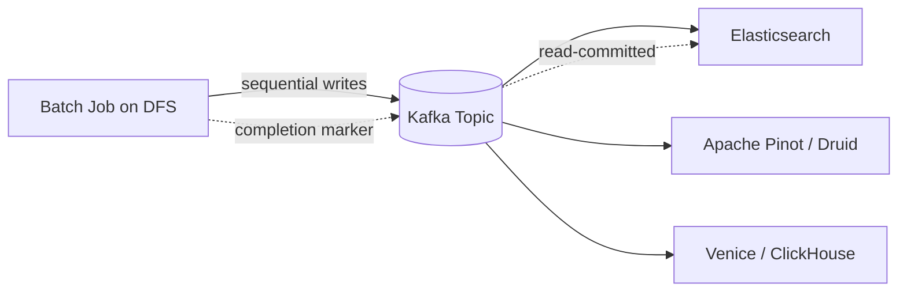

# Batch Use Cases and Serving Derived Data

> **One-sentence summary.** Batch jobs power ETL, analytics, and machine learning — but their outputs only earn their keep when they are shipped back to production through Kafka fan-out or bulk-loaded database files, never by writing records one at a time from inside parallel tasks.

## Where Batch Jobs Live

Batch processing is the workhorse for workloads that are large in volume but tolerant of staleness. Accounting and inventory reconciliation runs nightly, manufacturing demand forecasting runs weekly, ecommerce and social media train recommendation models on hourly or daily cadence, and the US banking network's ACH settlement is almost entirely batch. The rule is simple: when data is abundant and freshness is measured in minutes or hours rather than milliseconds, batch wins on cost and simplicity. Four canonical use-case families dominate: ETL, analytics, machine learning, and serving derived data back to production. The first three produce artifacts; the fourth is the one that trips most teams up.

## Use Case 1: ETL / ELT

Extract-Transform-Load pipelines pull rows out of a production database, reshape them, and push them into a downstream system — typically a warehouse. Transformation is the "embarrassingly parallel" sweet spot for batch: filtering rows, projecting columns, and flattening nested records all shard cleanly across tasks with no cross-task coordination (see [[06-shuffle-and-distributed-joins]] for when that assumption breaks).

What makes ETL pleasant in production is not the transforms themselves but the workflow schedulers wrapped around them (see [[03-distributed-job-orchestration]]). Airflow, Dagster, and Prefect ship with built-in source, sink, and query operators for MySQL, PostgreSQL, Snowflake, Spark, and Flink, so glue code is replaced by declarative DAGs. Failed tasks retry automatically for transient issues; persistently failing jobs surface in a UI where engineers can inspect intermediate files and rerun.

Two recent shifts matter. First, *data mesh*, *data contract*, and *data fabric* practices have decentralized pipeline ownership — product teams now publish their own datasets with standardized metadata rather than funneling requests through a central data-engineering team. Second, analytics and ETL have converged on the same execution engines: SparkSQL, Trino, and DuckDB run both the pipeline that builds a table and the interactive query that reads it.

## Use Case 2: Analytics (Data Lakehouse)

OLAP queries — large scans with GROUP BY and aggregation — run on top of a distributed filesystem or object store (see [[02-distributed-storage-for-batch]]), with table formats like Apache Iceberg and catalogs like Unity tracking file-to-table mappings. This layered stack is the *data lakehouse*. It splits into two query styles:

- **Pre-aggregation queries** roll data up into OLAP cubes or data marts on a schedule, then push results into purpose-built serving engines like Apache Druid or Apache Pinot. Airflow, Dagster, and Prefect orchestrate the refresh cadence.
- **Ad hoc queries** are the iterative, latency-sensitive path analysts take when exploring data in Tableau, Power BI, Looker, or Apache Superset. These tools connect through SparkSQL, Trino, Presto, or Hive, which ultimately dispatch batch jobs against the lakehouse.

## Use Case 3: Machine Learning

ML and batch are inseparable. The chapter names three sub-patterns:

- **Feature engineering** — turn raw text, categorical fields, or event logs into numeric features. Spark's MLlib and Flink's FlinkML provide the statistical functions and encoders.
- **Model training** — training data goes in, model weights come out. Classic batch, often with GPU-aware schedulers.
- **Batch inference** — apply the trained model to a large dataset when real-time scoring isn't required, e.g., nightly product-recommendation refresh or backfilling predictions for evaluation.

Recommendation and ranking systems lean heavily on graph processing, implemented via the *bulk synchronous parallel* (BSP) model popularized by Google's Pregel paper and realized in Apache Giraph, Spark's GraphX, and Flink's Gelly. LLM data preparation has become a flagship batch workload: HTML-to-text extraction, low-quality and duplicate document removal, tokenization, and embedding generation all run through Kubeflow, Flyte, or Ray — OpenAI uses Ray for ChatGPT training. Data scientists prototype on top of all this in Jupyter or Hex notebooks, executing batch frameworks through DataFrame APIs or SQL cells.

## Use Case 4: Serving Derived Data to Production

This is where batch jobs meet the hardest interface problem in the stack. A recommendation model, a search index, and a precomputed feature store are all useless until they land in a system that serves user requests. The naive move — import your database's client library into the batch task and write one record at a time — looks like it will work, and does, briefly, before breaking in three predictable ways:

1. **Throughput collapse.** A network round-trip per record is orders of magnitude slower than the sequential write throughput a batch task expects.
2. **Serving database overload.** Every parallel task hammers the same production database concurrently, so query latency for live traffic spikes and cascading operational problems follow.
3. **Violated all-or-nothing semantics.** Batch jobs promise that either every task committed exactly once or no output exists. Writing to an external system breaks that guarantee — a retried task produces duplicate rows that are externally visible, even though the job reports success.

### Pattern A: Stream through Kafka

The preferred fix is to make the batch job's output a Kafka topic and let downstream systems ingest at their own pace. Elasticsearch, Apache Pinot, Apache Druid, LinkedIn's Venice, and ClickHouse all have built-in Kafka ingestion.

Kafka fixes each of the three failures: it is optimized for sequential writes; it buffers so consumers can throttle their read rate; one batch output fans out to many sinks; and the topic can live in a DMZ network between the batch environment and production, giving a security boundary. The one thing Kafka does not solve for free is the all-or-nothing guarantee — consumers must keep newly ingested data invisible to queries until the batch job sends a completion marker, behaving like an uncommitted transaction under read-committed isolation.

### Pattern B: Bulk-load prebuilt database files

When bootstrapping, build the database itself inside the batch job and bulk-import the files. TiDB's Lightning tool, Apache Pinot's Hadoop import, and RocksDB's SST-file ingestion API all follow this pattern. The payoff is speed and atomic version switching: the old dataset serves traffic until a single pointer flip makes the new one live. The cost is that incremental updates are awkward — you've committed to building whole new files on each run. Venice is a notable hybrid: it supports both full dataset swaps and row-level batch updates in the same store.

## Comparison Table

| Approach | Latency to serving | Write throughput | Atomicity | Operational complexity | Incremental updates |
|---|---|---|---|---|---|
| Direct writes from tasks | Immediate | Poor (per-record RTT) | Broken by retries | Low (but dangerous) | Native |
| Stream through Kafka | Seconds to minutes | High (sequential) | Needs completion marker | Medium | Natural fit |
| Bulk-load prebuilt files | Minutes (swap) | Very high | Atomic version switch | Medium-high | Awkward; hybrid needed |

## Trade-offs

| Aspect | Advantage | Disadvantage |
|---|---|---|
| Direct writes | Simplest mental model | Overwhelms prod DB, violates all-or-nothing |
| Kafka fan-out | One source to many sinks, DMZ isolation, throttling | Requires invisible-until-committed logic in consumers |
| Bulk-load | Atomic swap, fastest bootstrap | Hard to incrementally update without hybrid tooling |

## Real-World Examples

- **LinkedIn Venice**: purpose-built derived datastore fed by both batch bulk-loads and streaming updates, powering ML feature serving.
- **Apache Pinot**: real-time OLAP layer bootstrapped via Hadoop bulk import, then kept fresh from Kafka.
- **ClickHouse**: widely used as the serving layer for batch-computed analytics, ingesting from Kafka topics.
- **Search indexes**: rebuilt nightly by batch jobs on a DFS, shipped to Elasticsearch through Kafka or via segment bulk-load.
- **Feature stores**: precomputed ML features pushed out of a Spark job into a serving store for online inference.

## Common Pitfalls

- **One-record-at-a-time writes from batch jobs.** Feels natural, wrecks production. Always stream or bulk-load.
- **Forgetting the all-or-nothing boundary.** The guarantee ends at the batch framework's edge; downstream consumers must hide in-flight data until they see a completion marker.
- **Trying to incrementally update a bulk-loaded database.** Choose a hybrid store like Venice, or pick streaming from the start.
- **Colocating batch and production networks.** Without a DMZ, a runaway batch job can take down live traffic; stream-based fan-out gives you an isolation point.

## See Also

- [[02-distributed-storage-for-batch]] — where the raw inputs and intermediate outputs live before serving
- [[05-dataflow-engines-spark-flink]] — the engines that produce the derived datasets discussed here
- [[06-shuffle-and-distributed-joins]] — the heavy-lifting primitive underneath most ETL and feature pipelines
