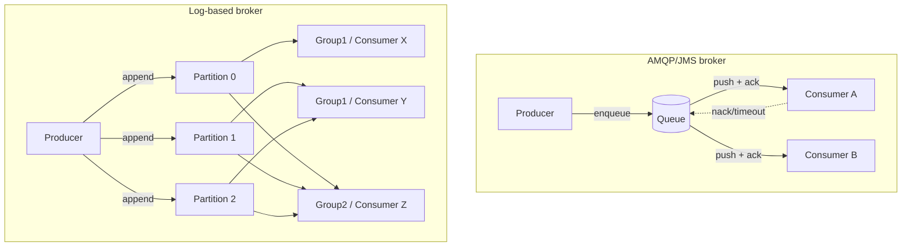

# Message Brokers: AMQP/JMS vs Log-Based

> **One-sentence summary.** Two fundamentally different broker designs for transmitting event streams: AMQP/JMS-style brokers treat messages as transient items that are destructively acknowledged off a queue, while log-based brokers store messages in an append-only partitioned log that consumers read by advancing an offset.

## The Core Problem

A messaging system connects **producers** (publishers) to **consumers** (subscribers) over **topics**. Unlike a Unix pipe or TCP socket, a topic must support multiple producers and multiple consumers, and the broker must answer two design questions:

1. **What if producers outpace consumers?** The broker can drop messages, buffer them, or apply backpressure.
2. **What if a node crashes?** Durability requires writing to disk and/or replication, both of which cost throughput.

Direct messaging avoids the broker entirely — UDP multicast (financial market feeds), brokerless libraries like ZeroMQ, and HTTP webhooks all push events straight to consumers. These work only when both ends stay online and message loss is tolerable. For everything else, an intermediary broker centralizes durability and decouples lifecycles.

## How It Works

**AMQP/JMS-style brokers** treat the broker like a transient queue. Each message is pushed to one consumer (load balancing) or fanned out to all consumers (pub/sub). The consumer must explicitly **acknowledge** each message; on timeout the broker redelivers it to someone else and deletes it once acked. Reading is destructive — once consumed, the message is gone. Two-phase commit support (XA/JTA) makes them feel database-like, but they assume short queues and small working sets.

**Log-based brokers** (Kafka model) treat the broker like a sharded append-only file. Producers append to a **partition**; the broker assigns each message a monotonically increasing **offset**. Consumers in a **consumer group** are assigned whole partitions and read sequentially, periodically checkpointing their offset. There is no per-message ack — recovery just rewinds to the last committed offset. Reading is non-destructive: any number of independent consumer groups can replay the same log.

The two ideas are converging — Kafka added consumer-group semantics that mimic queues, and Pulsar/Pub/Sub expose log storage behind JMS-style APIs.

## Big Comparison

| Aspect | AMQP/JMS (RabbitMQ-style) | Log-based (Kafka-style) |
|---|---|---|
| **Storage model** | Transient queue, message deleted on ack | Append-only partitioned log, retained for time/size window |
| **Delivery unit** | Individual message assigned to a consumer | Whole partition assigned to a consumer in a group |
| **Acknowledgment** | Per-message explicit ack; redelivery on timeout | Periodic offset commit; no per-message bookkeeping |
| **Ordering** | Best-effort within a queue; broken by load-balanced redelivery | Strict total order **within** a partition; none across partitions |
| **Parallelism granularity** | Message-level — add consumers, broker hands out work | Partition-level — max parallelism = partition count |
| **Slow-consumer handling** | Small per-message stalls; risk of unbounded queue growth | Falls behind in offsets; only that consumer affected |
| **Head-of-line blocking** | Avoided — broker reassigns the next message to a free consumer | Yes — a slow message stalls everything after it in that partition |
| **Replay** | Impossible — message is gone after ack | Trivial — rewind the offset, reread the log |
| **Bad-message handling** | Dead-letter queue (DLQ) after N failed redeliveries | Skip the offset, optionally route to DLQ topic |
| **Throughput** | Lower (per-message I/O, ack chatter) | Very high (sequential disk writes, batching) |
| **Adding a new consumer** | Sees only messages sent after subscription | Can start from offset 0 and replay history |

## Trade-offs by Use Case

**Choose AMQP/JMS when** each message is an expensive, independent task: parallel email sends, image transcoding, third-party API calls. You want fine-grained load balancing across a worker pool and per-message retry semantics; ordering is irrelevant; replay is meaningless because the side effect (e.g. sending an email) cannot be undone anyway.

**Choose log-based when** the stream **is** durable derived data: change data capture, event sourcing, analytics pipelines, materialized view maintenance. Replayability lets you re-derive search indexes, debug consumers in production without disrupting peers, and treat the log as the system of record. The trade-off is coarse parallelism and head-of-line blocking, which is acceptable when each message is fast and message ordering matters.

The log model also enables **stream-table duality**: because consumers can be added without losing history, the broker becomes a natural integration backbone for the patterns covered in [[02-change-data-capture]] and event sourcing.

## Real-World Examples

- **RabbitMQ, ActiveMQ, IBM MQ, Azure Service Bus, Google Cloud Tasks, AWS SQS** — classic AMQP/JMS task-queue brokers. Used for work distribution, RPC backplanes, and async job processing.
- **Apache Kafka, Amazon Kinesis, Apache Pulsar, Redpanda** — log-based brokers. The default choice for CDC pipelines, event sourcing, and stream processing.
- **Google Cloud Pub/Sub** — architecturally a log-based broker but exposes a JMS-style ack API, illustrating the convergence of the two models.
- **WarpStream, Confluent Freight, Bufstream** — newer log brokers that offload all storage to object stores (S3/Iceberg), enabling effectively unbounded retention and direct warehouse-query access to the log.

## Common Pitfalls

- **Poison messages without DLQs.** A malformed message that crashes consumers will be redelivered forever in an AMQP broker, blocking the queue. Always configure a dead-letter destination and an alert on it.
- **Treating partition count as tunable later.** In a log-based broker, partition count caps consumer-group parallelism. Repartitioning is operationally painful, so size partitions for projected peak concurrency, not current load.
- **Assuming ordered delivery from a load-balanced AMQP queue.** Redelivery after a consumer crash interleaves messages out of order. If you need causal ordering, route causally related messages to a dedicated queue (or use a log broker with a partition key).
- **Forgetting that log-based offset commit gives at-least-once.** Crash between processing and offset commit replays messages. Achieving exactly-once requires the techniques in [[07-stream-fault-tolerance]] (idempotent writes, atomic commit, fencing).
- **Using AMQP for derived-data pipelines.** Once a consumer acks, you cannot rebuild a downstream search index or warehouse without re-extracting from the source. Logs separate input from derived output, the same way batch jobs do.

## See Also

- [[02-change-data-capture]] — the canonical use case for log-based brokers: turning a database's replication log into a public event stream.
- [[07-stream-fault-tolerance]] — how stream processors achieve exactly-once semantics on top of at-least-once log delivery via idempotence and checkpointing.
