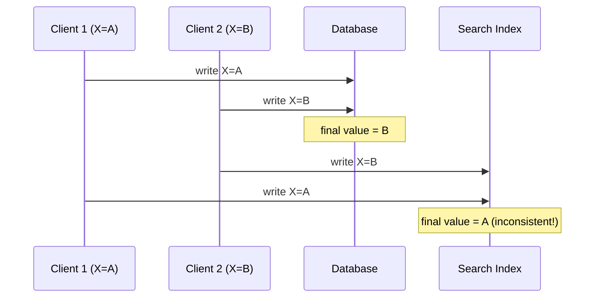
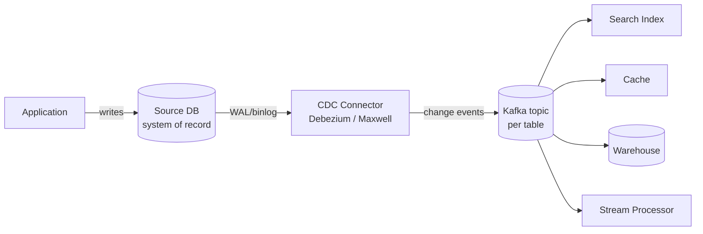

# Change Data Capture

> **One-sentence summary.** CDC turns a database's internal replication log into a public, replayable event stream so that caches, search indexes, and warehouses become deterministic followers of a single system of record.

## How It Works

Real applications mix storage technologies: an OLTP database for transactions, a cache for hot reads, a full-text search index for queries, and a warehouse for analytics. Each holds its own copy of the same data and must be kept in sync. The naive fix — *dual writes*, where the application writes to every system itself — fails in two well-known ways. First, two concurrent writers can interleave their updates so that the database lands on `B` while the search index lands on `A`, leaving the systems permanently inconsistent. Second, one of the writes can simply fail while the others succeed, producing partial state that requires distributed atomic commit (an expensive, rarely-used solution) to repair.

CDC fixes this by electing a single leader — the source database — and turning every other system into a follower. The database already linearizes writes through its replication log; CDC simply exposes that log as a public event stream. A connector tails the binlog/WAL, normalizes each row change into a structured event (`{op, key, before, after}`), and publishes it to a log-based broker. Consumers replay events in the same order the database committed them, so the search index, cache, and warehouse converge on identical state.

Two practical wrinkles round out the design. **Initial snapshot:** if the broker doesn't hold the entire history, a new consumer must first load a consistent snapshot pinned to a known log offset, then apply changes from that offset forward. Debezium uses Netflix's DBLog watermarking to interleave snapshot rows with live changes without locking the source. **Log compaction:** an alternative to snapshotting where the broker periodically discards superseded values, keeping only the latest record per primary key (plus tombstones for deletes). A compacted topic is guaranteed to contain the current value of every key, so any consumer can rebuild its full state by reading from offset 0 — no separate snapshot needed. See [[01-message-brokers-amqp-vs-log]] for why a partitioned, replayable log (Kafka-style) is the right transport here; an AMQP queue would not work.

## When to Use

- **Heterogeneous derived stores.** You already have a primary database and want to feed a search index, recommendation engine, denormalized cache, or warehouse without writing brittle dual-write code.
- **Streaming ETL replacing nightly batch.** You want sub-second freshness in the warehouse instead of waiting for tomorrow's `pg_dump` → S3 → Snowflake pipeline.
- **Materialized views over operational data.** Tools like Materialize and RisingWave ingest CDC streams and maintain incrementally-updated SQL views that always reflect the source DB.
- **Event-driven microservices on legacy schemas.** Other services react to domain changes without coupling to the owning service's database, often combined with the *outbox pattern* to decouple internal schema from the public event contract.

## Trade-offs

| Aspect | Dual writes | CDC |
|---|---|---|
| Ordering across systems | Each client decides → race conditions | Source DB linearizes; downstream replays in same order |
| Partial failure | One write fails → silent inconsistency | Connector retries from last offset → eventually consistent |
| Adding a new consumer | Modify application code | Add a new subscriber; replay log from snapshot or offset 0 |
| Slow consumer impact | Blocks application path | Asynchronous → does not affect SoR latency |
| Freshness | Synchronous (if it works) | Async lag, typically sub-second |
| Schema coupling | Each system has its own write schema | Source DB schema becomes a public API |

The headline win is correctness: a single linearization point eliminates the race condition entirely. The headline cost is replication lag — CDC is asynchronous, so consumers always trail the source by some milliseconds to seconds. For most derived-data use cases that's a fair trade.

## Real-World Examples

- **Yelp's data pipeline.** MySQL binlogs flow through a Kafka-based CDC pipeline that fans out to search (Elasticsearch), analytics, and ML feature stores — all consumers tail the same change stream rather than dual-writing.
- **Debezium + Kafka Connect.** The de-facto open-source CDC stack: source connectors for MySQL, PostgreSQL, Oracle, SQL Server, MongoDB, Cassandra, and Db2 emit a standardized envelope schema onto Kafka topics. Maxwell and pgcapture cover MySQL and PostgreSQL respectively; Oracle GoldenGate is the long-running commercial equivalent.
- **Materialize and RisingWave.** Streaming SQL engines that consume CDC topics and maintain incrementally-updated materialized views, effectively making a Postgres view that auto-refreshes in milliseconds.
- **Cloud-native CDC.** Google Cloud Datastream, AWS DMS, and Azure's equivalents wrap the same idea as managed services for cross-region replication and warehouse loading.

## Common Pitfalls

- **Schema-evolution breaks consumers.** The source DB's schema is now a public API. Dropping a column or renaming a table can cascade into a customer-facing outage. Use *data contracts* and the *outbox pattern* (a dedicated table whose schema you treat as the public event contract) to decouple internal models from the published event shape.
- **Forgetting log compaction's contract.** Compaction keeps only the latest value per primary key, so it works for *state* (CDC, where each event carries the full new row) but not for *intent* events (event sourcing, where later events do not supersede earlier ones). See [[03-event-sourcing-immutable-logs]] for the distinction.
- **Snapshot/stream offset mismatch.** Bootstrapping a new consumer from a snapshot taken at a different offset than where you start tailing produces silent gaps or duplicates. Always pin the snapshot to a known LSN/GTID.
- **Treating CDC as synchronous replication.** It isn't. Read-your-writes guarantees against derived systems require either reading from the source DB or a session-token mechanism — never assume the search index is up to date the instant the API call returns.
- **Quorum-based sources.** Cassandra-style stores have no single linearization point, so they expose per-node logs and leave merging to the consumer — much more work than a single-leader source.

## CDC vs Event Sourcing in One Line

CDC captures *what the database did* after the fact (low-level row changes, replayable for derived views). Event sourcing makes *what the user intended* the original input, and the database becomes a derived view. Both produce an event log, but only one of them is the source of truth — see [[03-event-sourcing-immutable-logs]].

## See Also

- [[01-message-brokers-amqp-vs-log]] — why a replayable, partitioned log is the right transport for change events
- [[03-event-sourcing-immutable-logs]] — making events the system of record rather than a derived projection
- [[06-stream-joins]] — using a CDC-fed local table to enrich an activity stream (stream-table joins)
