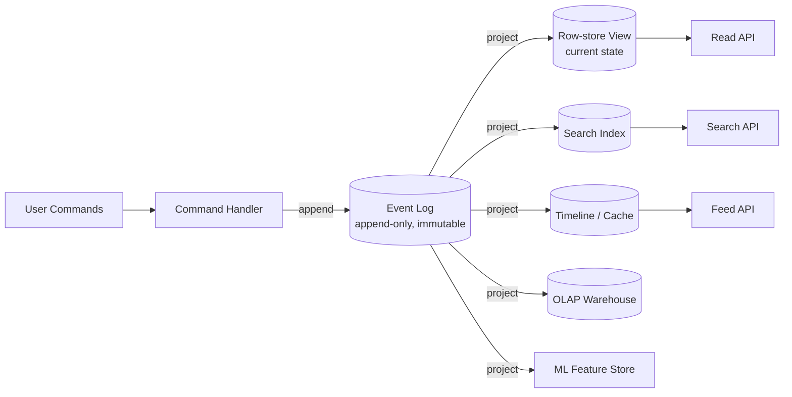

# Event Sourcing & Immutable Event Logs

> **One-sentence summary.** Treat the immutable, append-only log of events as the system of record and derive every queryable view (DB rows, search indexes, caches, OLAP cubes) from it — state becomes the integral of events, and events become the derivative of state.

## How It Works

We usually picture a database as a bag of mutable rows. Event sourcing inverts that: the **log of events** is the source of truth, and any "current state" is just a cached projection of that log. Mathematically, application state is what you get when you *integrate* an event stream over time, and a change stream is what you get when you *differentiate* the state — two sides of the same coin. Crash, lose the database, replay the log: the state comes back.

The discipline is older than computing. An accountant's **ledger** is an append-only log; the balance sheet is a derived view. To fix a mistake, the accountant doesn't erase a row — they post a *compensating* transaction. The original entry stays forever for auditability. Event-sourced systems do the same: a buggy deploy that wrote bad data is *recoverable* because the raw events are still there, and you can reproject from any point.

Once the log is the source of truth, you can fan it out into as many read-optimized views as you want (this is the read side of **CQRS** — Command Query Responsibility Segregation). The same approach works whether events are explicitly emitted by the app or harvested via [[02-change-data-capture]] from a mutable database; the line between the two blurs in practice.

A snapshot mechanism is usually layered on top so consumers don't replay from genesis on every boot — but snapshots are a **performance optimization**, not the system of record. Log compaction (keeping only the latest event per key) is the bridge between "log" and "database" when full history isn't needed.

## When to Use

- **Auditability is a hard requirement** — finance, healthcare, compliance, anything where "who changed what, when, and why" must survive forever.
- **Application is rapidly evolving** — you keep wanting to present existing data in new ways. Build a new projection alongside the old one, switch readers, retire the old (no painful schema migration).
- **Multiple read shapes for one truth** — the same orders need to feed an OLTP API, a search index, a recommendation model, and a daily report. One log, many sinks.
- **Recovery from buggy writes** — overwriting databases lose history; a log lets you reproject around the bad code.
- **Behavioural analytics** — capturing *intent* matters. "Added to cart, then removed" is two events worth keeping; a row-store DB only remembers the empty cart.

## Trade-offs

| Aspect | Advantage | Disadvantage |
|--------|-----------|--------------|
| **Auditability** | Full history of every change, forever | Storage grows monotonically; high-churn workloads bloat |
| **Schema evolution** | New view runs alongside old; no online migration | Old events use old schemas — projection code must handle every historical version |
| **Recovery** | Reproject around a bad deploy; replay the log | Reprojection of years of events can take hours; needs snapshots |
| **Concurrency** | Single-writer-per-shard log serializes events naturally; fewer multi-object txns | Cross-shard events still need coordination (see Ch. 13) |
| **Read consistency** | Many specialized read models, each fast | Projections are *asynchronous* — read-your-writes is not free |
| **Deletion / GDPR** | — | Immutability fights right-to-be-forgotten; needs excision, shunning, or crypto-shredding |

## Real-World Examples

- **Apache Kafka + Kafka Connect** — the canonical event log + sink connectors that fan out to Elasticsearch, Postgres, S3, etc.
- **Druid ingesting from Kafka** — analytical store derived directly from the event stream.
- **Datomic** — database built on an immutable log of facts; supports `excision` for legally-mandated deletion.
- **Fossil VCS** — uses `shunning` to hard-delete content while keeping the rest of the history immutable.
- **Git / Mercurial** — even non-event-sourced systems lean on immutability for snapshot isolation.
- **Social network home timelines** — denormalized fan-out cache kept in sync with a write-side feed of `posted` and `followed` events (see [[06-stream-joins]] for the join mechanics).

## Concurrency Control: A Hidden Win

Much of the historical pain of multi-object transactions came from "one user action mutates five rows." With event sourcing you make the **event itself** the self-contained description of that action. The user-facing write is a single atomic append. If the log and the projection are sharded the same way, a single-threaded log consumer per shard needs no concurrency control at all — the log defines a serial order. This is the same principle as Actual Serial Execution (Ch. 7), gifted to you by construction.

## Limitations of Immutability

- **Churn-heavy workloads** — small dataset, huge update rate ⇒ the log grows orders of magnitude bigger than the live state. Compaction and GC become the operational bottleneck.
- **GDPR / right-to-be-forgotten** — laws don't accept "I appended a `forget(user)` event." Genuine deletion requires rewriting history. Datomic's *excision*, Fossil's *shunning*, and **crypto-shredding** (encrypt sensitive data with a per-subject key, then destroy the key) are the standard tools.
- **Crypto-shredding moves the problem** — the encrypted ciphertext is still immutable; only the key store is mutable. You must commit *up front* to the key partitioning, and per-record keys make the key store as big as the data.
- **Backups and SSDs cheat** — copies live in places you don't control. As the chapter puts it, **deletion is more about making it harder to retrieve the data than impossible** to retrieve it.

## Common Pitfalls

- **Treating the read model as the source of truth** — once you query the projection and write back into the log based on it, you've coupled them and lost the asymmetry that gave you safety.
- **Putting business logic in the projector** — projectors should be pure derivations. Decisions belong in the command handler that *appends* events.
- **Forgetting schema versioning of events** — events live forever, but your code doesn't. Old event shapes will haunt you; design upcasters from day one.
- **Synchronous read-your-writes** — users will write and immediately read; the projection lags. Design the UX (or a single-writer read-through) to handle staleness, not pretend it doesn't exist.
- **Assuming "immutable" means "compliant"** — see GDPR. Plan crypto-shredding or excision before regulators ask.
- **Replay storms** — rebuilding all projections from scratch in production is rarely tested until the day you need it. Snapshot, parallelize, and rehearse.

## See Also

- [[02-change-data-capture]] — the alternative way to get an event stream out of a legacy mutable database; the line between CDC and explicit event sourcing is fuzzy.
- [[04-stream-processing-use-cases]] — what you actually *do* with the event log once you have it (materialized views, search indexing, analytics, notifications).
- [[06-stream-joins]] — how derived views combine multiple event streams (e.g., enriching activity events with user profile updates).
