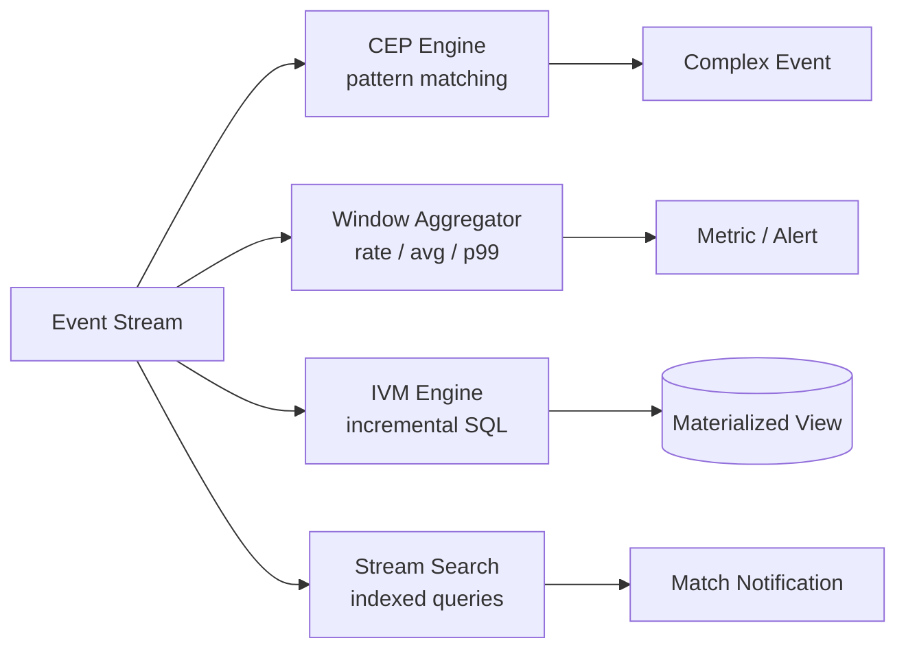

# Stream Processing Use Cases

> **One-sentence summary.** Once you have a stream you can write it to storage, push it to humans, or transform it into another stream — and that third option splits into four distinct patterns: complex event processing, stream analytics, materialized view maintenance, and search on streams.

## How It Works

Once events are flowing through a broker (see [[01-message-brokers-amqp-vs-log]]), there are three things you can do with them: (1) write them to a database, cache, or search index where other clients can query the result; (2) push them to a human via alerts, push notifications, or a real-time dashboard; or (3) transform one or more input streams into one or more output streams. This article focuses on option 3.

A piece of code that does that transformation is called an **operator** or a **job**. It is essentially a MapReduce job for unbounded data — the same sharding and parallelization patterns apply, the same map/filter primitives work — except that the input never ends. That single difference rules out sort-merge joins (you cannot sort an infinite stream) and forces a different fault-tolerance model (you cannot just restart from the beginning of a job that has been running for two years).

The key conceptual inversion versus a normal database is this: in a database, **data is persistent and queries are transient** — a query arrives, scans the data, returns, and is forgotten. In stream processing, **queries are persistent and data is transient** — long-lived standing queries sit in memory while events flow past them and get matched, aggregated, or routed.

## When to Use

The four patterns serve genuinely different needs:

- **Complex Event Processing (CEP)** — when you need to detect specific *sequences* of events, like "three failed logins followed by a password reset within five minutes" or a textbook fraud signature. Think regular expressions, but over events instead of characters.
- **Stream analytics** — when you need rolling aggregations: requests per second, p99 latency over the last five minutes, week-over-week trend comparisons. The output is a metric, not a pattern match.
- **Materialized view maintenance** — when a downstream system (cache, search index, denormalized read model from [[03-event-sourcing-immutable-logs]]) must stay consistent with the source. Unlike analytics, you usually cannot bound the window — the view depends on *all* events ever, modulo log compaction.
- **Search on streams** — when many users have standing queries that should fire whenever a matching document arrives (real-estate alerts, media monitoring, security keyword scans).

## Trade-offs

| Pattern | Query Model | State Needed | Latency | Frameworks |
|---------|-------------|--------------|---------|------------|
| **CEP** | Declarative pattern rules; engine maintains state machine per query | Per-pattern partial-match state | Sub-second | Esper, Apama, TIBCO StreamBase, Flink/Spark Streaming SQL |
| **Stream analytics** | Aggregations over bounded windows | Counters / sketches per window | Seconds | Storm, Spark Streaming, Flink, Samza, Beam, Kafka Streams; Google Dataflow, Azure Stream Analytics |
| **IVM** | SQL view definition translated to incremental operators | Full materialized view + delta buffers | Sub-second to seconds | Materialize, RisingWave, ClickHouse, Feldera, Kafka Streams + ksqlDB |
| **Stream search** | Standing search queries (often indexed) | Inverted index of *queries* | Sub-second | Elasticsearch percolator |

A few cross-cutting trade-offs worth calling out:

- **Probabilistic algorithms** (Bloom filters, HyperLogLog, t-digest) are common in stream analytics because they bound memory at the cost of approximate answers. This has led to a myth that stream processing is inherently lossy — it is not. The approximation is a deliberate optimization, not a property of the paradigm.
- **Naive `REFRESH MATERIALIZED VIEW` is the wrong tool** for keeping a view fresh against a stream: it reprocesses everything on each refresh (poor efficiency) and the view is stale between refreshes (poor freshness). IVM systems translate the SQL into operators that recompute *only what changed* — the DBSP framework is the canonical formalization.
- **Unbounded vs windowed state.** Analytics windows let state be garbage-collected; materialized view maintenance needs an "all of time" window, which is why log-compacted topics matter so much for this use case.

## Real-World Examples

- **Fraud detection, algorithmic trading, factory monitoring, military surveillance** — classic CEP territory; sequences of events trigger blocking, trades, or alarms.
- **Site analytics dashboards (rate, error %, p99 latency)** — stream analytics over tumbling or sliding windows; HyperLogLog often used for unique-visitor counts.
- **Materialize / RisingWave / Feldera** — ingest a Kafka topic, expose `CREATE MATERIALIZED VIEW`, keep it incrementally fresh, serve sub-second SQL reads. Recent events buffered in memory; periodically merged to disk.
- **Elasticsearch percolator** — register a query, get notified whenever an incoming document matches it. Used by media monitoring services and real-estate "new listing" alerts.
- **Apache Storm distributed RPC** — the rare crossover where actor-style synchronous queries are interleaved with stream events, results aggregated and returned to the caller.

## Common Pitfalls

- **Conflating analytics and view maintenance.** Pointing a windowed analytics framework at a problem that needs an unbounded materialized view will silently lose history once the window slides. Pick a framework whose state model matches the time horizon you need.
- **Using `REFRESH MATERIALIZED VIEW` on a stream-driven workload.** Cron-driven full refreshes do not scale and stale data poisons downstream consumers. Reach for IVM (Materialize, RisingWave, ksqlDB) instead.
- **Treating actor frameworks as stream processors.** Actors give you concurrency and message passing, but most do not guarantee delivery on crash and communication is typically ephemeral one-to-one. Without explicit retry/replay logic you do not get fault-tolerant processing.
- **Believing probabilistic == lossy.** Sketches are an optimization choice. Exact-count operators exist; pick them when correctness matters more than memory.
- **Indexing the documents instead of the queries** in stream search. With many standing queries and a high event rate, the right inversion is to index the queries so each event narrows down to a candidate set.

## See Also

- [[01-message-brokers-amqp-vs-log]] — the transport layer feeding every stream operator
- [[03-event-sourcing-immutable-logs]] — the canonical "all of time" source that materialized view maintenance reads from
- [[05-reasoning-about-time-and-windows]] — how analytics and CEP bucket unbounded streams into finite chunks
