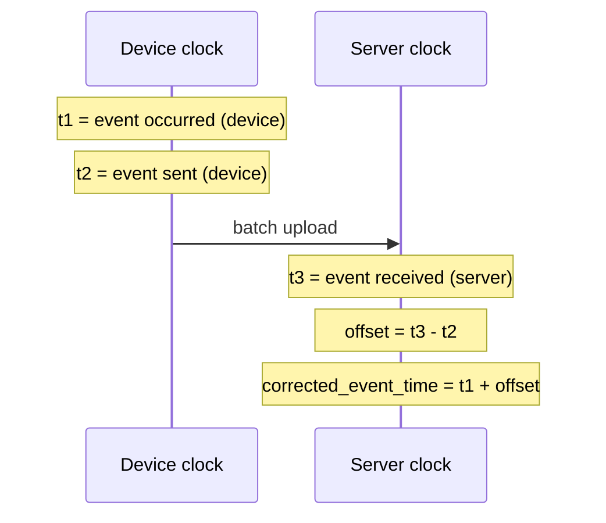

# Reasoning About Time & Windows

> **One-sentence summary.** "The last 5 minutes" is deceptively hard on a stream — you must pick between event-time and processing-time clocks, decide what to do about late stragglers, and choose a window shape (tumbling, hopping, sliding, or session) that matches the question you're actually asking.

## How It Works

A stream processor that wants to compute "requests per second over the last five minutes" needs an answer to two questions: *whose clock defines the window*, and *when can the window be closed*? Both are subtle on unbounded data.

**Event time vs. processing time.** A batch job is deterministic because it reads timestamps embedded in events; running it twice gives the same answer. Many stream frameworks instead window by the *processing-time* clock of the worker. That is simpler, but breaks under any real lag — queueing, network faults, broker contention, a consumer restart, or replay after a bug fix all delay events. The classic failure: a stream processor is shut down for one minute during a redeploy; when it restarts it drains the backlog at full speed; a processing-time rate metric will show a fake spike, even though the true request rate was flat. Think of it like the *Star Wars* release order — humans cope with episodes IV-V-VI-I-II-III-VII-VIII-IX, but a windowed aggregate over watch dates gives a nonsensical narrative.

**Stragglers.** With event-time windows you never *know* when all events for window `[t, t+Δ)` have arrived; some may still be buffered on a flaky machine. Two coping strategies: (1) close the window after a quiet period and drop late arrivals, exporting `dropped_events` as a metric you alert on; or (2) emit a *correction* — re-publish the window with stragglers folded in, retracting the old value. A *watermark* message ("no more events with timestamp < t") lets a producer signal completeness, but bookkeeping gets hard when producers join or leave.

**Whose clock?** When events are buffered far from the server (e.g., a mobile app used offline for days), you can't trust the device clock and the server clock isn't meaningful. The fix is to log three timestamps and reconstruct the offset:

Subtract `t2` from `t3` to estimate device-vs-server clock skew (assuming network delay is small), then add that offset to `t1` to recover the real event time.

## Window Types

```mermaid
gantt
  title Four windowing strategies over the same event stream
  dateFormat  HH:mm
  axisFormat  %H:%M
  section Tumbling (5m)
  W1 :a1, 10:00, 5m
  W2 :a2, 10:05, 5m
  W3 :a3, 10:10, 5m
  section Hopping (5m len, 1m hop)
  H1 :b1, 10:00, 5m
  H2 :b2, 10:01, 5m
  H3 :b3, 10:02, 5m
  section Sliding (5m gap)
  S1 :c1, 10:02, 5m
  section Session (30m idle)
  Sess :d1, 10:01, 8m
```

| Window | Shape | Overlap? | State cost | Typical use |
|--------|-------|----------|------------|-------------|
| **Tumbling** | Fixed length, contiguous boundaries | No — every event in exactly one window | Constant per window for counts/sums | Per-minute rate, per-hour billing buckets |
| **Hopping** | Fixed length, hop size `< length` | Yes — built from tumbling sub-windows | Constant per sub-window | Smoothed rolling dashboards (1-min hop, 5-min length) |
| **Sliding** | Length defined by *time between events* | Yes — boundaries floating | Buffer all events in the interval | "Any two events within 5 minutes" co-occurrence |
| **Session** | Variable length, ends after idle gap | Per-key, no fixed length | Buffer per active session key | Web analytics sessionization, user-engagement bouts |

## When to Use

- **Real-time SLO dashboards** — tumbling 1-minute windows for raw rates; hopping windows for smoothed lines that don't jitter at boundaries.
- **Sessionization for product analytics** — session windows keyed by `user_id` with a 30-minute idle gap, used for funnels, retention, and time-on-site.
- **Mobile telemetry pipelines** — events buffered offline for hours; correct timestamps via the three-clock technique before windowing, otherwise yesterday's data lands in today's bucket.

## Trade-offs

| Aspect | Advantage | Disadvantage |
|--------|-----------|--------------|
| Processing-time windows | Trivial to implement, no clock issues | Wrong under any lag — redeploys, replays, and broker stalls all fabricate fake spikes |
| Event-time windows | Deterministic, matches batch results, replay-safe | Requires straggler policy, watermarks, and late-correction logic |
| Drop stragglers | Simple, output is final | Silently lossy — must alert on dropped fraction |
| Publish corrections | Eventually accurate | Downstream must handle retractions |
| Tumbling/hopping with counts | Constant memory regardless of throughput | Boundary effects — events near edges get misattributed |
| Sliding/session/joins | Captures co-occurrence and natural user bouts | Must buffer raw events; high-throughput streams keep large state |

## Real-World Examples

- **Apache Flink and Google Dataflow** — first-class event-time semantics with watermarks and configurable allowed lateness; the canonical model for "correct" windowing.
- **Spark Streaming (DStream era)** — defaulted to processing-time microbatches, which is simple but produces the redeploy-spike artifact; Structured Streaming added event-time + watermarks later.
- **Web analytics platforms (e.g., session-based funnels)** — session windows are the standard primitive; state is keyed per visitor and flushed after the idle gap.

## Common Pitfalls

- **Windowing rate metrics by processing time.** A 10-minute outage followed by replay produces a 10× spike in `requests_per_second`, triggering false-positive alerts. Always window observability metrics by event time.
- **Trusting device clocks.** A user with a wrong-set phone clock can poison your bucket assignments years into the future or past. Use the three-timestamp offset trick or fall back to server-receive time with a known caveat.
- **Closing event-time windows too eagerly.** Without a straggler policy you silently drop late data; without a correction policy you publish wrong numbers. Pick one explicitly and monitor the drop rate.
- **Sliding windows on high-throughput streams without backpressure.** Sliding semantics force you to buffer every raw event in the interval — memory grows linearly with throughput, unlike a tumbling counter.
- **Assuming stream-time order matches event order.** Two web servers emit events for one user's two sequential requests; the second can reach the broker first. Stream operators must be coded for reordering, not assume it away.

## See Also

- [[04-stream-processing-use-cases]] — analytics and CEP are the use cases that force you to think about windows in the first place
- [[06-stream-joins]] — stream–stream joins *are* window joins, and inherit every event-time concern from this article
- [[07-stream-fault-tolerance]] — replay and recovery are exactly the scenarios that make processing-time windowing break, and that exactly-once semantics try to make safe
