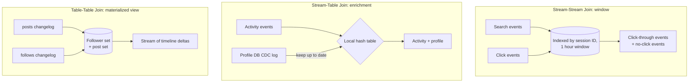

# Stream Joins

> **One-sentence summary.** Stream processing generalizes batch joins to incremental, unbounded data — but because new events can arrive at any time, joins split into three distinct shapes (stream–stream, stream–table, table–table), each with its own state requirements, window semantics, and time-dependence quirks.

## How It Works

A batch join scans two finite datasets and matches them by key. A stream join must do the same incrementally, with the awkward fact that one matching event may arrive seconds, hours, or never after the other. Every stream join therefore boils down to: **maintain state derived from one input, then query that state when records from the other input arrive.** The differences lie in *what* state, *over what window*, and *what gets emitted*.

**Stream–stream (window join).** Click-through-rate analysis: a `search` event and a matching `click` event share a session ID but may arrive minutes apart, possibly out of order, possibly never. The processor indexes both streams by session ID inside a bounded window (say, one hour). On each arrival it probes the *other* index. When the window expires without a match, it can emit a "search with no click" event — a non-event detection that you cannot get by simply embedding search context inside the click payload.

**Stream–table (enrichment).** Activity events get user-profile fields stitched onto them. A naive remote DB query per event is slow and overloads the database. Instead, the processor keeps a local hash-table copy of the profile DB and maintains it via [[02-change-data-capture]]. Conceptually this is the same as a stream–stream join where the table side has a window stretching back to the beginning of time and newer versions overwrite older ones.

**Table–table (materialized view maintenance).** The social-network home timeline cache joins a `posts` changelog with a `follows` changelog. The processor keeps both the follower set and the post set as state and emits a stream of deltas to the materialized timeline view. There is a clean differential-calculus analogy: if a stream is the derivative of a table and a join is a product `u·v`, then the change stream obeys the product rule `(u·v)' = u'·v + u·v'` — every change to `posts` joins with current `follows`, every change to `follows` joins with current `posts`.

## When to Use

- **Stream–stream**: bounded-window correlation of two event types — search/click, ad impression/conversion, request/response latency tracing, fraud signal pairs.
- **Stream–table**: enriching high-volume event streams with slowly changing reference data — user profiles, product catalogues, geo-IP tables.
- **Table–table**: maintaining a denormalized read model that mirrors a SQL `JOIN ... GROUP BY` in real time — timelines, leaderboards, dashboards, search indexes.

## Trade-offs

| Aspect | Stream–stream | Stream–table | Table–table |
|---|---|---|---|
| Inputs | two event streams | event stream + DB changelog | two DB changelogs |
| State shape | events indexed by key, both sides | local copy of one table | full state of both tables |
| Window | bounded (e.g. 1 hour) | infinite on table side, often none on stream side | infinite on both sides |
| Output | matched pairs + non-event timeouts | enriched events | stream of changes to a materialized view |
| Memory cost | proportional to window × throughput | proportional to table size | proportional to both tables |
| Replay cost | low | medium (must rebuild table) | high (must rebuild both) |

## Real-World Examples

- **Photon (Google)**: a fault-tolerant stream–stream join system designed for matching ad clicks with ad impressions, where late or duplicate events are common.
- **Kafka Streams / ksqlDB**: surfaces the distinction directly through the `KStream` (event stream) and `KTable` (changelog-backed table) abstractions; `KStream.join(KTable)` is enrichment, `KTable.join(KTable)` is materialized-view maintenance.
- **Materialize / RisingWave / Feldera**: incremental view maintenance engines that treat SQL `JOIN`s over streaming inputs as table–table joins, continuously emitting view deltas (see [[05-reasoning-about-time-and-windows]] for window concerns).

## Time Dependence and Slowly Changing Dimensions

All three join shapes share one thorny question: **when state changes over time, which version do you join with?** If a user updates their profile, do activity events emitted milliseconds earlier get the old profile or the new one? Across different Kafka partitions there is no global ordering guarantee, so the join is non-deterministic — replaying the same inputs can produce different outputs.

The data-warehousing answer is the **slowly changing dimension (SCD)**: version-stamp every revision of the record. Tax rates get a new ID each time they change; an invoice records the rate ID active at sale time. The join becomes deterministic at the cost of disabling log compaction — every historical version must be kept.

The simpler escape hatch is **denormalize**: copy the tax rate (or profile snapshot) directly into the event payload. The event becomes a self-contained fact, no join needed, no time-travel ambiguity. This pairs naturally with [[03-event-sourcing-immutable-logs]], where events are meant to be immutable records of "what happened, with the context as it was."

## Common Pitfalls

- **Confusing embedded data with a join**. Stuffing search context into the click event tells you about clicks but hides the searches with *zero* clicks — you lose the denominator of click-through rate.
- **Unbounded window state explosion**. Stream–stream windows that are too long (or skewed keys) blow up RAM. Watch p99 state size, not average.
- **Assuming cross-partition ordering**. Kafka preserves order *within* a partition only. A stream–table join can see an activity event before the profile-update CDC event that "should" have arrived first.
- **Log-compacting an SCD table**. Compaction discards old versions, breaking deterministic point-in-time joins. Either denormalize, or accept the storage cost.
- **Treating a remote DB lookup as "good enough"**. Per-event network round-trips kill throughput and turn the source DB into a single point of overload — always prefer a local CDC-fed copy.

## See Also

- [[02-change-data-capture]] — the mechanism that feeds the local table copy in a stream–table join
- [[03-event-sourcing-immutable-logs]] — the philosophical alternative: denormalize so joins aren't needed
- [[05-reasoning-about-time-and-windows]] — windows, watermarks, and the event-time vs processing-time question that haunts stream–stream joins
