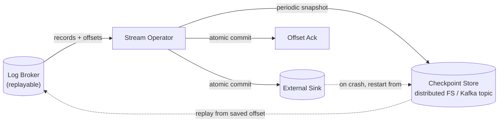

# Stream Fault Tolerance & Exactly-Once Semantics

> **One-sentence summary.** Long-running stream jobs achieve the *appearance* of exactly-once processing not by avoiding retries, but by combining microbatching/checkpointing, framework-internal atomic commits, idempotent writes, and rebuildable local state — so that crashes leave no visible duplicates or gaps.

## How It Works

In batch processing, fault tolerance is almost free: if a task crashes, the framework throws away the partial output file, restarts the task on another node, and the final result is bit-identical to a clean run. That trick works because the input is immutable and the output is only revealed when the task finishes. Streams never finish — you can't withhold output until "the end," because there is no end. So we need a finer-grained recovery story.

The principle we want is **exactly-once semantics** — sometimes more accurately called **effectively-once**. Records may physically be processed multiple times due to retries, but the *visible* effect on downstream state is as if each record was handled exactly once. No skips, no duplicates. There are four building blocks frameworks combine to achieve this: microbatching, checkpoint barriers, atomic commits internal to the framework, and idempotent writes.

**Microbatching** (Spark Streaming) chops the stream into ~1-second mini-batches and runs each as a small batch job. If a microbatch fails, its output is discarded and replayed. This implicitly imposes a tumbling window equal to the batch size, windowed by *processing time* — see [[05-reasoning-about-time-and-windows]] for why event-time vs processing-time matters here.

**Checkpoint barriers** (Apache Flink) avoid forcing a window size. Special barrier records flow through the pipeline; when an operator sees one, it snapshots its state to durable storage. On crash, every operator rewinds to the last checkpoint and the source replays from the corresponding offset.

Both stop short of a full guarantee. They give exactly-once *within the framework*. The moment output leaves — a row written to Postgres, an email sent, a message republished to an external broker — the framework can no longer "discard" the side effect on retry.

To close that gap, **atomic commit** is reapplied to streams. Outputs, state changes, and input-offset acknowledgments must persist together or not at all. This sounds like XA two-phase commit, but the implementations (Kafka's transactional API, Google Dataflow, VoltDB) keep transactions *internal* — no heterogeneous resource managers — and amortize protocol overhead across many records per transaction.

The other route is **idempotence**: design writes so that applying them N times equals applying once. `DELETE WHERE key=X` is naturally idempotent; `counter += 1` isn't. You can make non-idempotent ops idempotent by stamping each write with the source offset and deduping on replay (Storm's Trident does this). Preconditions: deterministic processing, in-order replay (only a [[01-message-brokers-amqp-vs-log]] gives you that), and no concurrent writers — use fencing tokens during failover.

Finally, stateful operators (windows, [[06-stream-joins]] tables) must **rebuild state** after a crash. Three options: (1) keep state in a remote replicated DB (slow per-event lookup); (2) keep state local and snapshot it — Flink writes snapshots to a distributed FS, Kafka Streams ships changes to a log-compacted topic, VoltDB redundantly processes on multiple nodes; (3) recompute from the input stream when the window is short or the local state is just a CDC-fed mirror.

## When to Use

- **Financial / billing pipelines** where double-charging or dropping a transaction is unacceptable — combine a log-based broker, Flink checkpoints, and a transactional sink.
- **Maintaining derived data** (search indexes, caches, materialized views) from a CDC stream — idempotent upserts keyed by primary key handle replay naturally.
- **Real-time analytics dashboards** where occasional duplication would inflate counters — use Kafka's transactional producer to make read-process-write loops atomic.

## Trade-offs

| Mechanism | Latency overhead | Output integration | Framework support |
|-----------|-----------------|---------------------|--------------------|
| **Microbatching** | High (batch size, ~1s) | Within framework only | Spark Streaming |
| **Checkpoint barriers** | Low (async snapshots) | Within framework only | Flink |
| **Internal atomic commit** | Medium (commit per N events) | Strong, but only for sinks the framework owns | Kafka transactions, Dataflow, VoltDB |
| **Idempotent writes** | Negligible | Works with any sink that supports keyed upserts | Trident, Kafka Streams, custom |

Other axes:

| Aspect | Advantage | Disadvantage |
|--------|-----------|--------------|
| Microbatch size | Larger = better throughput | Larger = higher end-to-end latency |
| Local + snapshot state | Fast per-event access | Snapshots cost disk + network bandwidth |
| Remote state store | Simpler recovery, no snapshots | Network round-trip per record kills throughput |
| Idempotence | Cheap, framework-agnostic | Requires deterministic, in-order, single-writer processing |

## Real-World Examples

- **Uber on Flink**: barrier-based checkpoints feed exactly-once aggregations for surge pricing and ETA models; failed task managers resume from the latest snapshot in HDFS.
- **LinkedIn on Kafka Streams + transactional API**: read-process-write loops use Kafka transactions so the produced output and the consumer offset commit atomically — a crash mid-transaction leaves no duplicates downstream.
- **Spark Streaming at early adopters**: chose microbatching for operational simplicity, accepting ~1s latency in exchange for reusing the existing batch scheduler and recovery model.
- **VoltDB**: replicates operator state by *redundantly executing* the same input stream on multiple nodes — no snapshots, recovery is instantaneous on the replica.

## Common Pitfalls

- **Assuming "exactly-once" means physical exactly-once.** It doesn't. Records *are* reprocessed on failure; the guarantee is about the visible effect, not the count of executions.
- **Mixing checkpointed state with non-idempotent external side effects.** Sending an email or charging a card from inside a checkpointed operator will double-fire on replay unless the sink itself is transactional or idempotent.
- **Using an AMQP-style broker (no replay) under an idempotence-based design.** Idempotence requires that replay produces the same records in the same order — only a log-based broker provides that.
- **Skipping fencing during failover.** A "dead" operator that's actually still alive can interleave writes with the new owner and break the no-concurrent-writer assumption that idempotence depends on.
- **Picking too large a microbatch.** It quietly forces a tumbling processing-time window equal to the batch size, which surprises jobs that needed event-time semantics.
- **Forgetting that checkpoints aren't free.** Snapshotting large operator state to a distributed FS every few seconds can dominate I/O; tune checkpoint interval against state size.

## See Also

- [[01-message-brokers-amqp-vs-log]] — replayable, ordered log brokers are a precondition for both checkpoint-based recovery and idempotent retries
- [[05-reasoning-about-time-and-windows]] — microbatching imposes processing-time tumbling windows, which interact with watermarks and stragglers
- [[06-stream-joins]] — stateful join operators are the main consumers of the state-recovery techniques described here
