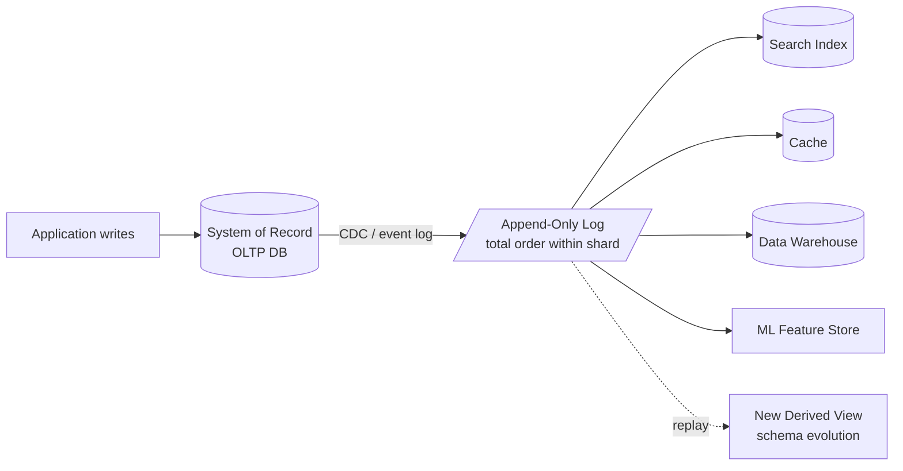

# Data Integration via Derived Data

> **One-sentence summary.** Keep heterogeneous storage systems in sync using an ordered log of events and idempotent derivations instead of cross-system distributed transactions.

## How It Works

Any nontrivial application ends up with several specialized stores: an OLTP database, a full-text index (Elasticsearch), a cache (Redis), a warehouse for analytics, and often a feature store or vector index for ML. Each is designed for a particular usage pattern, and no single product covers them all well. The integration problem is how to keep these representations mutually consistent when a fact changes.

There are fundamentally two answers. The first is to wrap every user-facing write in a *distributed transaction* — XA / 2PC — that atomically updates the database, the index, the cache, and the warehouse together. The second is to designate one store as the **system of record**, capture every change it makes to an append-only **log** (via change data capture or event sourcing), and have every other store *derive* itself from that log by applying the events in order. If the derivation is a deterministic, side-effect-free function and each step is idempotent, a crashed consumer simply resumes from its last offset and re-applies events until it catches up — no coordination with the source required.

The key asymmetry: the log funnels **all** writes through a single point that decides their order, and every downstream store processes that same ordered sequence. No two consumers can disagree about what happened, because none is authoritative — the log is. This is state-machine replication applied across tool boundaries, and it sidesteps the Figure 12-4 scenario where an app writes to two stores directly and they disagree about order.

## When to Use

- **Heterogeneous tool integration.** You have a Postgres OLTP database and need the same data searchable in Elasticsearch, cached in Redis, analyzed in Snowflake, and vectorized in a feature store. A distributed transaction spanning those vendors is not realistically available; CDC into a log is.
- **Evolving schemas and reprocessing.** Today you store users flat; tomorrow you want a graph of relationships. Because the log is the source of truth, you spin up a new consumer with the new schema, backfill from offset zero, and shift traffic gradually — the *Schema Migrations on Railways* analogy: lay a third rail (the new derived view), run mixed-gauge, then retire the old rail. Every stage is reversible because the old view is still live.
- **Unifying batch and stream.** The *lambda* architecture ran a batch path and a streaming path separately and reconciled them; it fell out of favor because maintaining two codebases was miserable. The *kappa* architecture drops the batch layer: a stream processor reads from a replayable log, so reprocessing is just rewinding the offset. Apache Beam, Flink, and Kafka Streams operationalize this.

## Trade-offs

| Aspect | Distributed transactions (XA / 2PC) | Log-based derived data |
|---|---|---|
| Consistency | Read-your-writes immediately across all stores | Derived stores are asynchronous; users may see stale reads for a window |
| Fault tolerance | Any participant failure aborts the whole transaction — faults amplify | A slow or broken consumer falls behind in isolation; others keep running |
| Heterogeneity | In practice XA rarely works across different vendors | Works across any store that can consume the log |
| Throughput | Coordination on every write caps throughput | Asynchronous fan-out; the log is the only bottleneck |
| Operational cost | Transaction manager, heuristic decisions, in-doubt locks | One more piece of infrastructure (Kafka, Pulsar) plus connector zoo |
| Ordering guarantee | Global atomic commit | Total order **within a log shard**; ambiguous across shards |

The last row is the deep caveat: **total order has limits**. A single-leader log scales only as far as one machine's throughput. Past that you shard, and events in different shards have no defined order. Geo-distributed deployments add a leader per region with similar ambiguity. Microservices deliberately refuse to share a log. Offline-capable clients produce events whose order the server cannot dictate. When any of these apply, total-order broadcast becomes infeasible — consensus is defined per log, not per universe — and you fall back to logical timestamps plus conflict resolution, or to routing causally linked events (e.g. all updates for one object ID) to the same shard so at least *that* subset stays totally ordered.

## Real-World Examples

- **Kafka + Debezium**: Debezium reads the Postgres / MySQL write-ahead log and publishes each row change as a Kafka record; Kafka Connect sinks feed Elasticsearch, S3, Snowflake, and BigQuery from the same stream.
- **LinkedIn's "log post"**: Jay Kreps' 2013 essay *The Log: What every software engineer should know about real-time data's unifying abstraction* was the original articulation of this pattern and the motivation for Kafka.
- **Apache Beam / Flink**: one dataflow program runs against bounded (batch) or unbounded (streaming) input, so reprocessing the archive uses the same operator graph as live processing — kappa in production.
- **Materialize, RisingWave, ksqlDB**: streaming SQL engines that maintain derived views as first-class output of the event log.

## Common Pitfalls

- **Assuming derived stores are strongly consistent.** They are asynchronous by design. A user who just updated their profile may not see the change in search for a few seconds. If UX cannot tolerate that, read-after-write from the system of record, surface the optimistic local value, or add a synchronous hop — do not pretend the index is up-to-the-millisecond.
- **Writing to two stores directly from the application.** The Figure 12-4 failure mode: two clients issue conflicting writes, the database applies them in one order, the search index in the other, and they become permanently inconsistent with no tiebreaker. Pick one system-of-record and derive everything else from it.
- **Trusting XA across different vendors.** The standard promises cross-product atomic commit; reality is heuristic decisions, in-doubt transactions holding locks for hours, and coordinators that become single points of failure. XA has poor fault tolerance and is unlikely to get better.
- **Ignoring causal links across shards.** If "unfriend" and "send message" live in different shards, a notification consumer can see them out of order and message the wrong person. Route causally related events to the same shard, or attach logical timestamps.

## See Also

- [[02-unbundling-the-database]] — once you take the log seriously, the whole organization starts to look like one database whose components (indexes, materialized views, replication) are independent services; this is the natural next step.
- [[03-applications-around-dataflow]] — how application code itself becomes a deterministic derivation function over the log, not a collection of RPC endpoints.
- [[05-end-to-end-argument-and-idempotence]] — why idempotent consumers (keyed by a client-generated request ID) are what make "just replay the log on failure" actually safe.
- [[03-systems-of-record-and-derived-data]] — the Chapter 1 introduction of the distinction this whole pattern rests on.
- [[07-event-sourcing-and-cqrs]] — the data-modeling style most naturally aligned with log-based derivation.
