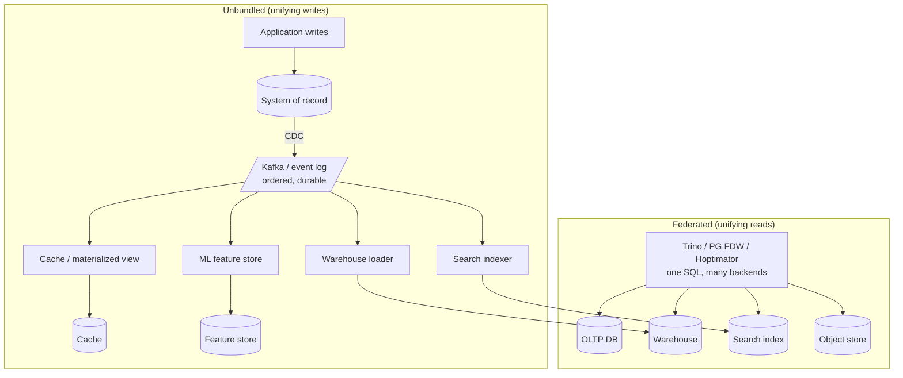

# Unbundling the Database

> **One-sentence summary.** Stop treating the organization's storage landscape as a zoo of disconnected products and start treating it as one giant, distributed database whose indexes, materialized views, and replication are maintained by independent, loosely-coupled components wired together with event logs.

## How It Works

Two traditions have always been in tension. The **relational** tradition hands the developer a short declarative query and hides index maintenance, join planning, concurrency control, crash recovery, and replication inside one monolithic engine. The **Unix** tradition hands the developer small tools that each do one thing well, communicating through a uniform low-level interface (pipes, byte streams) and composed with a higher-level language (the shell). The NoSQL era, CDC, stream processors, and distributed filesystems are all, at heart, Unix-style pushback against the integrated engine. Unbundling is the conscious attempt to combine the two — to get the composability of Unix with semantics strong enough to keep data consistent.

The unbundling insight comes from looking at a familiar command in a new light. When you run `CREATE INDEX`, the database scans a consistent snapshot of the table, sorts the indexed values, writes the new index, then catches up on writes that occurred during the scan, and finally keeps the index fresh on every subsequent transaction. That is *exactly* the procedure used to set up a new follower replica and to bootstrap a CDC consumer: snapshot, backfill, tail. An index is just another derived view, and the machinery that keeps it current is the same machinery we already build across services. Once you see this, the dataflow across an entire company — ETL jobs, search indexes, caches, data warehouses, ML feature stores — starts to look like one huge database, in which batch and stream processors are elaborate triggers and materialized-view maintainers, and each derived store is a different "index type" run by a different team.

There are two complementary avenues for composing the giant database. **Federated databases** (polystores) unify *reads* by layering a single query interface over heterogeneous engines — PostgreSQL foreign data wrappers, Trino, and Hoptimator translate one SQL query into sub-queries against many stores and stitch the results back together. **Unbundled databases** unify *writes* via CDC plus an event log plus idempotent consumers: the log becomes the cross-system equivalent of an index-maintenance trigger, synchronously-committed in one system and asynchronously-derived into all the others.

## When to Use

- **No single product covers all access patterns.** OLTP writes in one engine, analytical scans in a warehouse, full-text in a search index, vectors in another, blobs in object storage — the moment your needs span more than one specialized engine, composition is already happening; the choice is whether it is principled.
- **Different teams own different subsystems.** Unbundling gives each team a narrow contract (produce/consume from the log) so they can evolve internals and operational quirks independently, the way Unix tools evolve behind stdin/stdout.
- **Loose coupling is a hard requirement.** If a slow or crashed consumer must not take the producer or sibling consumers down with it, you want an asynchronous log buffering between them — the opposite of the cascading-failure mode induced by synchronous distributed transactions.

## Trade-offs

| Aspect | Integrated database | Unbundled / composed architecture |
|---|---|---|
| Operational complexity | One product, one learning curve, one set of quirks | Many moving parts, each with its own failure modes and runbooks |
| Performance on designed workload | Deep — optimized end-to-end for the workload it targets | Shallower per workload; pays glue cost in latency and consistency |
| Breadth of workloads | Narrow — you get what the vendor ships | Wide — mix specialized engines for each access pattern |
| Failure isolation | A bug or overload in one subsystem can take the whole engine down | Log buffers between stages; a slow consumer stays local |
| Team autonomy | Central DBA team and schema gatekeeping | Each team owns a producer or consumer behind the log contract |
| Evolvability | Bound to the vendor's release cycle | Swap a component by spinning up a new consumer and backfilling |

| Axis | Federated (unifying reads) | Unbundled (unifying writes) |
|---|---|---|
| Solves | Cross-store queries without moving data | Cross-store synchronization without XA |
| Feels like | Relational tradition — declarative façade, complicated insides | Unix tradition — small tools, pipes, composition |
| What it does not give you | Write consistency across stores | A single query language over everything |

## Real-World Examples

- **Debezium**: extracts ordered change streams out of Postgres, MySQL, MongoDB, and others — the CDC source that turns an operational DB into the head of an event log.
- **Apache Kafka**: the de facto event-stream standard; the durable, partitioned log that plays the role of "pipe" in the unbundled architecture.
- **Materialize, RisingWave, Feldera**: incremental view maintenance engines — effectively *unbundled* materialized-view maintainers that run outside any single database and consume CDC streams.
- **Trino, PostgreSQL foreign data wrappers, Hoptimator, Xorq**: federated query engines that fit the *reads* side of the picture — one SQL over many backends.
- **Linkedin-style data platforms**: the original motivation; CDC from Oracle/MySQL into Kafka, fanned out into Espresso, Pinot, Venice, and search indexes, each maintained by a specialist team.

## Common Pitfalls

- **Premature unbundling.** Breadth-not-depth is the explicit goal, and composing five products is always more work than running one. If a single engine covers your workload, use it — unbundling is for when no one product fits, not a trophy architecture.
- **Assuming XA or heterogeneous 2PC will fix cross-system writes.** Distributed transactions across different vendors' systems are fragile, poorly supported, and escalate local faults into global ones. Use ordered event logs with idempotent consumers instead — see [[01-data-integration-via-derived-data]].
- **Forgetting you still need databases.** Unbundling does not abolish DBs; stream processors need durable state stores, and query results still need to be served from an index, cache, or warehouse. The log is glue, not a destination.
- **Treating the log as a bus, not a database.** If consumers cannot replay from the beginning, you cannot add new derived stores or re-derive after a bug. Retention, partitioning, and ordering guarantees are the contract — not niceties.
- **Ignoring schema and compatibility.** The log becomes the cross-team interface. Without schema evolution discipline (see Chapter 5 on rolling upgrades), one producer change silently corrupts every downstream derivation.

## See Also

- [[01-data-integration-via-derived-data]] — the log-and-idempotence substrate that makes unbundled writes work at all.
- [[03-applications-around-dataflow]] — once the database is unbundled, applications themselves become stream operators over those logs.
- [[05-dataflow-through-databases]] — data outlives code, which is why the log-as-source-of-truth pays off across the many generations of consumers built on top of it.
- [[07-event-sourcing-and-cqrs]] — the application-level cousin of unbundling: one write model, many specialized read models.
- [[06-query-execution-and-materialized-views]] — the integrated-engine version of what incremental view maintenance engines now offer as unbundled components.
