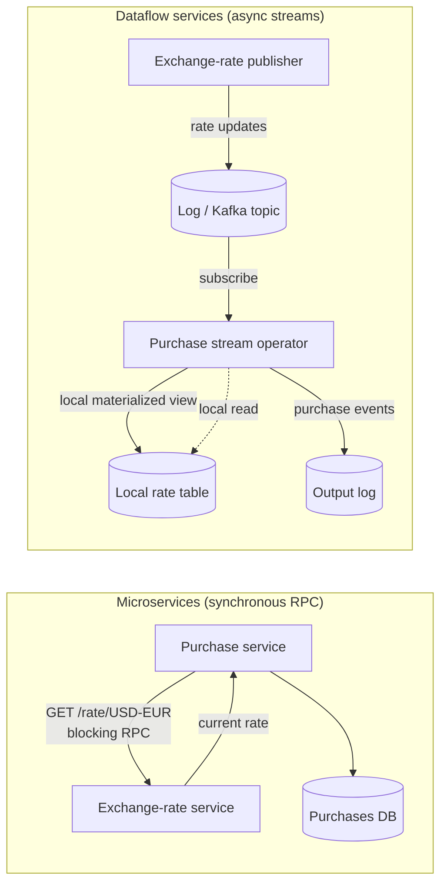

# Designing Applications Around Dataflow

> **One-sentence summary.** Build applications as compositions of stream operators where each piece of application code is a deterministic derivation function over ordered event logs, cleanly separating stateless logic from managed state.

## How It Works

The core idea is older than it looks. A spreadsheet is a dataflow program: put `=SUM(A1:A10)` in a cell and whenever any input changes, every dependent cell recomputes automatically. VisiCalc had this in 1979. We want exactly that guarantee at the data-system level — when a record changes, every index, cache, materialized view, and downstream derived dataset that depends on it should refresh itself, and the application author should not have to think about *how*. Everything in this chapter is an attempt to recover that property for systems that also have to be fault-tolerant, durable, sharded, and glued together from independently-developed tools.

Each derived dataset has a *derivation function* — the transformation from source data to derived data. A secondary index is the trivial case: pick out the indexed columns and sort by them. `CREATE INDEX` is enough. A full-text index needs tokenization, stemming, and language detection; some of that is generic, much is domain-specific. ML feature engineering is almost entirely custom, shaped by intimate knowledge of the product. Once the derivation function stops being cookie-cutter, custom application code is required — and that is where databases fall down as hosts. Stored procedures, triggers, and user-defined functions exist, but databases were never designed as deployment environments: no rolling upgrades, no package management, weak version control, poor metrics, awkward network calls, painful integration with external services. Kubernetes, Docker, Mesos, and YARN do a far better job at running arbitrary code, precisely because that is all they do.

So keep the two concerns apart. As the functional programming joke goes, *"we believe in the separation of Church and state"* — Alonzo Church's lambda calculus has no mutable state, and modern web apps likewise keep stateless logic on app servers while the database holds persistent state. The missing ingredient is the spreadsheet's *push* model: in most languages you cannot subscribe to a mutable variable, you can only poll it, and databases inherit that passivity. Stream processors fix this. They host the derivation code outside the database, consume an ordered log of state-change events, and emit further state-change events — Unix pipes for data, where each operator is a composable function. The log-based broker provides stable ordering and fault-tolerant delivery (much cheaper and more robust than distributed transactions), and the stream processor provides a real runtime for application code.

On the left, every purchase pays for a network round-trip and is hostage to the rate service's uptime. On the right, the purchase operator subscribed once, the log keeps its local rate table fresh, and processing a purchase is a *local* query — effectively a stream-table join between purchases and exchange-rate updates. The fastest, most reliable network request is the one you do not make.

## When to Use

- **Per-request latency matters and synchronous RPC chains are hurting you.** Replace the chain with a local materialized view populated by a subscription, and a request becomes a local lookup.
- **You need replayable history.** Because the inputs are logs and the code is a deterministic function, you can rerun the pipeline over the whole log to rebuild any derived view — useful for schema changes, bug fixes, new indexes, or backfilling a new feature.
- **Different teams need loose coupling but strong ordering.** Asynchronous streams give each team independent deployability (like microservices) while the log gives you a globally ordered, replayable source of truth (unlike microservices).

## Trade-offs

| Aspect | Microservices (sync REST/RPC) | Dataflow services (async streams) |
|---|---|---|
| Latency of a dependent lookup | Network round-trip per request | Local cache / materialized view lookup |
| Fault tolerance | One downstream service down breaks the chain | Log buffers events; consumers catch up when healthy |
| Throughput | Bounded by slowest dependency | Each operator scales independently on its own partition |
| Time-dependent joins | Trivial — "current rate" is whatever the service returns | Subtle — reprocessing must use the *historical* rate captured at event time |
| Operational familiarity | Mainstream: REST, OpenAPI, tracing, service mesh | Newer: log brokers, state stores, exactly-once semantics |
| Replay / backfill | Hard — no canonical ordered history | Natural — rerun the operator over the log |
| Evolvability | Contract changes ripple through callers | Add a new consumer; old ones keep working |

## Real-World Examples

- **Apache Kafka Streams, Samza, and Flink** provide the runtime: stream operators that maintain local state stores populated from Kafka topics, turning applications into compositions of stream-table joins.
- **LMAX Architecture** (written up by Martin Fowler) is the classic non-Kafka example — a single-threaded business-logic processor fed by an input log, with derivations rebuilt by replay; pioneered in high-frequency trading.
- **LinkedIn** pushed this style at scale with Samza on top of Kafka, initially to decouple teams publishing and consuming derived views like the social graph, search indexes, and the newsfeed.

## Common Pitfalls

- **Ignoring the time-dependence of joins.** Reprocessing a three-year-old purchase event against *today's* exchange-rate table is wrong. The derivation must join against the rate as of the purchase's event time, which usually means versioning the rate stream by timestamp and performing an as-of lookup — not a plain "current value" query. See [[05-end-to-end-argument-and-idempotence]] for why reprocessing correctness matters.
- **Trying to subscribe to a mutable DB variable.** Most databases only let you poll. If you treat a traditional OLTP table as your change source, you need [[07-event-sourcing-and-cqrs]] or CDC tooling to turn updates into a subscribable stream — you cannot just read-and-hope.
- **Sneaking shared state into a "stateless" service.** Two dataflow services that both read and write the same table have defeated the Church/state separation: now ordering, consistency, and coupling leak back in through the shared DB. State belongs to one operator, exposed only as an output stream.
- **Using stored procedures as the derivation host.** Tempting because the code sits next to the data, but you lose rolling upgrades, package management, metrics, and external integrations — the very reasons [[02-unbundling-the-database]] pushes derivation out of the DB in the first place.

## See Also

- [[02-unbundling-the-database]] — the architectural precondition: treat dataflow across the org as one big database whose parts are loosely coupled.
- [[04-write-path-and-read-path]] — where the derived view materializes the boundary between eager (write-path) and lazy (read-path) work.
- [[05-end-to-end-argument-and-idempotence]] — how to make the reprocessing story correct even under duplicates and retries.
- [[07-event-sourcing-and-cqrs]] — the canonical way to turn mutations into a subscribable log of events.
