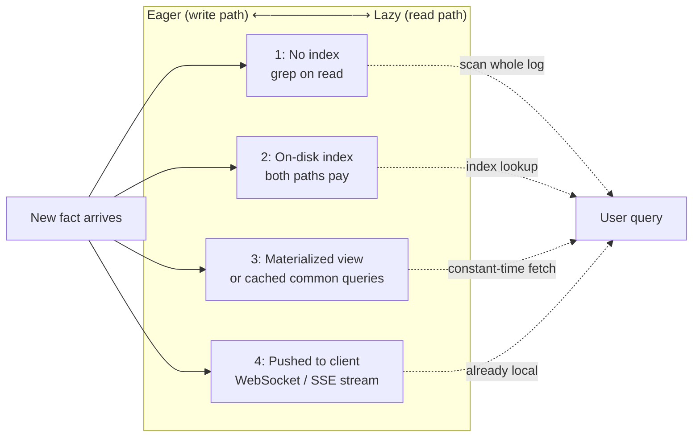

# Write Path, Read Path, and Observing Derived State

> **One-sentence summary.** Every derived dataset — cache, index, materialized view — is a chosen boundary between eager write-path work and lazy read-path work; slide that boundary far enough and end-user devices become live subscribers instead of pollers.

## How It Works

When new data enters a system, some work can be done *now* (while the writer is waiting) and some can be deferred until *someone asks*. The eager portion is the **write path**: CDC capturing a row change, a stream processor updating a running aggregate, an inverted index absorbing the new document. The deferred portion is the **read path**: the query that walks the index, intersects posting lists, ranks, returns. These are eager and lazy evaluation under different names. The **derived dataset** — index, cache, materialized view — is the place where the two paths meet; it exists so read-time cost is paid against a shape the writer already prepared.

A full-text search index is the canonical illustration. Zero write-path work means `grep` per query — cheap writes, brutal reads. Precomputing every possible query keyed by query string means trivial reads, but the query space is exponential in the vocabulary, so the write path is infeasible. Real systems land in between: an inverted index pays a bounded write cost per document and a bounded read cost per query. Caches, secondary indexes, and materialized views are not distinct things — they are all **different choices of where to place the boundary** on one spectrum.

The Chapter 2 home-timeline case study is the same idea in different clothes. For the median user, posts are fanned *out* into each follower's precomputed timeline — maximum write path, trivial read. For a celebrity with millions of followers, that fan-out would overwhelm the writer, so posts are fanned *in* at read time, joined only when the follower opens the app. Twitter's hybrid is a per-user choice of boundary based on which side of the inequality is cheaper.

## When to Use

- **Read QPS greatly exceeds write QPS.** Shift toward the write path: build indexes, materialize views, cache common queries. Pay the work once per write so you don't pay it thousands of times per read.
- **Queries are unpredictable or ad-hoc.** Shift toward the read path. You cannot precompute what you cannot anticipate, and a speculatively materialized view nobody queries is pure overhead. OLAP exploration against raw columnar storage sits here.
- **Offline or low-latency UX matters.** Extend the write path *past* the server into the client. State streamed over WebSockets or server-sent events removes a network round-trip from every read and keeps the UI working when the network drops. On-device state becomes a cache of server state; the pixels on screen become a materialized view of the client's model, which is itself a replica of the server's.
- **Reads that are themselves cross-shard aggregations.** When answering one query means joining across shards (fraud scoring against reputation databases sharded by IP, email, billing address; counting people who have seen a URL via the union of followers of everyone who posted it), model the read itself as an event. Route it through the same stream infrastructure used for writes and let a copartitioned stream-table join do the work.

## Trade-offs

| Boundary choice | Write cost | Read cost | Freshness | Operational complexity |
|---|---|---|---|---|
| No index (read-time scan) | None | O(corpus) per query | Always current | Trivial — just store the log |
| On-disk index | O(terms-per-doc) per write | O(query-terms × log n) | Updated with write | Moderate — index maintenance, compaction |
| Materialized view / cached common queries | O(views affected) per write; view can be expensive | O(1) or very small | Lags writes by view-maintenance delay | High — invalidation, refresh policy, backfill on schema change |
| Pushed to client (write path extends to device) | Write path plus fan-out over pub/sub to every subscribed client | Zero — state is already local | Near-instant while online; stale during offline gap, reconciles via consumer offset | Very high — pub/sub infrastructure, per-device subscription state, reconnect semantics, conflict resolution |

## Real-World Examples

- **React and Elm** re-render UIs in response to state changes; they are waiting for servers to push state into that pipeline instead of making the client poll.
- **Meteor, Apollo Client, Firebase Realtime Database, RxDB, and sync-engine frameworks** are commercial instances of "extend the write path to the client" — the database is effectively replicated onto every logged-in device and writes propagate over a subscription channel. See [[04-sync-engines-and-local-first-software]].
- **Twitter home-timeline fan-out split** — ordinary users fan out on write, celebrities fan in on read. The same system runs both halves of the spectrum simultaneously. See [[01-social-network-timeline-case-study]].
- **Storm's distributed RPC** routes read queries as events across shards, collecting partial results into a response stream. Used at Twitter to compute the reach of a URL across follower sets.
- **Data warehouse query engines** build internal dataflow graphs much like stream-processor topologies for cross-shard joins; warehouse materialized views ([[06-query-execution-and-materialized-views]]) are the pre-pushed boundary for common analytical queries.

## Common Pitfalls

- **Treating "push state to the client" as a UI concern.** It is not. Extending the write path to devices ripples back to storage: the database must expose a subscription interface, the app must route change events, the broker must track per-device offsets, and request/response frameworks give way to publish/subscribe dataflow. This is a multi-quarter rewrite, not a frontend sprint.
- **Logging every read without planning for the cost.** Reads-as-events unlocks provenance and causal tracking, but can double event-log write volume and dominate I/O. Optimising the overhead is still an open research problem; only adopt it when the audit or multishard-join payoff justifies it.
- **Mixing polling and subscription on the same surface.** A page that polls some data and subscribes to the rest tends to suffer both failure modes at once: staleness from the polled parts *and* subscription storms from the pushed parts.
- **Forgetting that "fresh" is relative to the boundary.** A materialized view lags writes; a cached query lags harder; a client-side replica lags during offline windows. Do not promise "real time" unless the full path — from origin write through every derived view to the pixel — is engineered for it end to end.

## See Also

- [[03-applications-around-dataflow]] — dataflow services *are* the stream operators maintaining derived datasets; this concept is about where on that dataflow the eager/lazy boundary sits.
- [[01-data-integration-via-derived-data]] — keeping heterogeneous stores in sync via an event log; every derived store is another boundary choice.
- [[01-social-network-timeline-case-study]] — fan-out-on-write vs. fan-in-on-read as the canonical per-user boundary placement.
- [[04-sync-engines-and-local-first-software]] — mechanics of extending the write path onto offline-capable devices.
- [[06-query-execution-and-materialized-views]] — materialized views inside a single query engine, which this concept generalises across systems.
