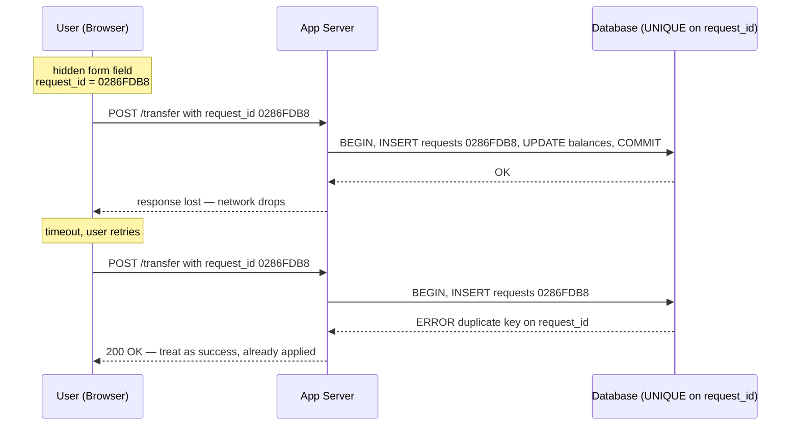

# The End-to-End Argument and Idempotent Operations

> **One-sentence summary.** Because duplicates and corruption can slip past any single hop, exactly-once correctness must be built at the application endpoints — typically by threading a client-generated request ID through every layer and enforcing idempotence there.

## How It Works

Saltzer, Reed, and Clark's 1984 **end-to-end argument** says that a function "can completely and correctly be implemented only with the knowledge and help of the application standing at the endpoints of the communication system." Implementing it inside the communication fabric is, at best, a performance enhancement. The canonical case study for data systems is duplicate suppression. TCP sequence numbers dedupe packets *within one connection*. A database transaction dedupes statements *within one transaction*. Two-phase commit dedupes an *in-doubt transaction* when the coordinator reconnects. None of these help when a user's browser POSTs a form, times out, and the user clicks "Submit again." From the app server's point of view that is a fresh request; from the database's, a fresh transaction. The `BEGIN; UPDATE accounts SET balance = balance + 11.00 ...; COMMIT;` transfer executes twice and $22 moves instead of $11.

The fix has to live at the endpoints — the browser and the database. The browser generates a request ID (a UUID embedded in a hidden form field, or a hash of the form fields themselves) and threads it through every layer. The database enforces a `UNIQUE` constraint on a dedicated `requests` table. The second arrival of the same ID fails the `INSERT`, which aborts the transaction, which guarantees the `UPDATE` statements never run a second time. Relational databases enforce uniqueness correctly even at weak isolation levels — an application-level check-then-insert would be vulnerable to [[05-write-skew-and-phantoms]] under anything less than serializable.

```sql
ALTER TABLE requests ADD UNIQUE (request_id);

BEGIN TRANSACTION;
  INSERT INTO requests (request_id, from_account, to_account, amount)
  VALUES ('0286FDB8-D7E1-423F-B40B-792B3608036C', 4321, 1234, 11.00);

  UPDATE accounts SET balance = balance + 11.00 WHERE account_id = 1234;
  UPDATE accounts SET balance = balance - 11.00 WHERE account_id = 4321;
COMMIT;
```

The `requests` table doubles as an event log, so the two `UPDATE` statements do not strictly have to live in the same transaction as the `INSERT` — a downstream consumer can derive the balances from the request events as long as each event is processed exactly once, which is itself enforced by the request ID. This is the bridge to [[07-event-sourcing-and-cqrs]].



## When to Use

- **Operations that are not naturally idempotent.** Money transfers, sending emails or push notifications, incrementing a counter, decrementing stock — anything where "apply the operation twice" is not equivalent to "apply it once."
- **Retry at a higher layer than the dedup layer.** Any time a client, SDK, or proxy can resend a request after the connection that originally carried it is gone (mobile networks, CDNs, load balancers, service meshes), TCP-level and DB-level dedup are bypassed by construction.
- **Stream processors claiming exactly-once semantics.** The framework gives you exactly-once *within the job*, but downstream sinks (databases, HTTP endpoints, webhooks) still need endpoint-level idempotence to survive reprocessing after a checkpoint rollback.

## Trade-offs

Each layer of deduplication catches a different class of duplicate. Lower layers are cheap and broadly applicable; higher layers are the only ones that catch the duplicates that actually hurt users.

| Layer | What it catches | What slips through | Cost |
|---|---|---|---|
| TCP sequence numbers | Duplicated/reordered IP packets within one connection | Anything after reconnect, or any retry initiated above TCP | Nearly free — kernel handles it |
| DB transaction (per-connection) | Duplicate statements within one BEGIN...COMMIT | Client retries after a COMMIT-timeout; retries on a new connection | Already paid for by using transactions |
| 2PC (per-distributed-transaction) | Coordinator can reattach to an in-doubt transaction and tell it commit/abort | Fresh user-initiated retries; any duplicate above the coordinator | Heavyweight — blocking, operational cost, requires all participants to cooperate |
| End-to-end request ID + UNIQUE constraint | Duplicate *business operations* no matter how they arrived | Bugs that assign the same ID to different operations, or different IDs to the same operation | One UUID per request + one indexed column |
| TCP/Ethernet/TLS checksums | Bit-flips on the wire | Bugs in sender/receiver software, disk corruption after receipt | Free in hardware/kernel |
| End-to-end application checksums | Corruption anywhere in the pipeline, including app bugs and disks | Only what you don't checksum | One hash per payload, verified at the far endpoint |
| WiFi WPA / TLS encryption | Local snoopers / on-path network attackers | Server-side compromise, rogue intermediaries with valid certs | Free |
| End-to-end encryption | Everything except compromise of the two endpoints themselves | Key management becomes the hard problem | Higher operational complexity, no server-side processing of plaintext |

The point is not that the lower layers are useless — without TCP's reordering, HTTP would be a mess. The point is that their dedup/integrity guarantees end at their layer boundary, so correctness at the business-operation level must be re-established at the endpoints.

## Real-World Examples

- **Stripe idempotency keys.** The public Stripe API accepts an `Idempotency-Key` header on every POST. Stripe stores the key and the full response, and replays the stored response on any retry with the same key for 24 hours. This is the end-to-end argument sold as a SaaS feature.
- **Kafka exactly-once semantics.** Producers get a monotonically increasing sequence number and a producer ID (with epoch fencing on re-init); the broker rejects duplicate `(producer, seq)` pairs. This is end-to-end dedup between producer and broker — but downstream consumers still need their own idempotence if *their* sinks can double-apply.
- **HTTP `Idempotency-Key` header** (IETF draft-ietf-httpapi-idempotency-key). Standardizes the Stripe pattern for any HTTP API.
- **S3 multipart uploads.** Each part upload carries an upload ID plus part number; S3 deduplicates by that pair, so retrying a failed `UploadPart` is safe.

## Common Pitfalls

- **Using a database-generated ID as the "unique" identifier.** The DB assigns the ID on insert, so a retry — which also inserts — gets a *different* ID and the row is duplicated. The ID has to come from the client, before the first attempt.
- **Relying on TCP to dedupe across a reconnect.** TCP's duplicate suppression scope is the TCP connection. A new connection is a new world.
- **Assuming "exactly-once" stream processing makes downstream writes idempotent.** It guarantees the framework will not reprocess its own state twice; it does not guarantee your HTTP sink, your email send, or your external DB write is idempotent. See [[07-async-dataflow-brokers-actors-durable-execution]].
- **Application-level check-then-insert under non-serializable isolation.** Two concurrent transactions can both `SELECT ... WHERE request_id = ?`, both see nothing, both `INSERT`, and you have a duplicate. Only a `UNIQUE` constraint (or serializable isolation) is safe — the classic [[05-write-skew-and-phantoms]] trap.
- **Discarding request IDs after "success."** A retry that arrives minutes later (because a queue re-drove it) has to find the original ID, not a clean slate. TTL the idempotency table generously, or keep it forever and treat it as an event log.

## See Also

- [[06-coordination-avoiding-constraints]] — scaling the same request-ID trick to cross-shard uniqueness without 2PC.
- [[07-trust-but-verify-auditability]] — end-to-end integrity checks, the other half of the Saltzer/Reed/Clark argument.
- [[03-applications-around-dataflow]] — why the application layer is where correctness has to live when the data system is unbundled.
- [[07-two-phase-commit-distributed]] — the heavyweight alternative the end-to-end request ID is designed to avoid.
- [[05-write-skew-and-phantoms]] — why application-level check-then-insert is unsafe and the `UNIQUE` constraint is required.
