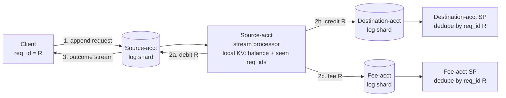

# Enforcing Constraints Without Coordination

> **One-sentence summary.** Route all potentially-conflicting writes to the same log shard so a single-threaded stream processor can order them deterministically — scaling uniqueness and multishard atomicity without an atomic-commit protocol, by separating *integrity* (must hold) from *timeliness* (may lag).

## How It Works

The key move is to split "consistency" into two independent properties. **Timeliness** means a client reads an up-to-date state; violations are temporary and self-healing — wait, retry, and the read-after-write lag goes away. **Integrity** means no data loss and no contradictions — a violation is *permanent*, and waiting does not fix corruption. Traditional ACID bundles both (strict serializability gives you linearizability *and* atomic commit), so the distinction looks inconsequential. Event-based dataflow decouples them. In slogan form: violations of timeliness are allowed under eventual consistency, whereas violations of integrity result in perpetual inconsistency. Integrity is almost always the property that matters more — a credit-card statement lagging by a day is a minor annoyance; the statement balance not equalling the sum of its transactions is catastrophic. Coordination-avoiding systems trade timeliness for integrity on purpose.

Uniqueness constraints require consensus — if two clients concurrently claim the same username, somebody has to be told "no," and async multi-leader replication cannot do it because conflicting writes get independently accepted on different leaders. But you can scale consensus by sharding on the unique value. Hash the username, pin every request for that name to the same log shard, and a single-threaded stream processor reads the shard in order, keeps a local KV of taken names, and emits `success` or `rejected` to an output stream. The client watches the output stream for its request ID. This is the "consensus via total-order broadcast" construction from [[05-consensus-and-its-equivalent-forms]]: the shared log *is* the consensus primitive, and throughput scales by adding shards. The same pattern handles any constraint whose conflicts partition statically — seat bookings, inventory reservations, per-account balances — as long as all potentially conflicting writes route to the same shard.

Multishard operations (pay Alice, debit Bob, collect a fee) look like they demand distributed transactions, but the dataflow rewrite avoids atomic commit entirely. The client appends one event — the transfer request with a client-generated request ID — to the log shard keyed on the *source* account. That single append is the atomic step. The source-account stream processor reads its log deterministically, checks its local balance, and if funds suffice emits three events carrying the same request ID: a `debit` back to the source shard, a `credit` to the destination shard, and a `fee` event to the fees shard. Each downstream processor dedupes on request ID (see [[05-end-to-end-argument-and-idempotence]]). If the source processor crashes mid-way, at-least-once delivery replays the input, determinism produces the same outputs, and downstream dedupe absorbs the duplicates. Atomicity comes from the single log append, not from 2PC. The price is timeliness: to learn the outcome, the client subscribes to the output stream and waits for the `debit` event.

One request ID R flows through three shards: a single atomic append drives deterministic fan-out, and each downstream shard dedupes on R so replays are safe.

## When to Use

- **Hard uniqueness on a shardable key** — usernames, email addresses, filenames in a bucket, one-seat-per-ticket. Shard by the uniqueness key, keep conflicts local, and you get consensus throughput that scales linearly with shard count.
- **Multishard operations where 2PC is too expensive or spans heterogeneous systems** — payments moving across accounts, inventory deductions feeding search and analytics, any "update A and B atomically" that today uses XA across a SQL database and a message broker.
- **Geo-distributed deployments** — multi-leader across regions with asynchronous inter-region replication. Synchronous cross-region coordination has unacceptable latency; dataflow gives each datacenter local autonomy while preserving integrity globally.
- **Business domains where an apology is cheaper than prevention** — hotel and airline overbooking, e-commerce stock-outs, bank overdrafts. These constraints are *loose*: occasional violations are fixed with compensating transactions (refunds, upgrades, overdraft fees). If the apology cost is low enough, optimistic writes plus after-the-fact reconciliation beats the cost of coordination on the critical path.

## Trade-offs

### ACID atomic commit vs. coordination-avoiding dataflow

| Aspect | ACID / 2PC / strict serializability | Coordination-avoiding dataflow |
|---|---|---|
| Throughput | Limited by cross-shard coordination; every txn waits for all shards | Scales per-shard; shards independent |
| Latency | Synchronous commit round-trips across all participants | One local log append; downstream async |
| Fault isolation | One slow/crashed participant stalls the whole transaction | Each shard processes independently; crashes replay locally |
| Geo-distribution | Requires synchronous coordination across regions (painful) | Natural fit for multi-leader / per-region deployments |
| Implementation complexity | Battle-tested in single DBs; XA across heterogeneous systems is notoriously fragile | Requires log, deterministic processors, end-to-end request IDs, subscribe-for-outcome UX |
| Programmer model | Familiar `BEGIN/COMMIT`; immediate read-your-writes | Must design outcome streams and dedupe; reads are asynchronous |

### Approaches to hard-uniqueness constraints

| Approach | Pros | Cons |
|---|---|---|
| Sharded log + single-threaded SP | Scales horizontally; same primitive handles arbitrary constraints; deterministic replay | Async outcome; can't use multi-leader replication within a shard |
| Two-phase commit (2PC) | Synchronous, familiar | Coordinator blocking, poor tail latency, hard across heterogeneous systems |
| Leaderless quorum (Dynamo-style) | High availability | Cannot enforce uniqueness safely — concurrent accepts on different replicas create duplicates |

## Real-World Examples

- **Twitter's Manhattan and log-sharded KV stores** — strong per-key consistency by pinning all writes for a key to one shard's log.
- **Event-sourced payment ledgers (Stripe-style)** — idempotent transfers keyed on an `idempotency_key`, processed by deterministic ledger consumers.
- **Airlines and hotels** — overbooking with compensating refunds/upgrades; loose constraints because the apology cost is bounded.
- **Bank transfers as events** — the canonical Figure 13-2 pattern: request event, source-account processor, deduped incoming/outgoing events.
- **"Online Event Processing" (CACM)** — the academic articulation of this pattern under the OLEP name.

## Common Pitfalls

- **Treating every business rule as a hard constraint.** If the apology cost is low, coordination is pure overhead. Ask whether a compensating transaction suffices *before* paying for linearizability.
- **Mis-sharding conflicts.** The scheme only works if *all* potentially-conflicting writes land on the same shard. Your shard key must encompass the full definition of "conflict" for the constraint.
- **Forgetting clients must subscribe for the outcome.** The UX is not request/response — the client writes, then waits on the output stream. Treating it as synchronous reintroduces a coordination point.
- **Using async multi-leader replication for uniqueness.** It cannot work: two leaders can each accept a conflicting write before learning about the other. One leader per shard via a shared log is load-bearing.
- **Ignoring determinism.** At-least-once replay only produces identical outputs if the processor is deterministic. Wall-clock reads, random IDs, or external calls break dedupe-by-request-ID.

## See Also

- [[05-end-to-end-argument-and-idempotence]] — the request-ID plumbing that makes downstream dedupe sound.
- [[01-data-integration-via-derived-data]] — the log-as-source-of-truth pattern this rides on.
- [[07-trust-but-verify-auditability]] — periodic re-derivation from the log to check nothing drifted.
- [[05-consensus-and-its-equivalent-forms]] — why sharded log + single-threaded consumer *is* consensus.
- [[07-two-phase-commit-distributed]] — the atomic-commit primitive this pattern avoids.
- [[01-linearizability]] — the timeliness guarantee you are trading for throughput.
