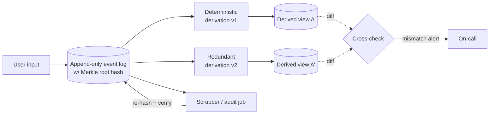

# Trust, but Verify — Auditable Dataflow Systems

> **One-sentence summary.** Because hardware and software both lie occasionally, mature systems continually re-derive state from an immutable event log and cryptographically check integrity end-to-end rather than trusting any single component.

## How It Works

System models are usually written as binaries — disks never corrupt silently, `fsync` is honoured, isolation levels deliver what they advertise — but every one of these assumptions is actually probabilistic. Data corrupts in RAM, on disk, and on the wire. Even battle-tested databases ship integrity bugs: past MySQL versions failed to enforce uniqueness constraints, and PostgreSQL's serializable isolation has exhibited write-skew anomalies. Application code, reviewed far less thoroughly, is worse. At large scale, "one in a billion" becomes "several per hour." The response is *auditing*: checking integrity in a way that does not depend on the component being audited. Large-scale storage already does a primitive version — HDFS DataNode scanners, Ceph deep scrubbing, and Amazon S3's background integrity checks read every replica periodically and replace damaged copies.

Event sourcing turns auditability from a bolt-on into a property of the architecture. If user input is captured as an immutable event and every derived view is the deterministic result of running a pipeline over that log, the log itself is the provenance record. A hash chain over the log catches storage corruption. Any derived table — index, materialized view, search index — can be rebuilt by rerunning the pipeline, and differences between the original and the rebuild expose bugs. Running a *redundant* derivation in parallel, ideally written by a different team, turns the second pipeline into a continuous oracle for the first. The transient application logic that "decided" a mutation is no longer lost: the event is the decision.

Cryptographic tooling strengthens these guarantees without requiring a blockchain. A *Merkle tree* lets a verifier confirm that a specific record appears in a dataset using a logarithmic-size proof; Google's *Certificate Transparency* layer uses append-only Merkle-tree logs to make mis-issued TLS certificates publicly detectable, avoiding consensus by having a single leader per log. Blockchains push this to the Byzantine-fault-tolerant extreme — replicas continually check each other so the system survives actively-lying nodes — at the price of huge throughput overhead. For most data systems, a hash-chained append-only log with a trusted operator lands in a better part of the design space.

The scrubber periodically re-reads the log and verifies its Merkle root against a published value; the two derivations produce independently-built copies of every view, and a continuous cross-check catches divergence before it reaches users.

## When to Use

- **Regulated financial and healthcare systems** where auditability is required by law and mistakes are assumed to happen — the entire industry is built on the premise that books must be reconcilable.
- **Systems at large enough scale** that one-in-a-billion hardware faults show up daily: object stores, distributed filesystems, petabyte-scale warehouses.
- **Anything already using event sourcing.** The audit infrastructure is almost free — you already have the immutable log and deterministic derivations, you just need to add hashes and a scrubber.
- **Public trust infrastructure**: certificate issuance (Certificate Transparency), software supply chains (SLSA, Sigstore), package registries, release artefacts.
- **Provenance-sensitive pipelines**: ML training data lineage, research datasets, insurance claims, any workflow where "why did this change?" must be answerable years later.

## Trade-offs

| Approach | Tamper-resistance | Throughput | Operational complexity | Trust model |
|---|---|---|---|---|
| Side audit table in the same DB | Very weak — a bug or attacker touching the DB touches both | Native DB speed | Low | Trusted DB + trusted ops |
| Event-sourced log with hashes | Detects accidental corruption; catches many bugs via re-derivation | Near-native (hashing is cheap) | Medium — need deterministic pipelines | Trusted operator, non-Byzantine |
| Merkle-tree append-only log (CT-style) | Strong against silent rewrites; proofs are publishable | High, single-leader per log | Medium-high — log operator + gossiped roots | Single trusted operator per log; public verifiers |
| Blockchain / BFT ledger | Strong against Byzantine participants | Low (consensus + crypto per write) | Very high | No trusted parties required |

The progression is about how much of your failure surface you want to cryptographically eliminate. Most systems do not face Byzantine participants; reaching for a blockchain when a hash-chained log with a trusted operator would do is usually a throughput and complexity footgun.

## Real-World Examples

- **HDFS DataNode block scanners** and **Ceph deep scrubbing** — continuously re-read every replica and compare checksums to catch bit rot before it collides with a replica failure.
- **Amazon S3** runs background integrity checks and repairs from redundant copies, which is why its durability claims can be stated in nines.
- **Google Certificate Transparency** — every public TLS certificate is logged to append-only Merkle-tree logs; browsers require a signed proof-of-inclusion, which means mis-issuance is publicly and cryptographically detectable without a global consensus protocol.
- **Bitcoin / Ethereum** — shared append-only logs with cryptographic integrity, where smart contracts are effectively stream processors over the transaction log; useful mostly as the Byzantine-extreme reference point.
- **LMAX (Martin Fowler's "LMAX Architecture")** — a production trading system built on deterministic replay of an event log, demonstrating that event-sourced architectures can be rebuilt, audited, and time-travelled in anger.

## Common Pitfalls

- **Putting the audit log in the same database as the data.** A bug that corrupts one will usually corrupt the other. The audit channel must fail independently.
- **Signing only the final state.** A cryptographic signature over the current row tells you nothing about *which sequence of transactions* produced it. Sign (or hash-chain) the events, not the state.
- **Assuming a tamper-proof log is enough.** You still have to prove the right events went in. An unforgeable log of wrong transactions is still wrong.
- **Skipping periodic backup restores.** An untested backup is a hypothesis, not a recovery plan; the same logic applies to the audit pipeline itself — run the scrubber for real, not on paper.
- **Reaching for blockchain by default.** If you have a trusted operator (yourself), a Merkle-tree append-only log gives you 90% of the integrity guarantees at 1% of the cost.

## See Also

- [[05-end-to-end-argument-and-idempotence]] — integrity checks, like correctness checks, work best end-to-end rather than at every hop.
- [[06-coordination-avoiding-constraints]] — asynchronous constraint checking in a dataflow system is only safe if you can audit that the constraints actually held.
- [[03-applications-around-dataflow]] — the unbundled, event-sourced architecture that makes this style of auditing essentially free.
- [[07-event-sourcing-and-cqrs]] — the provenance model that auditable dataflow systems lean on.
- [[05-byzantine-faults]] — when you actually face lying participants and a trusted-operator Merkle log is no longer enough.
