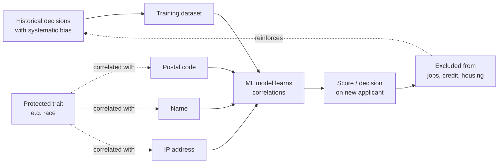

# Algorithmic Decision-Making and Bias

> **One-sentence summary.** When predictive models are used to decide who gets a loan, a job, or parole, they inherit and amplify the biases of their training data while hiding behind a veneer of mathematical objectivity — and the people they wrongly exclude have almost no way to appeal.

## How It Works

Traditional rule-based systems automate a decision by having a human specify the yes/no criteria in code. Predictive analytics is different: the criteria themselves are *learned* from historical data. A model is trained on a labeled dataset (past loan repayments, past hiring outcomes, past reoffending records) and produces a scoring function that ranks new applicants by similarity to the "good" or "bad" examples in that history. The critical property — and the critical danger — is that neither the engineer nor the model itself can fully articulate *why* any particular feature got the weight it did. The patterns are opaque even to their authors.

This opacity is what turns biased input into biased output. If the historical data reflects discriminatory practices — fewer loans approved in Black neighborhoods, fewer women promoted to senior engineering roles, harsher sentencing for certain demographics — the model will learn those patterns as predictive signal and reproduce them on new applicants. Worse, anti-discrimination laws typically prohibit the use of *protected traits* (race, gender, age, disability, religion), but the model does not need those traits directly. Any feature that correlates with a protected trait works as a proxy. Postal code predicts race in a segregated city. First name predicts gender and ethnicity. Browser user-agent and typing cadence correlate with age. The model sees these "neutral" features, latches onto their predictive power, and delivers the same discriminatory outcome through a back channel — an effect Maciej Cegłowski called "machine learning is like money laundering for bias."

The feedback loop on the bottom edge is the final twist: the decisions the model makes today become the labeled training data for tomorrow's model. Discrimination, once encoded, tends to compound.

## When to Worry

Worry whenever a model's output materially constrains someone's life and the person cannot easily correct or contest it. The chapter highlights four domains:

- **Criminal justice** — recidivism prediction influencing bail, sentencing, and parole. Wrong answers mean someone stays in jail who should not.
- **Credit and lending** — ML credit scoring for loans, mortgages, and rental applications. Being mislabeled risky can cascade into joblessness and poverty.
- **Employment** — resume filters, personality tests, and automated interview scoring decide who reaches a human recruiter at all.
- **Insurance** — life, health, and auto premiums priced from behavioral data that the insured may not even realize is being collected.

In each of these, the cost of a false negative (wrongly excluding someone) is borne entirely by the individual, while the cost of a false positive is modest and diffused across the institution — which biases operators toward "when in doubt, say no." Accumulate enough of those no's and you get what Bill Davidow called the *algorithmic prison*: systematic exclusion from jobs, travel, housing, and finance without any finding of guilt and with little chance of appeal.

## Trade-offs: Human vs Algorithmic Decisions

| Aspect | Human decision-maker | Algorithmic decision-maker |
|---|---|---|
| Consistency | Varies by mood, fatigue, unconscious bias | Perfectly consistent — applies the same rule to every case |
| Scalability | Linear in headcount | Near-free once trained |
| Bias visibility | Biases are known categories (racism, sexism, halo effect) | Biases hidden inside opaque feature weights |
| Bias magnitude | Bounded by one person's prejudice at a time | Systemic — every applicant hits the same biased function |
| Accountability | A named person can be questioned, sanctioned, retrained | Diffused across data scientists, vendors, product owners |
| Appeal process | "Ask to speak to a manager" works | Usually no route; staff often cannot explain the score either |
| Correcting errors | Update the person's record, re-decide | Often requires retraining the whole model |

Algorithms are not uniformly worse than humans — they can be fairer when humans are openly prejudiced. The problem is that their failure modes are *different*, and we have built far less social machinery to detect and correct them.

## Real-World Examples

- **ML credit scoring**: A traditional credit score answers "how did *you* behave in the past?" and draws on a narrow set of auditable facts — your borrowing history — which you can legally inspect and correct. ML-based scoring answers "how did people *like you* behave?" and pulls in hundreds of opaque features, many of which are proxies for socioeconomic class or race. Recourse, when the model is wrong, is almost impossible.
- **Recidivism prediction in criminal justice**: Tools that score defendants on the probability of reoffending are used to inform bail and sentencing. Because the training data is past arrests and convictions — themselves the product of biased policing — the models reproduce that bias and deliver it to a judge wrapped in the authority of a number.
- **Hiring algorithms**: Resume screeners trained on a company's historical hires will learn that the company historically hired one demographic and preferentially surface similar candidates. The discrimination is not in the rules the engineers wrote; it is in the data those rules were inferred from.

## Common Pitfalls

- **Proxy variables for protected traits.** Dropping `race` from the feature set accomplishes nothing if `postal_code`, `first_name`, and `browser_locale` are still in there. Audit for correlations, not just column names.
- **Treating ML output as money laundering for bias.** A biased human decision is clearly biased; the same decision produced by a model feels rigorous. The model has not removed the bias — it has hidden it behind a regression coefficient.
- **Blind belief in the supremacy of data.** Predictive models extrapolate from the past. If the past is discriminatory, the model will codify and amplify that discrimination. Wanting a future better than the past requires human moral imagination that no model can supply.
- **Ignoring statistical error at the individual level.** Even a model that is well-calibrated *in aggregate* is often wrong on any particular person. The average life expectancy being 80 does not mean *you* die on your 80th birthday, and a 72 percent recidivism score does not mean a specific defendant will reoffend.
- **Assuming the vendor is accountable.** When a model denies someone a loan, neither the bank's clerk, the data scientist, the vendor, nor the regulator has a clear answer for who is responsible or how to appeal. That gap is the accountability problem, and no amount of technical polish fills it.

## See Also

- [[02-feedback-loops-and-systems-thinking]] — how today's algorithmic decisions become tomorrow's training data, creating self-reinforcing downward spirals.
- [[05-data-as-toxic-asset]] — why the training data that powers these systems is itself a liability, not just a resource.
- [[06-data-minimization-and-self-regulation]] — the counter-principle: collect less, retain less, give users agency back.
