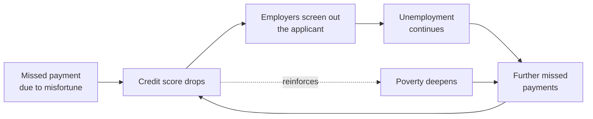

# Feedback Loops and Systems Thinking

> **One-sentence summary.** A predictive system deployed into the world reshapes the very world it predicts on, and self-reinforcing feedback loops often push the outcomes in directions nobody designed or wanted — so the responsible unit of analysis is never the algorithm alone, but the whole socio-technical system in which humans and algorithms interact.

## How It Works

When a model is trained offline and then deployed, it stops being a passive observer: its outputs start driving decisions that change the distribution of the inputs it will see next. A credit scoring model does not merely *describe* the probability that someone will default — it *causes* them to be offered or denied a loan, which changes their financial trajectory, which changes future credit data. The system is a loop, not a pipeline. Once that loop closes, small biases, proxies, or optimization targets can get amplified with each turn of the crank, because every pass writes the model's own decisions back into the world it learns from.

The canonical example from the chapter is the credit score downward spiral. Employers use credit scores to screen job applicants. A person hits a misfortune — a medical bill, a layoff — and misses a payment. Their score drops. Now they are less likely to be hired. Joblessness deepens their financial trouble, which further worsens the score, which further narrows their job prospects. The "poisonous assumption" that past financial trouble predicts future work quality becomes a self-fulfilling prophecy, hidden behind what looks like mathematical rigor.

Systems thinking is the discipline of analyzing this full loop — not just the computerized parts, but the humans, incentives, and institutions wired into it. Instead of asking "is the model accurate on the holdout set?", systems thinking asks "how does the model's deployment change the behavior of employers, applicants, lenders, and future training data?" The chapter cites Donella Meadows' tradition: trace the stocks, flows, and reinforcing loops, and check whether the system is quietly widening existing gaps between rich and poor, or between majority and marginalized groups.

## When to Use / When to Worry

Feedback loops are likely — and worth explicit modelling — whenever a system's outputs influence the world that generates its future inputs. In practice, that means:

- **Recommendation and ranking systems.** What a user clicks is shaped by what was shown, and what is shown is trained on what was clicked. Polarization and echo chambers are the loop running for years.
- **Credit scoring and algorithmic hiring.** Decisions about who gets capital and work directly change the economic trajectory that later becomes training data.
- **Predictive policing.** Sending more patrols to a neighborhood produces more arrest records there, which justifies sending even more patrols.
- **Pricing algorithms in competitive markets.** Competitors' algorithms observe each other's prices and react in near-real-time, which is how the German gas-station case ended in tacit collusion.

If your system has none of these properties — say, a weather model whose forecasts do not alter the weather — feedback-loop risk is low. The moment a human acts on the output in a way that changes future observations, the loop is live.

## Trade-offs

| Aspect | Ignoring feedback loops (local-metric optimization) | Systems thinking (global-effect analysis) |
|---|---|---|
| What you measure | Offline accuracy, CTR, conversion, AUC | Downstream behavior of humans and markets over time |
| Unit of analysis | The model in isolation | Model + users + institutions + incentives |
| Development speed | Fast; ships on a single validation metric | Slower; requires hypotheses about second-order effects |
| Failure mode | Proxy metric improves while the real goal rots | Harder to optimize numerically; risks analysis paralysis |
| Typical outcome | Amplifies whatever bias or dynamic was latent in the data | Catches some pathological loops before deployment; cannot catch all |
| Accountability | "The algorithm decided"; harms diffuse | Forces designers to own the full socio-technical outcome |

## Real-World Examples

- **Credit-score downward spiral.** Employers screen on credit scores, so an unlucky missed payment translates into lost employment, which translates into further missed payments — a reinforcing loop dressed up as objective scoring.
- **German gas-station price collusion.** When stations adopted algorithmic pricing, the algorithms learned, without any explicit instruction, that matching and slightly raising competitors' prices was individually profitable. Competition fell and consumer prices rose — collusion emerged from local optimization with no collusive intent anywhere in the code.
- **Social-media echo chambers.** Recommenders optimize engagement by showing users more of what they already engage with, which narrows their information diet, which makes engagement on that narrower diet even easier to predict. Over years, the loop contributes to polarization and to the amplification of misinformation around elections.

## Common Pitfalls

- **Optimizing a proxy metric that drifts from the real goal.** Click-through rate is a proxy for "user found this useful"; default rate on approved loans is a proxy for "creditworthiness." Once the proxy becomes the target, the loop will happily maximize the proxy at the expense of the underlying goal.
- **Assuming the model's predictions don't affect the world.** Treating deployment as a passive readout lets second-order effects accumulate invisibly. By the time the degradation shows up in aggregate statistics, the loop has been running for years.
- **Treating amplification as neutral.** A ranker that "just shows people what they want" is not a mirror — it chooses, and at scale those choices reshape discourse, markets, and opportunity. Neutrality is not a default; it has to be engineered for.
- **Only analyzing the computerized parts.** The loop runs through humans, courts, HR departments, regulators, and competitors. Looking only at the code misses where most of the dynamics live.

## See Also

- [[01-algorithmic-decision-making-and-bias]] — how biased training data becomes the raw material that feedback loops then amplify.
- [[03-surveillance-as-a-lens]] — the data-collection side of the same socio-technical system, and another place where "it's just data" obscures what is really happening.
