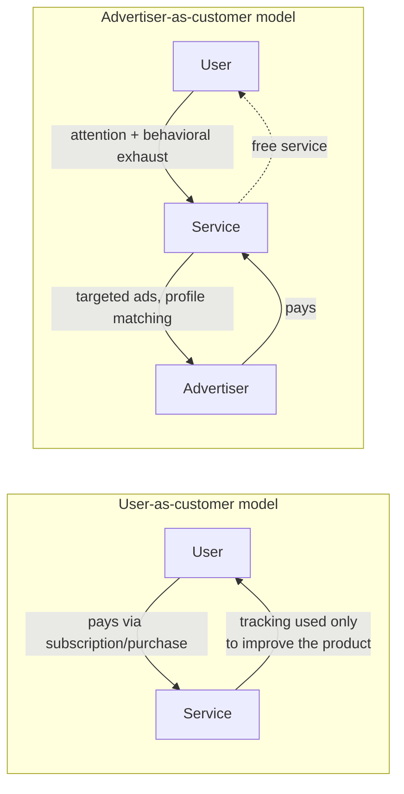

# Surveillance as a Lens for Data Collection

> **One-sentence summary.** Treating your data pipeline as a *surveillance* pipeline is a diagnostic lens: if "surveillance warehouse," "surveillance-driven organization," and "real-time surveillance streams" sound sinister but accurately describe what you are building, the system is probably serving someone other than the user whose behavior it is recording.

## How It Works

The lens is a simple word-substitution exercise. Take any sentence you would write in a design doc or architecture review and replace *data* with *surveillance*: "In our surveillance-driven organization we collect real-time surveillance streams and store them in our surveillance warehouse. Our surveillance scientists use advanced analytics and surveillance processing in order to derive new insights." The sentence is technically unchanged, but the euphemism is gone. What remains is a question: is this an accurate description of what the system does? If yes, the next question is *who benefits*.

That question has two clean answers. In a **user-serving** pipeline, tracking exists because it directly improves the thing the user asked for — search-ranking feedback, "people who liked X also liked Y" recommendations, A/B tests and user-flow analysis that iterate on the UI. The user is the customer, and tracking is a means to serve them. In an **advertiser-serving** pipeline, the user is not the customer — the advertiser is. The user is given a free service and coaxed into engaging with it as much as possible so that detailed profiles can be built and sold as targeting capability. The same technical primitives (event logs, feature stores, profile joins) sit in both pipelines; only the beneficiary differs.

The thought experiment matters because corporate data collection has quietly become more pervasive than any historical regime could have engineered. Totalitarian governments of the past could only *dream* of putting a microphone in every room and forcing every citizen to carry a location tracker — they could not afford it, and the population would have revolted. Today we voluntarily carry smartphones, install smart TVs and voice assistants, and strap fitness trackers to our wrists. The difference from state surveillance is that the operator is a corporation offering a service, not a government seeking control — but the infrastructure is the same, and a sufficiently well-instrumented organization may end up knowing more about a person than they know about themselves: predicting illness, financial distress, or a breakup before the user is consciously aware of it.

## When to Use

Apply the surveillance lens whenever your design collects behavioral data that is *not strictly required* to serve the user's immediate request. Concrete triggers:

- You are about to log an event "just in case it becomes useful later" — the canonical surveillance-accumulation pattern.
- The data model includes a long-lived per-user profile whose primary consumer is not the user-facing product.
- Revenue flows from advertisers, data brokers, or "partners" rather than from the users being tracked.
- The system ingests data from devices (smart speakers, wearables, cars, TVs) whose microphones, sensors, or telemetry run continuously in private spaces.
- You catch yourself writing the word "engagement" where "attention extraction" would be more honest.

If the substitution test produces a description you would not want read aloud in a courtroom or on a front page, the design probably needs to change — not the vocabulary.

## Trade-offs

| Aspect | Advantage | Disadvantage |
|---|---|---|
| Behavioral tracking | Enables ranking, recommendations, personalization, UX iteration | Creates detailed profiles that outlive their original purpose |
| Ad-funded "free" services | Broad access without paywalls; network effects compound | Users are the product; their interests rank below the advertiser's |
| Rich per-user profiles | More relevant suggestions, better fraud detection | Power asymmetry — the collector knows things the subject does not |
| Long data retention | Historical analytics, model training, experimentation | Every retained record is a future breach, subpoena, or regime-change risk |
| "Benign" use cases | Useful today (fitness coaching, driving feedback) | Coercive tomorrow when the same data sets insurance premiums or hiring outcomes |

## Real-World Examples

- **Smart TVs and smart speakers**: internet-connected microphones in the living room whose cloud-based speech recognition runs continuously; many have poor security records, so the surveillance surface extends to anyone who breaches them.
- **Fitness trackers and health insurance**: coverage tied to wearing a tracker turns a "wellness perk" into a condition of insurability — a textbook benign-to-coercive drift.
- **Car telematics and auto insurance**: vehicles silently transmit driving-behavior data that insurers then use to set premiums, often without the driver's meaningful consent.
- **Smartwatch motion sensors**: researchers have shown that the accelerometer in a wrist-worn device can reconstruct typed passwords from hand movement with useful accuracy — a sensor sold for step counting leaks keystrokes.
- **"Data exhaust" warehouses at ad-funded platforms**: per-user event logs retained for years, joined with purchased third-party data, and exposed as ad-targeting audiences — the textbook surveillance warehouse.

## Common Pitfalls

- **The "nothing to hide" fallacy.** The argument works only for people who are already aligned with prevailing power structures. Marginalized users, dissidents, and anyone who might be targeted by a future government do have things to hide, and the same datasets will be used against them.
- **Assuming corporate surveillance is benign because it is not governmental.** The infrastructure is indistinguishable; ownership can transfer through acquisition, bankruptcy, subpoena, or regime change. Treat every dataset as if a hostile future actor will inherit it — see [[05-data-as-toxic-asset]].
- **Collecting "just in case" it becomes useful.** This is the single most common way surveillance warehouses grow. Data minimization — collect only what you need *for the current purpose* and purge it when that purpose ends — is the opposite discipline and the one GDPR's *purpose limitation* principle encodes.
- **Hiding behind consent theater.** Burying surveillance in a privacy policy written to obscure rather than illuminate does not make the relationship reciprocal; it just transfers privacy rights to the collector. See [[04-meaningful-consent-and-privacy]].
- **Confusing "not creepy-looking" with "not creepy."** Many organizations optimize the *perception* of their data practices while leaving the practices themselves untouched.

## See Also

- [[02-feedback-loops-and-systems-thinking]] — why surveillance-fed decision systems tend to reinforce existing power asymmetries rather than correct them.
- [[04-meaningful-consent-and-privacy]] — why clicking "I agree" on a 40-page policy does not make the transfer of privacy rights legitimate.
- [[05-data-as-toxic-asset]] — the natural follow-on: once you have collected it, every retained byte is a liability waiting for a breach, subpoena, or change of ownership.
