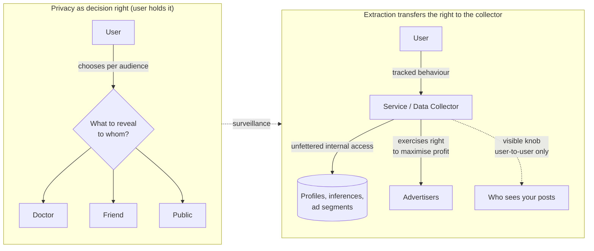

# Meaningful Consent and Privacy as a Decision Right

> **One-sentence summary.** Privacy is not secrecy but the *decision right* to choose what to reveal to whom; when a service extracts data through surveillance, that right is not destroyed — it is silently transferred from the user to the collector, who then exercises it to maximize profit.

## How It Works

The popular claim that "privacy is dead" rests on a category error. It points at people who post freely on social media and concludes that nobody cares about control anymore. But privacy was never about *keeping everything secret*. It is the freedom to sit anywhere on the spectrum between total disclosure and total secrecy, and to pick a different point for each audience and each situation. A patient tells their doctor things they would never tell an employer; a person with a rare illness may happily donate their medical record to researchers while refusing to share it with an insurer. Privacy is a form of autonomy — a *decision right* about the flow of information about oneself.

Genuine consent is what preserves that decision right when a service collects data. The GDPR codifies what "genuine" has to mean: consent must be **freely given, specific, informed, and unambiguous**, worded in plain language, refusable and revocable without detriment; silence, pre-ticked boxes, and inactivity do not count. In practice almost none of those conditions hold on the consumer internet. Privacy policies obscure more than they illuminate, so users cannot be *informed*. Opting out of a dominant platform carries real social and professional cost, so consent is not *freely given*. Derived datasets combine one user's data with everyone else's behavior plus data scraped from non-users (friends' contact lists, mentions, inferred graph edges), so consent cannot be *specific* — and the non-users never consented at all. And the relationship is one-sided: the user does not negotiate terms with the service; they click the only button offered.

The diagram names the sleight of hand. Service-level privacy settings — "only friends can see this photo" — are a *user-to-user* control. They never touch the *user-to-service* channel, where the platform retains effectively unrestricted rights to analyze, profile, and monetize the same data internally. The user appears to be in charge while the structural decision right has already moved to the collector.

## When the Framing Applies

- **Every consent dialog.** Cookie banners, account sign-ups, permission prompts — any moment a product asks a user to agree to data processing is a moment this framing is in play, and usually failing.
- **Every tracking pipeline.** Clickstreams, pixels, SDK telemetry, "anonymous analytics": if the data is being retained and used to build profiles, the consent question applies even when the user never saw a dialog.
- **Every third-party data-sharing arrangement.** Ad network integrations, data-broker sales, SSO graph sharing, and "trusted partner" clauses in ToS all move the decision right one more hop from the person the data is about.
- **Data about non-users.** Contact-list uploads, tagged photos, inferred relationships — the subject of the record never even had the option to refuse.

## Trade-offs

| Aspect | GDPR-style meaningful consent | Common practice |
|---|---|---|
| How the choice is offered | Freely given; refusal does not degrade the service | "Accept or leave," opt-out buried, dark patterns |
| Scope of the request | Specific purpose, separately for each use | Vague blanket policy covering "service improvement," "partners," future purposes |
| Clarity | Intelligible, plain language | Dense legal prose users cannot reasonably understand |
| Default state | Unambiguous opt-in, no pre-ticked boxes | Pre-ticked boxes, "legitimate interest" toggles defaulted on |
| Revocability | Can be withdrawn as easily as given, without detriment | Withdrawal requires hunting through settings or deleting the account entirely |
| Essential-for-service claims | Narrow: only data truly required to deliver what the user asked for | Broad: tracking framed as "essential" to justify consent-free collection |
| Subjects covered | The consenting user's data | Also sweeps in non-users via contacts, social graph, inferences |

## Real-World Examples

- **GDPR cookie banners.** The regulation requires meaningful consent; the industry response was the cookie banner, most of which violate the spirit of the law — "Accept all" one click away, "Reject all" three screens deep, "legitimate interest" toggles already on. Form without substance.
- **"Accept or leave" on essential platforms.** When a messaging app is the default way an entire country communicates, declining the ToS is not a real choice. Network effects convert what looks like consent into de facto compulsion — the "freely given" requirement fails quietly.
- **Medical data for research.** One of the few domains where informed consent can actually work: a specific condition, a specific study, a named institution with ethical oversight, revocable participation, and a direct plausible benefit to the subject. Contrast with cross-site ad tracking, which has none of these properties.
- **Contact-list uploads.** A new user grants a social app access to their address book; the app now holds phone numbers and relationship edges for hundreds of people who never installed it and never consented.

## Common Pitfalls

- **Treating ToS acceptance as informed consent.** A checkbox next to a 30-page document that changes unilaterally is not consent under any serious definition, regardless of what the ToS itself says.
- **Equating privacy with secrecy.** If you think privacy means "hiding things," you will conclude that sharing anything waives it. The decision-right framing shows that sharing with a doctor does not waive the right against an insurer seeing the same record.
- **Exposing user-to-user privacy knobs but not user-to-service ones.** "Only my friends can see this" does nothing about the company's ML pipeline reading the same post. Do not let peer-visibility settings launder unrestricted internal collection.
- **Collecting data about non-users.** Contact uploads, tagged photos, inferred social graphs, and shadow profiles mean your consent story only covers a fraction of the people your database is actually about.
- **"Essential for service" as a catch-all.** Genuine functional needs are narrow. Ad targeting, cross-product personalization, and long-term behavioral profiling are almost never essential to the thing the user actually came for.

## See Also

- [[03-surveillance-as-a-lens]] — the framing that makes the transfer of privacy rights visible by renaming "data collection" to "surveillance."
- [[06-data-minimization-and-self-regulation]] — what you do once you accept that meaningful consent is rare: collect less, keep it shorter, and treat the data you hold as a liability.
