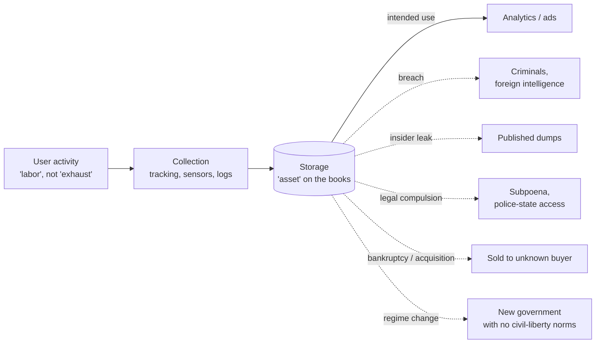

# Data as Toxic Asset and Power

> **One-sentence summary.** Personal data is not inert "exhaust" but a concentrated asset whose value to collectors is matched by its liability to everyone else — it leaks, it gets subpoenaed, it gets sold in bankruptcy, and it outlives the political regime under which it was gathered, so it is better reasoned about as hazardous material than as the new oil.

## How It Works

Industry has two competing framings for behavioral data. The first, "data exhaust," treats it as a worthless byproduct of users interacting with a service — something that would be thrown away if we did not recycle it through analytics. The second framing, which the chapter argues is more accurate, is that user activity on an ad-funded service *is labor*: the advertisers are the paying customers, the application is "merely a means to lure users into feeding more and more personal information into the surveillance infrastructure," and the data is the product being extracted. Once that inversion is made, the rest follows. Startups are valued by their "eyeballs" — i.e., their surveillance capabilities. A secretive industry of data brokers purchases, aggregates, and resells personal data. When a company goes bankrupt, its user data is one of the assets sold to creditors. Data is an asset precisely because so many parties want it.

The asset view is only half the picture. The same properties that make data valuable — it is persistent, copyable, and combines with other datasets — make it a *liability*. Breaches happen disconcertingly often. Insiders leak. Governments compel disclosure through secret deals, subpoenas, or outright theft. Future management may not share the values of the people who collected it. Future governments may not respect human rights. Each of these risk surfaces opens the moment the data is written to disk and stays open for as long as it is retained. This is why critics call data a "toxic asset" (Schneier), "hazardous material" (Scott), or "the new uranium" (Pesce) — incredibly powerful and amazingly dangerous. Schneier's civic-hygiene warning captures the temporal dimension: "It is poor civic hygiene to install technologies that could someday facilitate a police state."

There is also a power dimension that sits underneath the economics. "Knowledge is power," and as the chapter quotes, "to scrutinize others while avoiding scrutiny oneself is one of the most important forms of power." That is why totalitarian governments have always wanted mass surveillance — it lets them control the population. Modern tech companies are not overtly seeking political power, but the data and knowledge they have quietly accumulated outside of public oversight gives them comparable leverage over individual lives. An Industrial-Revolution analogy is useful: industrialization produced sustained growth and better living standards, but it also produced choking pollution, child labor, and unsafe factories, and it took decades of costly regulation before society extracted the benefits without the harms. In Schneier's phrasing, "data is the pollution problem of the information age, and protecting privacy is the environmental challenge."

## When the Framing Matters

- **Any "collect everything, figure out the value later" architecture** — event pipelines, clickstream warehouses, observability stacks that retain user identifiers indefinitely. The cheaper storage gets, the more tempting this becomes and the larger the eventual liability.
- **Any data warehouse or lake holding personal data**, especially one that joins behavioral traces with external datasets. Re-identification risk is nonlinear in the number of attributes.
- **Any pitch that uses "data is the new oil"** or valuations driven by MAU / "eyeballs." The framing encourages a collect-maximize-monetize posture that ignores the liability side of the ledger.

## Trade-offs: Data-as-Oil vs. Data-as-Uranium

| Aspect | "Data is the new oil" (value-extraction view) | "Data is the new uranium" (hazard view) |
|---|---|---|
| Optimizes for | Monetization, model quality, exploratory analytics | Breach blast radius, regulatory exposure, future-regime risk |
| Default on collection | Collect everything — storage is cheap | Collect only what's justified now; purge aggressively |
| Retention policy | Keep forever; more data is more value | TTL by default; "data you don't have can't leak" |
| Access controls | Broad internal access to enable exploration | Least privilege, per-purpose access, audit trails |
| Ignores | Breach cost, subpoena risk, regime change, bankruptcy sale | Legitimate analytical value, medical/research upside |
| Framing bias | User data is a renewable resource | User data is a radioactive half-life problem |

Neither framing is complete on its own — overregulating can block genuine public-interest use like disease research — but a team that *only* uses the oil metaphor will systematically underweight the liability side until the breach headline arrives.

## Real-World Examples

- **Data brokers.** An entire industry operates in secrecy, buying, aggregating, and reselling personal data, mostly for marketing (US Senate Commerce Committee report, 2013, cited in the chapter). Users have no relationship with these companies and no practical way to opt out.
- **Bankruptcy asset sales.** When a company winds down, user data is listed alongside office furniture as an asset for creditors. The privacy policy the user originally agreed to rarely binds the buyer.
- **Government compulsion.** National-security letters, subpoenas, and warrant-backed data requests routinely convert "data the company holds" into "data the state holds." The chapter notes regimes change; data collected under one government is available to its successor.
- **Breaches.** Because data is "difficult to secure, breaches happen disconcertingly often." Every breach is a realization of latent liability that was created the moment the data was first stored.

## Common Pitfalls

- **Assuming the current political environment will persist.** Data collected today under a rights-respecting government is available tomorrow under whatever government comes next. Plan for the worst realistic future regime, not the best current one.
- **Assuming internal access controls are sufficient.** Insiders leak, admin credentials get phished, and acquisitions dissolve access policies. Controls reduce risk but do not eliminate it.
- **Collecting "just in case" because storage is cheap.** Storage cost is the wrong anchor — compare against breach cost, regulatory fines, and reputational damage. Cheap storage is precisely what makes the uranium pile grow without anyone noticing.
- **Treating anonymization as sufficient.** Combining quasi-identifiers across datasets re-identifies individuals with depressing ease; the "anonymized" label often reflects compliance theater rather than a meaningful privacy property.
- **Reasoning only as collector, never as leak target.** Every schema decision should be reviewed twice: once as "what value does this give us," and once as "what harm does this cause if it appears on a public mirror tomorrow."

## See Also

- [[03-surveillance-as-a-lens]] — the thought-experiment that exposes how much "data" rhetoric conceals by substituting "surveillance" and seeing whether the sentence still sounds benign.
- [[06-data-minimization-and-self-regulation]] — the practical response: collect less, retain less, purge sooner, and treat the cultural shift as part of the engineer's job.
