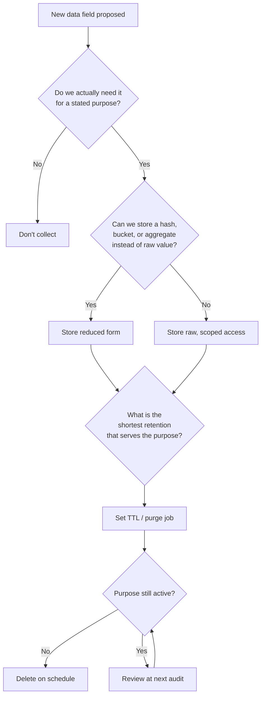

# Data Minimization and Engineering Self-Regulation

> **One-sentence summary.** Data minimization is the principle that personal data must be collected only for specified, explicit purposes and kept only as long as strictly necessary — and because regulation like GDPR is weakly enforced, the durable safeguard is engineers self-regulating: collecting less, purging aggressively, and treating users as humans rather than metrics.

## How It Works

The GDPR encodes two rules that together define *data minimization*. Personal data must be "collected for specified, explicit and legitimate purposes and not further processed in a manner that is incompatible with those purposes," and must be "adequate, relevant and limited to what is necessary" for those purposes. Together they outlaw the default reflex of modern data engineering: collect everything, keep it forever, figure out a use later. Each field needs a stated purpose before it is recorded and must stop existing when that purpose is exhausted.

This collides head-on with the big-data philosophy, whose value proposition is the *unforeseen* insight — combining datasets, exploring correlations, training models on features you did not yet know you wanted. Exploration is by definition not a "specified and explicit" purpose. In practice GDPR has been weakly enforced and has not shifted culture across the industry, which is why the engineering response cannot be outsourced to a compliance team. Self-regulation means the people writing the schema, the ingestion pipeline, and the retention job internalize minimization as a design constraint, not a checkbox.

The playbook is small and blunt: do not retain forever; purge as soon as data is no longer needed; minimize what you collect in the first place. The reasoning is defensive — "data you don't have is data that can't be leaked, stolen, or compelled by governments to be handed over."

## When to Use

Apply the minimization loop at every decision point where user data enters, lingers in, or leaves your system:

- **Every new feature that touches user data** — before shipping a profile field, a tracking event, or a personalization signal, ask whether the stated user benefit actually requires storing it.
- **Every retention policy decision** — default TTLs on logs, events, backups, and analytics tables. Indefinite retention should require justification, not the other way around.
- **Every logging and telemetry system** — request logs, crash dumps, and debug traces routinely become the largest unintended store of personal data in a company.
- **Every data-sharing deal** — third-party SDKs, partner integrations, and data broker contracts are where minimization leaks out of your control entirely.

## Trade-offs

| Aspect | Data minimization | Big-data maximalism |
|---|---|---|
| Breach blast radius | Small — you only expose what you collected | Large — every field you ever kept is in scope |
| Compliance posture | Defensible under GDPR purpose limitation | Constant exposure to fines and consent lawsuits |
| Future insight potential | Limited — cannot mine data you didn't keep | High — exploratory analysis across all history |
| User trust | Earned through visible restraint | Eroded the first time a breach or misuse is reported |
| Storage and ops cost | Lower — TTLs and purges keep datasets small | Higher — indefinite retention compounds |
| ML model quality | Smaller training sets, narrower features | Rich features, but often on stale or unconsented data |
| Coercion risk (subpoena, insider, state) | Cannot hand over what does not exist | Everything you retained is reachable |

The honest trade is *risk reduction now* versus *possible insight later*. When the "later" insight is speculative and the "now" risk is a concrete population of real people, minimization is usually the correct default.

## Real-World Examples

- **GDPR purpose limitation** — Article 5 forces European operators to tie every field to a declared purpose; "we might need it someday" is not a legal basis for retention.
- **Right-to-erasure workflows** — companies that engineered delete cascades across warehouses, backups, and derived tables discovered how much cheaper the work is when less was collected in the first place.
- **Reduced log retention** — cloud providers and SaaS companies quietly shortened request-log windows from years to weeks once they realized the logs were a liability without a corresponding business use.
- **Never-collected fields** — messaging apps that store only ciphertext, payment forms that tokenize card numbers at the edge, and analytics libraries that bucket ages into ranges are all examples of designing the sensitive value *out* of the system rather than protecting it once stored.

## Common Pitfalls

- **Compliance as a checklist** — passing a GDPR audit while still collecting everything "just in case" satisfies the law and ignores the principle.
- **"Just in case" collection** — the most expensive data to own is data you were not sure you needed; it is rarely revisited and almost always ends up in the breach.
- **Indefinite retention because storage is cheap** — storage cost is the wrong axis; the real cost is breach blast radius, subpoena surface, and user harm.
- **Reversible anonymization** — hashing an email or coarsening a location often leaves enough entropy for re-identification when joined with another dataset. Pseudonymization is not anonymization.
- **"Privacy is someone else's problem"** — pushing it onto the privacy, legal, or security team guarantees the engineers closest to the schema never internalize the constraint.
- **Shadow datasets** — copies in analytics warehouses, feature stores, backups, and notebooks outlive the production purge job.

### Engineer's Checklist

Before merging any change that touches user data, answer these out loud:

- Do we actually *need* this field to deliver the stated feature, or is it aspirational?
- What is the shortest retention that still serves the purpose, and is there a TTL enforcing it?
- What is the minimum scope of access — which services, which humans, under which audit trail?
- Can we store a hash, a bucket, or an aggregate instead of the raw value?
- Is the field derivable on demand instead of persisted?
- Where else does this data end up — logs, backups, metrics, warehouses, third parties — and is each copy on the same retention clock?
- Is there a documented breach plan for this dataset, and who is paged if it leaks?
- If a user invokes right-to-erasure, can we actually find and delete every copy?

Reframe the user. They are not a row to be optimized or a metric to be moved; they are a person who extended trust and deserves respect, dignity, and agency. The individual right to control personal data is like the natural environment of a national park — if engineers do not explicitly protect it, it will be destroyed in a tragedy of the commons. Educate users about how their data is used instead of keeping them in the dark, and treat societal impact as part of the job, not an extracurricular.

## See Also

- [[04-meaningful-consent-and-privacy]] — the consent side of the same problem: minimization reduces what consent even has to cover.
- [[05-data-as-toxic-asset]] — the economic and risk framing that makes minimization the financially rational default, not just the ethical one.
- [[01-algorithmic-decision-making-and-bias]] — why the features a model is trained on are themselves a minimization question: every predictor kept is a bias and breach surface.
