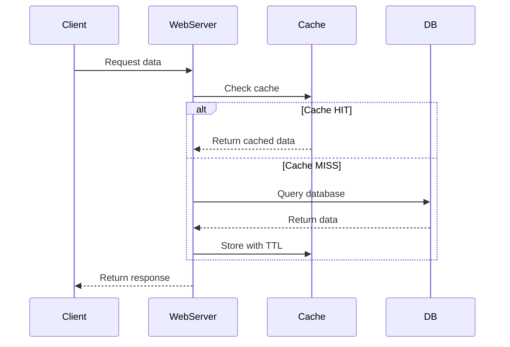
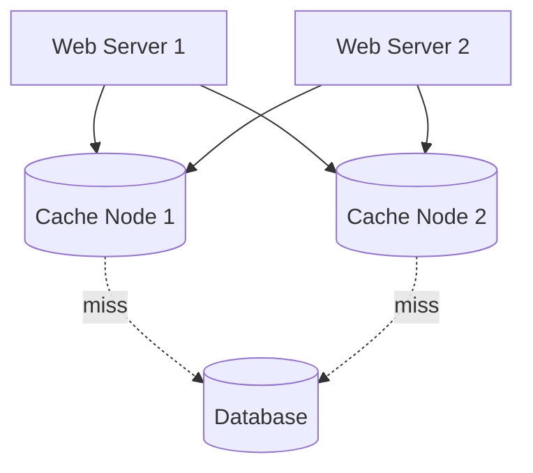

## Summary

A cache tier is a temporary data store layer that sits between web servers and the database, storing frequently accessed or expensive-to-compute data in memory. Caching dramatically reduces database load and improves response times. Key considerations include expiration policy, consistency, eviction strategy, and avoiding single points of failure.

## How It Works

### Read-Through Cache Pattern

### Cache Architecture

## When to Use

- Data is **read frequently** but **modified infrequently**
- Database queries are expensive or slow
- The same data is requested by many users
- Response latency is critical (sub-millisecond reads from cache vs milliseconds from DB)

## Trade-offs

| Concern | Recommendation |
|---------|---------------|
| **When to cache** | Read-heavy, infrequently modified data only |
| **Expiration (TTL)** | Not too short (causes reload storms) or too long (stale data) |
| **Consistency** | Hard to maintain in single transaction; accept eventual consistency |
| **Single point of failure** | Use multiple cache nodes across data centers |
| **Eviction policy** | LRU (most common), LFU (frequency-based), FIFO |
| **Volatile storage** | Never use cache as primary data store; data lost on restart |

## Real-World Examples

- **Memcached:** Simple key-value cache; used by Facebook for social graph caching
- **Redis:** Feature-rich (pub/sub, sorted sets, persistence); used by Twitter, GitHub
- **Facebook:** Published "Scaling Memcache at Facebook" -- caching at massive scale
- **CDN caching:** Static content cached at the edge (see [[cdn]])

## Common Pitfalls

- Using cache for data that changes frequently (high invalidation cost)
- Not setting an expiration policy (cache grows unbounded, data becomes stale)
- Relying on a single cache server (SPOF -- always use multiple nodes)
- Cache stampede: many requests hit DB simultaneously when a popular key expires
- Storing important data only in cache without a persistent backing store

## See Also

- [[cdn]] -- Caching applied to static content delivery
- [[database-replication]] -- Reduces read load; caching reduces it further
- [[stateless-web-tier]] -- Session data often stored in cache (Redis)
