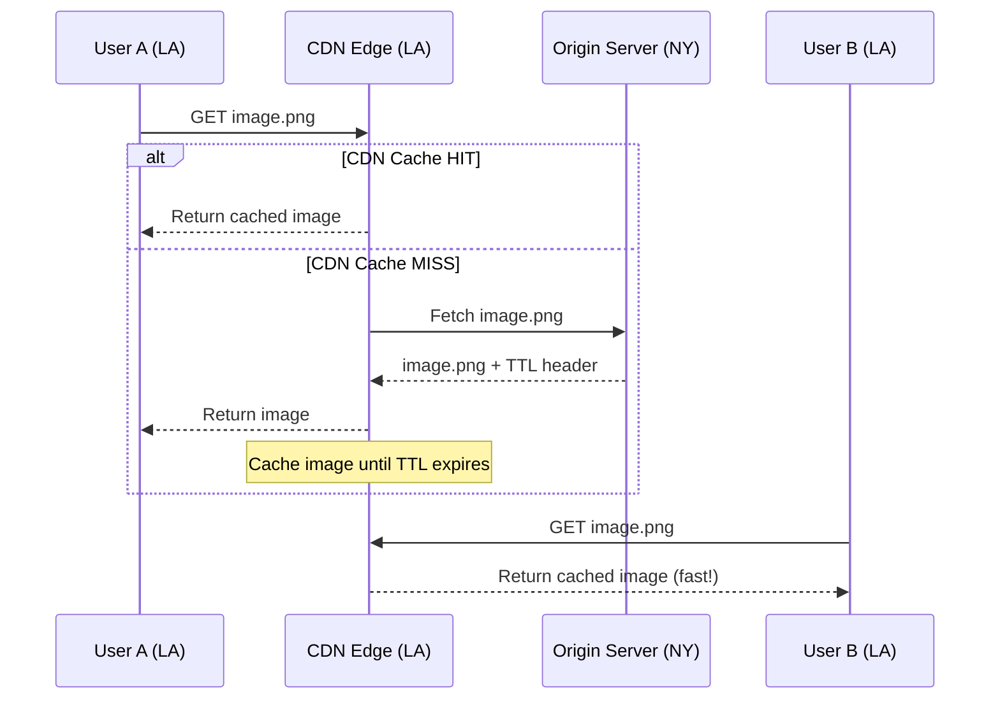

## Summary

A Content Delivery Network (CDN) is a network of geographically dispersed servers that cache and deliver static content (images, CSS, JavaScript, videos) from edge locations close to users. By serving content from nearby servers instead of the origin, CDNs dramatically reduce latency and offload traffic from your web servers.

## How It Works

### CDN Workflow

1. User requests a static asset via a CDN URL (e.g., `mysite.cloudfront.net/logo.jpg`)
2. If the CDN edge has the file cached, it returns it immediately
3. If not, the CDN fetches from the origin server, caches it with a TTL, and returns it
4. Subsequent requests from nearby users are served from the edge cache

## When to Use

- Serving static assets (images, CSS, JS, fonts, videos)
- Global audience with users in many geographic regions
- High-traffic websites where origin server offloading matters
- When low latency for static content is critical

## Trade-offs

| Benefit | Cost |
|---------|------|
| Low latency for users worldwide | Pay per GB transferred |
| Offloads origin server | Infrequently accessed content wastes CDN cost |
| Built-in redundancy | Cache invalidation complexity |
| Handles traffic spikes | TTL tuning: too long = stale, too short = origin load |

## Real-World Examples

- **Amazon CloudFront:** Integrated with S3 and EC2; global edge network
- **Akamai:** One of the oldest and largest CDN providers
- **Cloudflare:** CDN + DDoS protection + DNS
- **Google Cloud CDN:** Integrated with Google's global network

## Common Pitfalls

- Setting TTL too long (users see stale content) or too short (constant origin fetches)
- Not planning for CDN outages -- clients should fall back to the origin
- Caching infrequently used assets on CDN (cost with no benefit)
- Not using URL versioning (`image.png?v=2`) for cache busting
- Forgetting to invalidate CDN cache when deploying new static assets

## See Also

- [[caching-strategies]] -- CDN is caching applied to static content at the edge
- [[load-balancing]] -- CDN reduces load on the origin server behind the load balancer
- [[vertical-vs-horizontal-scaling]] -- CDN is a form of horizontal scaling for content delivery
