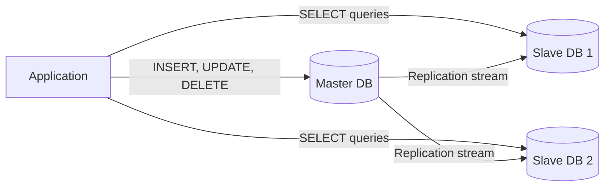
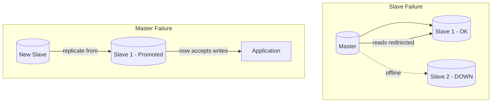

## Summary

Database replication uses a master/slave model to separate write and read operations. The master handles all writes; slaves receive copies of data and handle reads. Since most applications are read-heavy, this model improves performance by parallelizing reads across multiple slaves. It also provides reliability (data preserved across locations) and high availability (failover when a node goes down).

## How It Works

### Failover Scenarios

**Slave fails:** Reads redirected to other slaves or temporarily to master. A new slave replaces the failed one.

**Master fails:** A slave is promoted to new master. Missing data updated via recovery scripts. A new slave is provisioned.

## When to Use

- Read-heavy workloads (most web applications)
- When high availability is required for the data tier
- When data durability across geographic locations matters
- When you need to scale read throughput beyond a single database

## Trade-offs

| Benefit | Cost |
|---------|------|
| Improved read performance | Replication lag (eventual consistency) |
| High availability via failover | Promotion complexity for master failure |
| Data redundancy across locations | More servers to manage |
| Read scaling is nearly linear | Write throughput still limited to master |

## Real-World Examples

- **MySQL:** Built-in master-slave replication; used by Facebook, Twitter
- **PostgreSQL:** Streaming replication with synchronous/asynchronous modes
- **Amazon RDS:** Managed read replicas across availability zones
- **Netflix:** Multi-region asynchronous replication for global availability

## Common Pitfalls

- Assuming replication is instantaneous -- there is always some lag
- Not testing master failover procedures before they are needed
- Reading from slaves for operations that require the latest data
- Having only one slave -- you lose read scaling during failover
- Not monitoring replication lag as a key metric

## See Also

- [[load-balancing]] -- Distributes read queries across slave databases
- [[database-sharding]] -- Horizontal data partitioning for write scaling
- [[caching-strategies]] -- Reduces read load on both master and slaves
