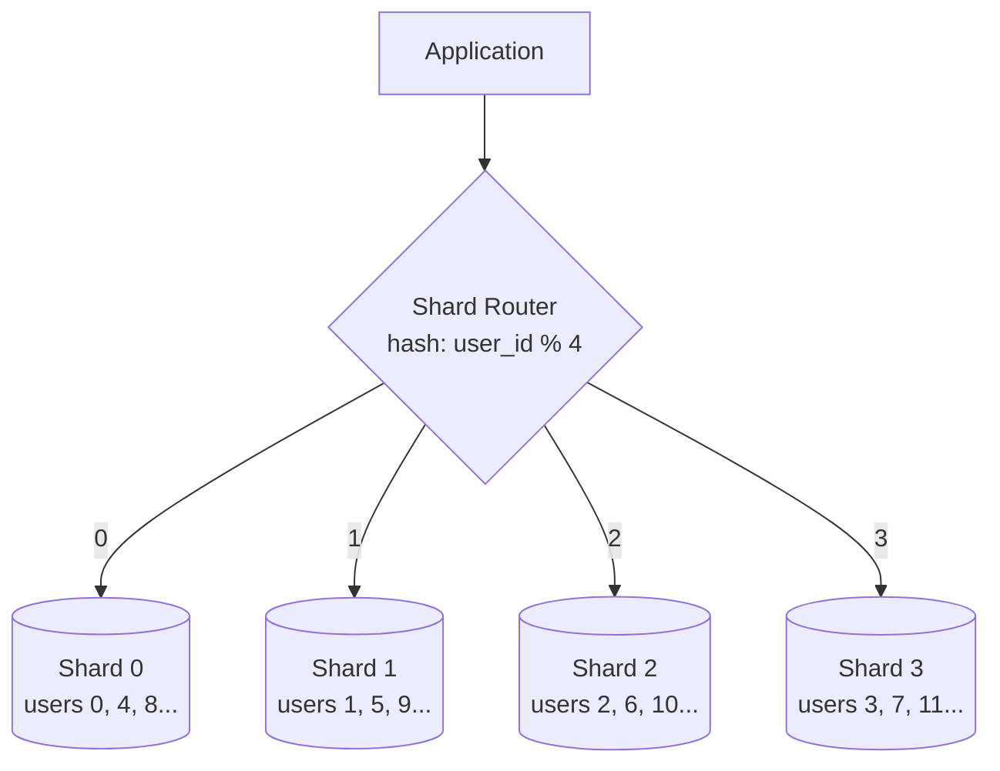

## Summary

Sharding is a horizontal scaling technique that partitions a large database into smaller, more manageable pieces called shards. Each shard has the same schema but holds a different subset of data. A sharding key (partition key) determines which shard stores each row. Sharding allows databases to scale beyond the limits of a single machine but introduces complexity around resharding, hotspots, and cross-shard operations.

## How It Works

1. Choose a **sharding key** (e.g., `user_id`) that distributes data evenly
2. Apply a **hash function** (e.g., `user_id % N`) to determine the target shard
3. Route all queries for that key to the correct shard
4. Each shard can be independently replicated for availability

## When to Use

- When a single database server cannot handle the write volume or storage
- When vertical scaling has reached its limits (cost or hardware ceiling)
- When data is naturally partitionable by a key (user_id, tenant_id, region)
- For large-scale applications with billions of rows

## Trade-offs

| Benefit | Cost |
|---------|------|
| Horizontal write scaling | Resharding is painful when shards grow unevenly |
| Each shard is smaller and faster | Cross-shard joins are expensive or impossible |
| Independent scaling per shard | Celebrity/hotspot problem on popular keys |
| Data locality | Application complexity increases significantly |

### Sharding Challenges

| Challenge | Description | Mitigation |
|-----------|-------------|------------|
| **Resharding** | Shards grow unevenly, need redistribution | Consistent hashing |
| **Celebrity/Hotspot** | One shard gets disproportionate traffic | Dedicated celebrity shards |
| **Cross-shard joins** | Joins across shards are costly | De-normalization |
| **Referential integrity** | Foreign keys across shards do not work | Application-level enforcement |

## Real-World Examples

- **Instagram:** Shards PostgreSQL by user ID
- **Pinterest:** Shards MySQL with consistent hashing
- **Vitess (YouTube):** MySQL sharding middleware
- **MongoDB:** Built-in auto-sharding with configurable shard keys
- **CockroachDB, TiDB:** Distributed SQL with automatic sharding

## Common Pitfalls

- Choosing a poor sharding key that leads to uneven data distribution
- Not planning for resharding from the start (consistent hashing helps)
- Assuming you need sharding before you actually do (premature optimization)
- Ignoring the operational complexity -- each shard needs backups, monitoring, failover
- Trying to do cross-shard transactions (use sagas or eventual consistency instead)

## See Also

- [[database-replication]] -- Each shard should be replicated for availability
- [[vertical-vs-horizontal-scaling]] -- Sharding is horizontal scaling for databases
- [[load-balancing]] -- Distributes application traffic; sharding distributes data
