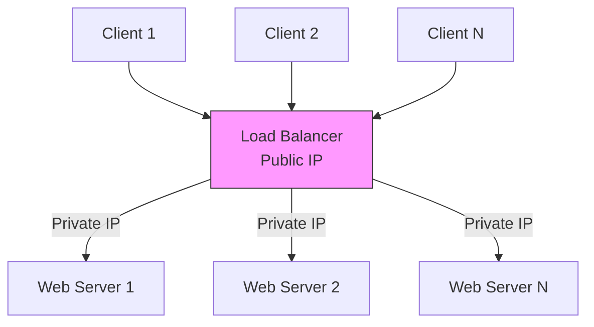

## Summary

A load balancer distributes incoming network traffic across multiple servers to ensure no single server bears too much demand. It sits between clients and web servers, routing requests through private IPs. Load balancing improves availability (routes around failed servers), enables horizontal scaling (add servers transparently), and enhances security (clients never contact servers directly).

## How It Works

1. Clients connect to the load balancer's **public IP** (resolved via DNS)
2. The load balancer forwards requests to backend servers via **private IPs**
3. If a server goes down, traffic is automatically rerouted to healthy servers
4. New servers can be added to the pool without client changes

### Common Algorithms

- **Round Robin:** Requests distributed in order across servers
- **Weighted Round Robin:** Servers with more capacity get more requests
- **Least Connections:** Send to server with fewest active connections
- **IP Hash:** Route based on client IP for session affinity

## When to Use

- When serving more traffic than a single server can handle
- When high availability is required (no single point of failure)
- When you need to perform rolling deployments without downtime
- In front of any horizontally scaled tier (web servers, API servers)

## Trade-offs

| Benefit | Cost |
|---------|------|
| High availability -- automatic failover | Additional infrastructure and cost |
| Horizontal scaling -- add servers as needed | Configuration complexity |
| Security -- servers not directly exposed | Load balancer itself can become a bottleneck |
| SSL termination at one point | Need redundant LBs to avoid SPOF |

## Real-World Examples

- **AWS Elastic Load Balancer (ELB):** Managed load balancing service with auto-scaling
- **Nginx / HAProxy:** Popular open-source software load balancers
- **Cloudflare:** Global load balancing across data centers
- **Google Cloud Load Balancing:** Global, anycast-based load balancer

## Common Pitfalls

- Using sticky sessions instead of making the web tier stateless
- Not making the load balancer itself redundant (active-passive pair)
- Choosing an algorithm without understanding the workload pattern
- Neglecting health checks -- a bad server stays in rotation

## See Also

- [[vertical-vs-horizontal-scaling]] -- Load balancers enable horizontal scaling
- [[stateless-web-tier]] -- Stateless design maximizes load balancer effectiveness
- [[database-replication]] -- Similar availability pattern applied to the data tier
