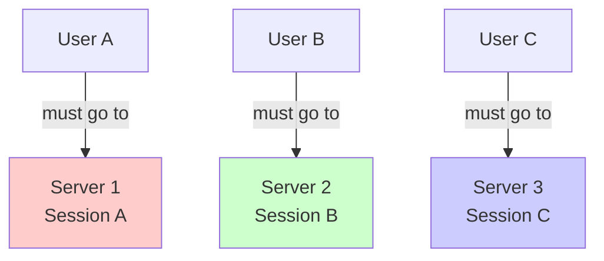
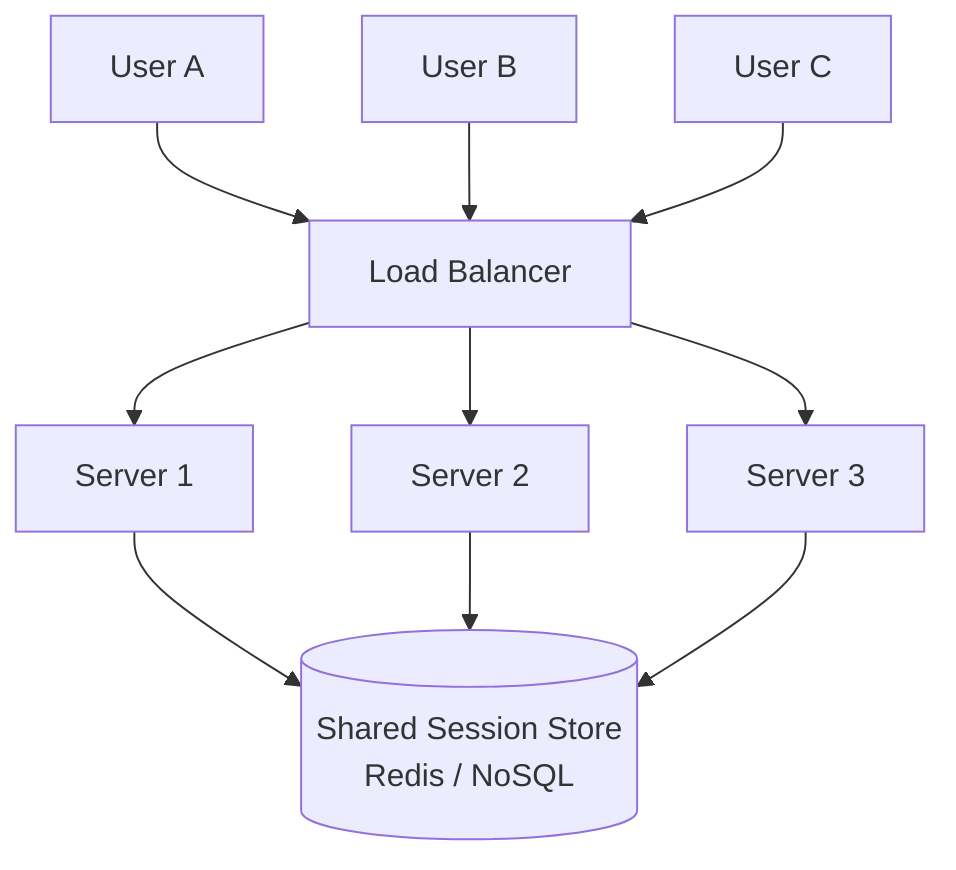

## Summary

A stateless web tier moves all session state (user sessions, preferences, authentication tokens) out of web servers into a shared external data store. This means any web server can handle any request from any user, enabling true horizontal auto-scaling. Without stateless design, sticky sessions tie users to specific servers, making scaling and failover difficult.

## How It Works

### Stateful Architecture (Problem)

Each server stores its own users' sessions. Users are pinned to specific servers via sticky sessions.

### Stateless Architecture (Solution)

All servers read session data from a shared store. Any server can handle any request.

## When to Use

- When you need horizontal auto-scaling (add/remove servers based on traffic)
- When high availability requires seamless failover between servers
- In any system that uses a load balancer
- In multi-datacenter deployments

## Trade-offs

| Benefit | Cost |
|---------|------|
| Any server handles any request | Need external session store (Redis, DynamoDB) |
| Easy horizontal auto-scaling | Network hop to session store adds small latency |
| Simplified failover | Session store becomes critical dependency |
| No sticky session overhead | Additional infrastructure to manage |

## Real-World Examples

- **Redis/Memcached:** Most common session stores for stateless web tiers
- **Amazon DynamoDB:** Serverless session store with built-in scaling
- **JWT tokens:** Store session info in the token itself (truly stateless, but limited size)
- **Spring Session / Express Session:** Framework integrations for external session stores

## Common Pitfalls

- Storing session data in local memory or local files on web servers
- Using sticky sessions as a workaround instead of making the tier truly stateless
- Not making the shared session store highly available (it becomes a new SPOF)
- Storing too much data in sessions (keep sessions small for performance)
- Not setting TTL on session data (sessions accumulate forever)

## See Also

- [[load-balancing]] -- Stateless design makes load balancing effective
- [[vertical-vs-horizontal-scaling]] -- Stateless tier is a prerequisite for horizontal scaling
- [[caching-strategies]] -- Redis is used both as cache and session store
