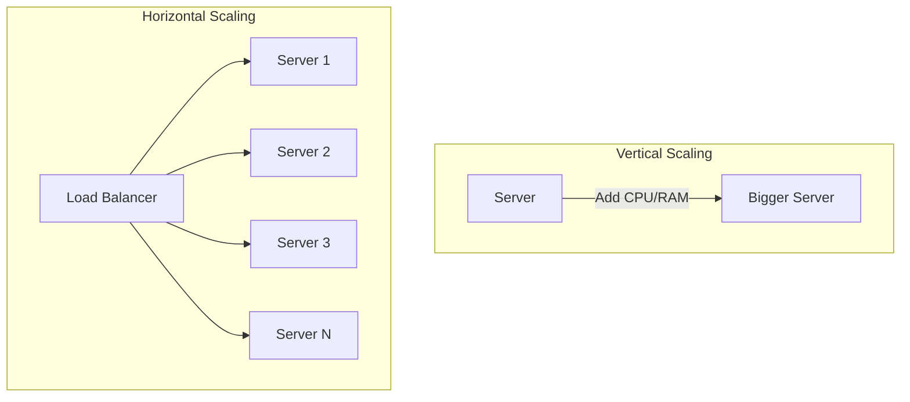

## Summary

Scaling is the process of increasing a system's capacity to handle more load. There are two fundamental approaches: **vertical scaling** (scale up) adds more resources to a single machine, while **horizontal scaling** (scale out) adds more machines to a pool. Horizontal scaling is preferred for large-scale systems because it avoids single points of failure and has no theoretical ceiling.

## How It Works

### Vertical Scaling (Scale Up)

Add more CPU, RAM, or disk to an existing server. Simple but limited.

### Horizontal Scaling (Scale Out)

Add more servers behind a load balancer. Requires stateless application design.

## When to Use

- **Vertical scaling:** Early-stage startups, small databases, quick prototyping, when simplicity matters most
- **Horizontal scaling:** Production systems serving many users, when high availability is required, when you need to scale beyond a single machine's limits

## Trade-offs

| Aspect | Vertical Scaling | Horizontal Scaling |
|--------|-----------------|-------------------|
| Simplicity | Easy -- no code changes | Requires stateless design, load balancer |
| Cost | Superlinear at high end | Linear -- commodity hardware |
| Limit | Hardware ceiling | Practically unlimited |
| Failover | Single point of failure | Built-in redundancy |
| Downtime | Often requires restart | Zero-downtime scaling |

## Real-World Examples

- **Stack Overflow (2013):** Served 10M monthly uniques with a single master database (vertical scaling)
- **Netflix, Google, Facebook:** All use horizontal scaling with thousands of servers
- **Amazon RDS:** Offers instances up to 24 TB RAM for vertical scaling

## Common Pitfalls

- Starting with horizontal scaling prematurely when vertical scaling would be simpler
- Failing to design for horizontal scaling from the start, making migration painful later
- Ignoring the session state problem -- stateful servers cannot horizontally scale
- Not considering that vertical scaling eventually hits a hard ceiling

## See Also

- [[load-balancing]] -- Required for distributing traffic across horizontally scaled servers
- [[database-sharding]] -- Horizontal scaling applied to the data tier
- [[stateless-web-tier]] -- Prerequisite for horizontal web tier scaling
