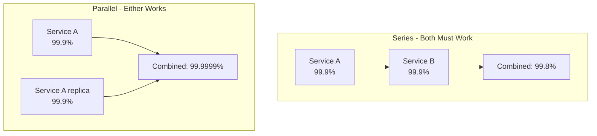

## Summary

High availability is measured as a percentage of uptime, commonly expressed in "nines." Each additional nine dramatically reduces allowed downtime. Service Level Agreements (SLAs) formally define the uptime a provider guarantees. Understanding availability numbers is critical for designing systems that meet reliability requirements and for communicating with stakeholders about expected downtime.

## How It Works

| Availability | Nines | Downtime/Year | Downtime/Month | Downtime/Day |
|-------------|-------|---------------|----------------|--------------|
| 99% | 2 | 3.65 days | 7.31 hours | 14.4 min |
| 99.9% | 3 | 8.77 hours | 43.8 min | 1.44 min |
| 99.99% | 4 | 52.6 min | 4.38 min | 8.6 sec |
| 99.999% | 5 | 5.26 min | 26.3 sec | 0.86 sec |

### Combined Availability

For components in **series** (all must work):

```
A_total = A_1 x A_2 x ... x A_n
```

For components in **parallel** (any one working is sufficient):

```
A_total = 1 - (1 - A_1) x (1 - A_2) x ... x (1 - A_n)
```



## When to Use

- Defining SLAs for your service
- Calculating end-to-end availability of a multi-component system
- Justifying redundancy investments (replication, multi-DC)
- Communicating with business stakeholders about reliability

## Trade-offs

| Nines | Cost to Achieve | Typical Systems |
|-------|----------------|-----------------|
| 2 (99%) | Low -- basic setup | Internal tools, dev environments |
| 3 (99.9%) | Moderate -- redundancy needed | Most SaaS products, cloud SLAs |
| 4 (99.99%) | High -- multi-DC, automated failover | Payment systems, cloud infrastructure |
| 5 (99.999%) | Very high -- heroic engineering | Telecom, air traffic control |

## Real-World Examples

- **AWS EC2 SLA:** 99.99% availability per region
- **Google Compute Engine SLA:** 99.99% for multi-zone deployments
- **Azure SLA:** 99.9% - 99.99% depending on service tier
- **AWS S3:** 99.999999999% (11 nines) durability for stored objects

## Common Pitfalls

- Confusing availability and durability (data not lost vs service not down)
- Assuming SLAs are guarantees (they define compensation, not promises)
- Not accounting for series composition: two 99.9% services give only 99.8%
- Aiming for too many nines when the business does not require it (cost vs value)
- Not measuring and monitoring actual availability against targets

## See Also

- [[latency-numbers]] -- Performance counterpart to availability
- [[power-of-two]] -- Another reference table for quick calculations
- [[database-replication]] -- Key technique for achieving high availability
