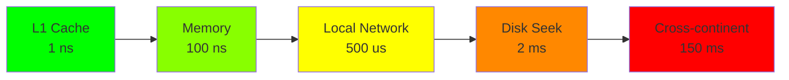

## Summary

Jeff Dean's latency numbers provide a mental model for the relative speeds of different computer operations. Knowing these numbers helps system designers make informed decisions about caching, compression, data locality, and storage choices. The key insight: memory is orders of magnitude faster than disk, and network latency varies enormously depending on distance.

## How It Works

### Latency Reference Table

| Operation | Latency | Scale |
|-----------|---------|-------|
| L1 cache reference | 1 ns | Instant |
| L2 cache reference | 4 ns | Instant |
| Main memory reference | 100 ns | Very fast |
| Compress 1 KB (Zippy) | 2 us | Fast |
| Send 2 KB over 1 Gbps network | 11 us | Fast |
| Read 1 MB from memory | 3 us | Fast |
| Round trip in same datacenter | 500 us | Noticeable |
| Disk seek | 2 ms | Slow |
| Read 1 MB from disk | 825 us | Moderate |
| Send packet CA to NL and back | 150 ms | Very slow |

### Visual Scale

## When to Use

- Deciding whether to cache data (memory vs disk: 100x-1000x difference)
- Choosing between local and remote storage
- Deciding whether to compress data before sending over the network
- Estimating response times for different architectural choices

## Trade-offs

| Decision | Fast Path | Slow Path | Speedup |
|----------|-----------|-----------|---------|
| Cache in memory vs read from disk | 100 ns | 2 ms | ~20,000x |
| Compress + send vs send uncompressed | 2 us + smaller transfer | Larger transfer | Depends on data |
| Same DC vs cross-continent | 500 us | 150 ms | ~300x |
| Sequential disk read vs random seek | 825 us/MB | 2 ms + 825 us/MB | Avoid seeks |

## Real-World Examples

- **Redis/Memcached:** Sub-millisecond reads because data is in memory
- **CDNs:** Edge servers reduce cross-continent latency from 150ms to <20ms
- **SSDs vs HDDs:** SSDs eliminate mechanical seek time (~100x faster random reads)
- **gRPC / Protocol Buffers:** Binary serialization reduces network payload size

## Common Pitfalls

- Treating all storage as equal (memory, SSD, HDD have vastly different latencies)
- Ignoring network latency in distributed system designs
- Not compressing data before cross-network transfer
- Underestimating the impact of disk seeks on random access patterns
- Assuming these numbers are exact -- they are order-of-magnitude guides

## See Also

- [[power-of-two]] -- Data size units used alongside latency for estimation
- [[qps-storage-estimation]] -- Latency numbers inform QPS capacity
- [[caching-strategies]] -- Motivated by the memory vs disk speed gap
