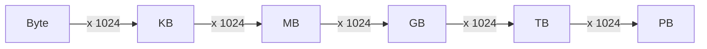

## Summary

Data volume in computer systems is measured using powers of 2. Understanding these units is essential for back-of-the-envelope estimation in system design interviews. A byte is 8 bits, and each subsequent unit (KB, MB, GB, TB, PB) is 1,024 times larger than the previous one. Quick mental math with these units lets you estimate storage, bandwidth, and memory requirements on the fly.

## How It Works

| Unit | Power | Bytes | Approximate |
|------|-------|-------|-------------|
| 1 Byte | 2^0 | 1 | 1 character |
| 1 KB | 2^10 | 1,024 | A short email |
| 1 MB | 2^20 | ~1 million | A high-res photo |
| 1 GB | 2^30 | ~1 billion | A movie |
| 1 TB | 2^40 | ~1 trillion | A small database |
| 1 PB | 2^50 | ~1 quadrillion | Large-scale analytics |

### Quick Conversion Rules

- For estimation, treat 1 KB as ~1,000 bytes (rounds well with powers of 10)
- 1 million characters (ASCII) is roughly 1 MB
- 1 billion characters is roughly 1 GB

## When to Use

- Estimating storage requirements for a new system
- Calculating memory needed for caches or in-memory data structures
- Sizing network bandwidth for data transfers
- Any back-of-the-envelope calculation in a system design interview

## Trade-offs

| Approach | Benefit | Risk |
|----------|---------|------|
| Exact powers of 2 | Precise | Slow to calculate under pressure |
| Approximate (1 KB = 1000 B) | Fast mental math | ~2.4% error per level, acceptable |

## Real-World Examples

- **Twitter:** A tweet is ~140 bytes of text; 500M tweets/day is ~70 GB/day of text alone
- **YouTube:** A 1080p video is ~1.5 GB/hour; millions of hours uploaded daily
- **Redis:** Typical instance holds 25-100 GB of data in memory

## Common Pitfalls

- Confusing bits and bytes (network speeds are in bits, storage in bytes)
- Forgetting to account for metadata and overhead (actual storage > raw data)
- Mixing up powers of 2 and powers of 10 (1 GB is not exactly 1 billion bytes)
- Not labeling units in calculations (ambiguous numbers lead to errors)

## See Also

- [[latency-numbers]] -- Understanding speed alongside size
- [[qps-storage-estimation]] -- Applying power-of-two knowledge to real estimates
- [[availability-numbers]] -- Another key reference table for interviews
