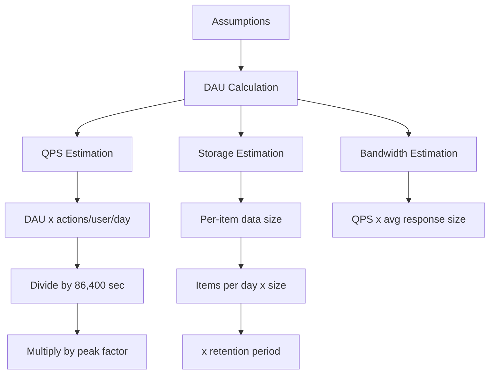

## Summary

Estimating Queries Per Second (QPS) and storage requirements is a core skill in system design interviews. The process starts with user counts and usage patterns, then derives throughput and capacity needs. The key is showing structured thinking -- precision is less important than demonstrating a logical approach with clearly stated assumptions.

## How It Works

### Estimation Flow

### The Template

1. **State assumptions:** MAU, DAU ratio, actions per user, data sizes
2. **Calculate DAU:** MAU x daily-active percentage
3. **Calculate QPS:** DAU x actions / 86,400 seconds
4. **Calculate peak QPS:** QPS x 2-5 (peak factor)
5. **Calculate storage:** items/day x item size x retention
6. **Sanity check:** Compare to known systems

## When to Use

- At the start of any system design problem (Step 2: high-level design)
- When the interviewer asks "how would you estimate the capacity?"
- To validate that your architecture can handle the expected load
- When choosing between system components (e.g., single DB vs sharded)

## Trade-offs

| Approach | Benefit | Risk |
|----------|---------|------|
| Detailed calculation | Shows thoroughness | Time-consuming in interviews |
| Quick order-of-magnitude | Fast, sufficient for design decisions | May miss important factors |
| Conservative estimate | Safe -- over-provision | Higher infrastructure cost |
| Aggressive estimate | Cost-efficient | Risk of under-provisioning |

## Real-World Examples

### Twitter-like Estimation

| Metric | Calculation | Result |
|--------|-------------|--------|
| MAU | Given | 300M |
| DAU | 300M x 50% | 150M |
| Tweets/day | 150M x 2 | 300M |
| QPS | 300M / 86,400 | ~3,500 |
| Peak QPS | 3,500 x 2 | ~7,000 |
| Media storage/day | 150M x 2 x 10% x 1 MB | ~30 TB |
| 5-year media | 30 TB x 365 x 5 | ~55 PB |

## Common Pitfalls

- Not stating assumptions before calculating
- Forgetting to label units (bytes vs bits, MB vs GB)
- Ignoring peak QPS (systems must handle spikes, not just averages)
- Not accounting for media vs text (media dominates storage)
- Over-focusing on precision instead of the estimation process
- Forgetting to consider data retention policies

## See Also

- [[power-of-two]] -- Units needed for all storage calculations
- [[latency-numbers]] -- Informs whether your QPS target is achievable
- [[availability-numbers]] -- Availability requirements affect architecture choices
