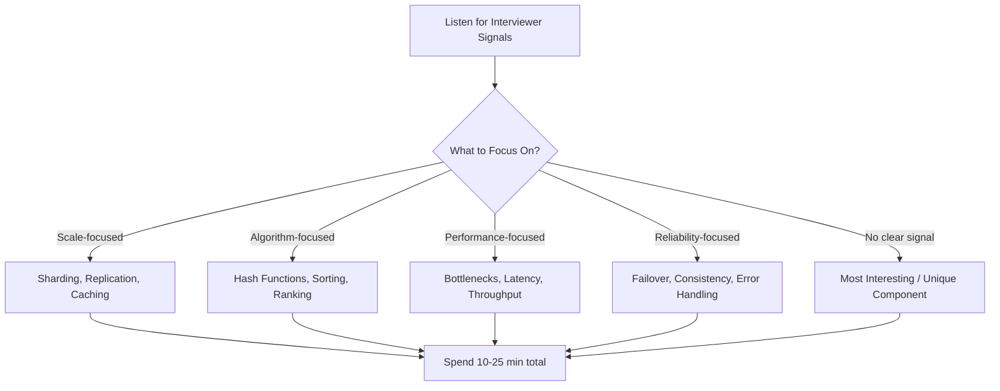

## Summary

The deep dive is where you demonstrate real design expertise by exploring specific components in detail. The key challenge is choosing what to dive into and managing time effectively. Follow interviewer signals to prioritize areas. Focus on bottlenecks, novel design decisions, and components that demonstrate your ability to think about scalability, performance, and reliability.

## How It Works

### What Interviewers Look For

| Candidate Level | Interviewer Focus |
|----------------|-------------------|
| Junior | Correct component choices, basic understanding |
| Mid-level | Trade-off analysis, concrete design details |
| Senior | Performance characteristics, bottleneck identification |
| Staff+ | System-wide impact, cross-cutting concerns, edge cases |

### Time Management

- Pick 2-3 components to discuss in depth (not everything)
- Spend 5-8 minutes per component
- If a topic is taking too long, offer to move on and return later
- Always have a "this is where I'd spend more time with more time" answer

## When to Use

- Step 3 of the system design interview (10-25 minutes)
- During technical design reviews when prioritizing what to detail
- When writing design documents -- which sections deserve the most depth

## Trade-offs

| Approach | Benefit | Risk |
|----------|---------|------|
| Follow interviewer cues | Aligns with evaluation criteria | May miss your strengths |
| Lead with your strengths | Showcase expertise | May not address interviewer's concerns |
| Breadth over depth | Cover more ground | Appear shallow |
| Depth over breadth | Show mastery | Miss important components |

## Real-World Examples

- **URL shortener:** Deep dive into hash function design (collision handling, short URL generation)
- **Chat system:** Deep dive into WebSocket connection management and online/offline status
- **News feed:** Deep dive into fanout strategy (push vs pull vs hybrid)
- **Rate limiter:** Deep dive into algorithm selection and distributed synchronization

## Common Pitfalls

- Diving into a component the interviewer is not interested in
- Spending too long on one topic and running out of time
- Explaining well-known technologies in detail (e.g., how TCP works) instead of design decisions
- Not connecting the deep dive back to the high-level design
- Ignoring the interviewer's attempts to redirect focus

## See Also

- [[four-step-framework]] -- Deep dive is Step 3
- [[high-level-design]] -- Must have buy-in before deep diving
- [[dos-and-donts]] -- Communication guidelines for the deep dive
