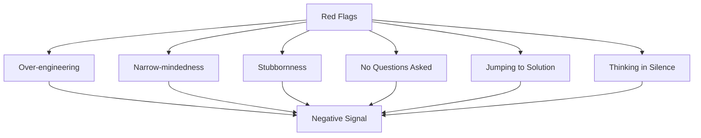

## Summary

System design interviews assess not just technical skill but collaboration, communication, and judgment. Certain behaviors create strong positive signals (dos), while others are red flags that can sink an otherwise competent candidate (don'ts). The most critical do: always ask clarifying questions before designing. The most critical don't: never jump straight to a solution.

## How It Works

### Dos

| Do | Why It Matters |
|----|---------------|
| Ask clarifying questions | Shows you understand requirements matter |
| Understand requirements first | Prevents designing the wrong system |
| Communicate your thinking out loud | Lets the interviewer evaluate your process |
| Suggest multiple approaches | Demonstrates breadth of knowledge |
| Design critical components first | Shows good prioritization |
| Collaborate with the interviewer | They are your teammate, not adversary |
| Bounce ideas off the interviewer | Gets real-time feedback, shows teamwork |
| Never give up | Persistence is valued |

### Don'ts

| Don't | What It Signals |
|-------|----------------|
| Jump to a solution immediately | Poor problem-solving process |
| Go deep on one component too early | Cannot see the big picture |
| Think in silence | Cannot collaborate |
| Over-engineer | Poor cost-benefit judgment |
| Be stubborn about your design | Hard to work with |
| Assume you are done | Lacks thoroughness |
| Be unprepared for common questions | Did not take the interview seriously |

### Red Flags Interviewers Watch For

## When to Use

- Throughout the entire system design interview
- In any collaborative design discussion
- During code reviews and design reviews
- When mentoring others on interview preparation

## Trade-offs

| Behavior | Positive Signal | Over-doing It |
|----------|----------------|---------------|
| Asking questions | Shows thoroughness | Analysis paralysis |
| Communicating thinking | Shows process | Talking without substance |
| Suggesting alternatives | Shows breadth | Indecisive, cannot commit |
| Being flexible | Collaborative | No strong opinions |

## Real-World Examples

- **Good interview:** Candidate asks 5 clarifying questions, sketches 2 approaches, picks one with rationale, collaborates on deep dive
- **Bad interview:** Candidate immediately draws a complex architecture, does not ask what features to build, gets defensive when questioned
- **Great recovery:** Candidate gets stuck, says "I am not sure about this part -- what if we approached it differently?" and pivots

## Common Pitfalls

- Treating the interview as an exam rather than a collaboration
- Not practicing the behavioral aspects (only studying technical content)
- Confusing "thinking out loud" with "rambling without direction"
- Being so focused on dos that behavior feels rehearsed and unnatural
- Not reading interviewer body language and verbal cues

## See Also

- [[four-step-framework]] -- The structure that guides good interview behavior
- [[requirements-gathering]] -- Where the most important "dos" apply
- [[deep-dive-strategy]] -- Where time management and communication matter most
