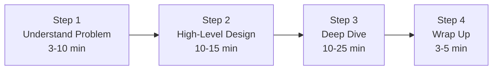

## Summary

The 4-step framework provides a structured approach to system design interviews. Rather than jumping to a solution, you methodically (1) understand the problem, (2) propose a high-level design, (3) deep-dive into key components, and (4) wrap up with improvements. This framework ensures you cover all important aspects within the limited interview time while demonstrating structured thinking and collaboration.

## How It Works

### Step 1: Understand the Problem and Establish Design Scope (3-10 min)
- Ask clarifying questions about features, users, scale, technology stack
- Write down assumptions
- Agree on functional and non-functional requirements

### Step 2: Propose High-Level Design and Get Buy-in (10-15 min)
- Draw box diagrams with key components
- Walk through concrete use cases
- Do back-of-envelope calculations if needed
- Get interviewer agreement before proceeding

### Step 3: Design Deep Dive (10-25 min)
- Focus on components the interviewer cares about
- Discuss bottlenecks, algorithms, data models
- Manage time -- do not get stuck on one component

### Step 4: Wrap Up (3-5 min)
- Identify bottlenecks and improvements
- Discuss error handling, monitoring, scaling to next level
- Recap your design

## When to Use

- Every system design interview
- Technical design reviews at work
- Architecture decision meetings
- Any open-ended design problem

## Trade-offs

| Benefit | Cost |
|---------|------|
| Structured approach reduces uncertainty | Requires discipline to follow under pressure |
| Ensures time is distributed across all aspects | Rigid time allocation may not fit every question |
| Demonstrates collaboration and communication | Must adapt if interviewer steers differently |
| Prevents common mistakes (jumping to solution) | Practice needed to internalize |

## Real-World Examples

- **Google, Meta, Amazon:** All expect candidates to demonstrate structured problem-solving
- **Design review meetings:** Follow a similar pattern: scope, design, details, action items
- **RFC documents:** Written form of this framework: problem, proposed solution, details, alternatives

## Common Pitfalls

- Skipping Step 1 and jumping straight to drawing boxes
- Spending too long on Step 1 (over-clarifying when you should be designing)
- Not getting buy-in at the end of Step 2 (risk of deep-diving into the wrong area)
- Going too deep on one component in Step 3 at the expense of others
- Not leaving time for Step 4 (missed opportunity to show critical thinking)

## See Also

- [[requirements-gathering]] -- Deep dive into Step 1
- [[high-level-design]] -- Deep dive into Step 2
- [[deep-dive-strategy]] -- Deep dive into Step 3
- [[dos-and-donts]] -- Behavioral guidelines across all steps
