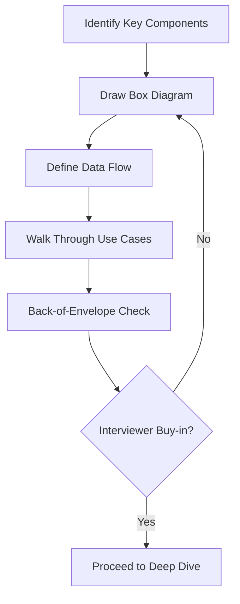
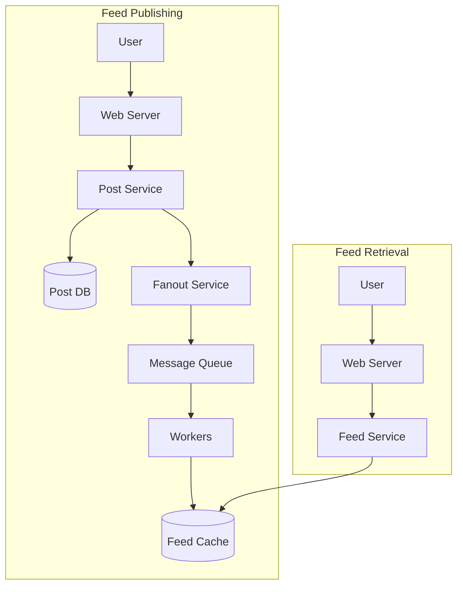

## Summary

The high-level design step translates requirements into an architecture blueprint. Draw box diagrams with key components (clients, APIs, web servers, data stores, cache, CDN, message queue), walk through concrete use cases, and do back-of-envelope calculations to validate feasibility. The critical goal is to get interviewer buy-in before proceeding to the deep dive.

## How It Works

### Typical Components to Include

| Component | Purpose |
|-----------|---------|
| **Clients** | Web browser, mobile app |
| **Load Balancer** | Traffic distribution |
| **Web Servers** | Request handling, business logic |
| **Cache** | Frequently accessed data |
| **CDN** | Static asset delivery |
| **Database** | Persistent storage (SQL/NoSQL) |
| **Message Queue** | Async processing |
| **APIs** | Interface definitions |

### Example: News Feed High-Level Design

## When to Use

- Step 2 of every system design interview (10-15 minutes)
- When starting a new project or feature at work
- In design review sessions with your team
- When documenting architecture for a new system

## Trade-offs

| Benefit | Risk |
|---------|------|
| Creates shared understanding | Too much detail slows you down |
| Validates design meets requirements | Too little detail misses issues |
| Interviewer can course-correct early | May need to revise if assumptions change |
| Enables productive deep dive | Skipping buy-in risks wasted deep-dive time |

## Real-World Examples

- **Whiteboard interviews:** Literally drawing boxes and arrows on a whiteboard
- **Architecture Decision Records (ADR):** Written form of high-level design + rationale
- **AWS Well-Architected Framework:** Provides component templates for cloud designs
- **C4 Model:** Context, Container, Component, Code -- structured architecture diagramming

## Common Pitfalls

- Going too deep too early (save details for Step 3)
- Not walking through concrete use cases (abstract designs miss edge cases)
- Forgetting to include API design or data schema when appropriate
- Not doing back-of-envelope to validate scale feasibility
- Proceeding without explicit interviewer buy-in

## See Also

- [[four-step-framework]] -- High-level design is Step 2
- [[requirements-gathering]] -- Must be complete before starting design
- [[deep-dive-strategy]] -- Where to go after buy-in is achieved
