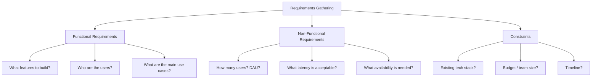

## Summary

Requirements gathering is the first and arguably most important step in a system design interview. Clarifying what to build before designing prevents wasted effort on the wrong system. Ask about features, users, scale, and constraints. Never assume -- always ask. The interviewer evaluates your ability to identify ambiguity and resolve it through good questions.

## How It Works

### Question Categories

### Example Questions

| Category | Question |
|----------|----------|
| **Features** | What specific features are we building? |
| **Users** | How many users does the product have? |
| **Scale** | What are anticipated scales in 3, 6, 12 months? |
| **Platform** | Mobile app, web app, or both? |
| **Content** | What types of content are supported? (text, images, video) |
| **Sorting** | How should items be ordered? |
| **Limits** | Any rate limits, size limits, or quotas? |
| **Tech stack** | What existing services can we leverage? |

## When to Use

- First 3-10 minutes of every system design interview
- Before any architecture or design work
- When given a vague or broad problem statement
- At the start of any technical project (not just interviews)

## Trade-offs

| Benefit | Risk |
|---------|------|
| Avoids designing the wrong system | Spending too long can eat into design time |
| Shows good engineering instincts | Asking too many trivial questions wastes time |
| Builds rapport with interviewer | Not asking enough leaves dangerous assumptions |
| Narrows scope to what is achievable in time | Over-narrowing may miss important aspects |

## Real-World Examples

- **News feed design:** Clarifying "sorted by recency or relevance?" completely changes the architecture
- **Chat system:** "1-on-1 or group chat?" determines whether you need fan-out
- **URL shortener:** "Custom aliases?" and "expiration?" change the data model significantly
- **Rate limiter:** "Per-user, per-IP, or global?" drives the key design decisions

## Common Pitfalls

- Jumping to architecture without understanding what to build
- Making assumptions without stating them explicitly
- Asking only about features and ignoring scale/performance requirements
- Not writing down assumptions for later reference
- Asking questions that the interviewer cannot answer (implementation details too early)

## See Also

- [[four-step-framework]] -- Requirements gathering is Step 1
- [[high-level-design]] -- The next step after requirements are clear
- [[qps-storage-estimation]] -- Scale requirements feed into capacity estimation
