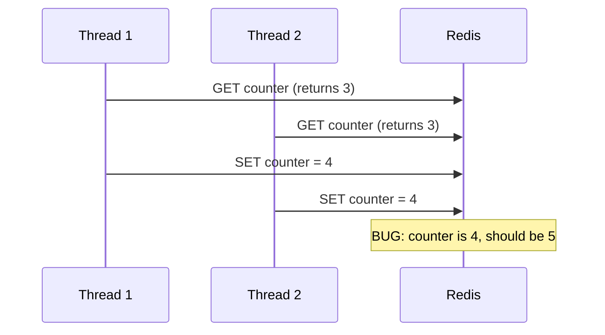
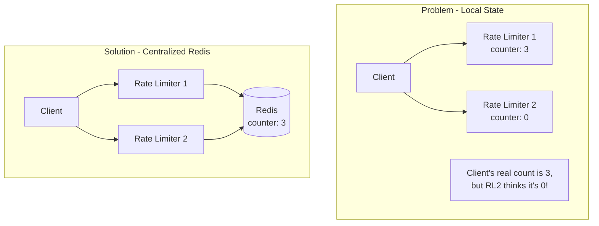
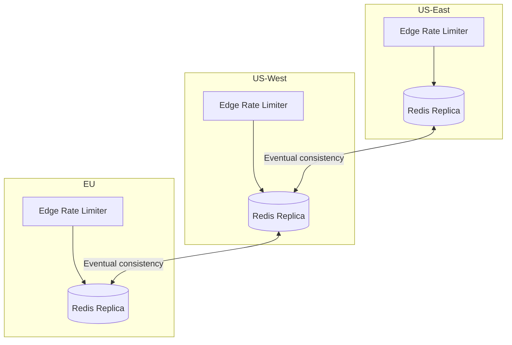

## Summary

Scaling a rate limiter to multiple servers introduces two core challenges: race conditions (concurrent counter updates) and synchronization (keeping state consistent across rate limiter instances). Race conditions are solved with atomic operations (Lua scripts in Redis or Redis sorted sets). Synchronization is solved by using a centralized data store (Redis) instead of local counters. Multi-datacenter deployments use edge servers and eventual consistency for performance.

## How It Works

### Challenge 1: Race Condition



**Solution: Lua Script (Atomic)**
```
-- Atomic increment with limit check
local current = redis.call('GET', KEYS[1])
if tonumber(current) < tonumber(ARGV[1]) then
    return redis.call('INCR', KEYS[1])
else
    return -1  -- rate limited
end
```

The Lua script executes atomically in Redis -- no other command can interleave.

### Challenge 2: Synchronization



### Multi-Datacenter Performance



Users are routed to the nearest edge server. Redis replicas sync with eventual consistency.

## When to Use

- Any rate limiter serving traffic from multiple servers or processes
- Systems with high concurrency (race conditions are inevitable)
- Multi-datacenter or globally distributed systems
- Microservice architectures where requests can hit any instance

## Trade-offs

| Approach | Benefit | Cost |
|----------|---------|------|
| Lua scripts | Atomic, no race conditions | Redis-specific, harder to debug |
| Redis sorted sets | Rich data operations | More memory per counter |
| Centralized Redis | Consistent state | Network hop adds latency |
| Sticky sessions | No sync needed | Not scalable, not fault-tolerant |
| Eventual consistency | Low latency globally | Temporarily allows slightly more requests |

## Real-World Examples

- **Cloudflare:** 194+ edge servers with distributed rate limiting
- **Stripe:** Centralized Redis-based rate limiter with Lua scripts
- **Lyft (Envoy):** Open-source rate limiting service using Redis
- **AWS API Gateway:** Managed distributed rate limiting across regions

## Common Pitfalls

- Using locks instead of atomic operations (locks are slow under high concurrency)
- Using sticky sessions for synchronization (breaks horizontal scaling)
- Not considering eventual consistency trade-offs in multi-DC setups
- Ignoring the failure mode: what happens when Redis is down? (fail open vs fail closed)
- Not testing race conditions under realistic concurrent load

## See Also

- [[rate-limiting-algorithms]] -- The algorithms that must be made concurrent-safe
- [[rate-limiter-placement]] -- Where distributed rate limiters sit in the architecture
- [[rate-limiter-monitoring]] -- Essential for detecting distributed sync issues
