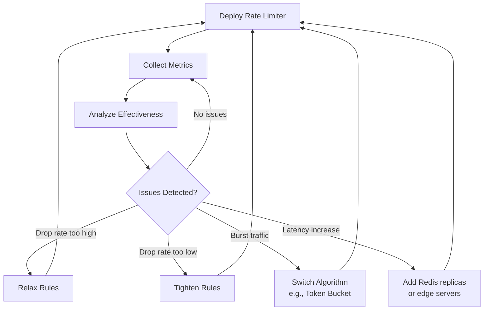

## Summary

After deploying a rate limiter, continuous monitoring is essential to verify that both the algorithm and the rules are effective. If rules are too strict, legitimate requests are dropped. If too lenient, the system is not protected. Monitoring also detects when traffic patterns change (e.g., flash sales) and the algorithm or rules need adjustment. Key metrics include drop rate, allowed rate, latency impact, and Redis memory usage.

## How It Works

### Monitoring Feedback Loop

### Key Metrics to Track

| Metric | What It Tells You | Action |
|--------|-------------------|--------|
| **Drop rate** (429s / total) | Are rules too strict or lenient? | Adjust thresholds |
| **Allowed request rate** | Is the system functioning correctly? | Baseline comparison |
| **Latency overhead** | Is the rate limiter adding delay? | Optimize Redis, add replicas |
| **Redis memory usage** | Is counter storage growing unbounded? | Verify TTL expiration |
| **Rule evaluation time** | Are rules too complex? | Simplify rule set |
| **False positive rate** | Legitimate traffic being dropped | Widen limits for affected endpoints |

### Alert Conditions

| Condition | Severity | Response |
|-----------|----------|----------|
| Drop rate > 10% sustained | Warning | Review rules; possible attack or misconfiguration |
| Drop rate > 50% | Critical | Likely misconfigured rules or infrastructure issue |
| Rate limiter latency > 10ms | Warning | Redis overloaded; scale out |
| Redis connection failures | Critical | Decide: fail open (allow all) or fail closed (block all) |
| Sudden spike in 429s | Info | Investigate: attack, flash sale, or legitimate growth |

## When to Use

- Immediately after deploying a rate limiter in production
- After any rule changes or algorithm updates
- During traffic spikes or unusual events
- As part of ongoing operational monitoring

## Trade-offs

| Approach | Benefit | Cost |
|----------|---------|------|
| Detailed per-endpoint metrics | Precise tuning | Storage and dashboard complexity |
| Aggregate metrics only | Simple to manage | May miss endpoint-specific issues |
| Real-time alerting | Fast response to issues | Alert fatigue if thresholds are wrong |
| Periodic review | Low operational overhead | Slow to catch problems |

## Real-World Examples

- **Cloudflare:** Dashboard showing rate limiting analytics per zone
- **AWS API Gateway:** CloudWatch metrics for 429 count, latency, integration errors
- **Stripe:** Internal dashboards monitoring rate limit effectiveness across API tiers
- **Datadog/Grafana:** Common tools for custom rate limiter monitoring dashboards

## Common Pitfalls

- Deploying rate limiting without monitoring (flying blind)
- Not establishing a baseline before tuning rules
- Setting alerts too sensitive (alert fatigue) or too lenient (miss real issues)
- Not monitoring the rate limiter's own health (Redis down = rate limiter down)
- Ignoring the fail-open vs fail-closed decision when the rate limiter fails

## See Also

- [[rate-limiting-algorithms]] -- Monitoring helps choose or switch algorithms
- [[rate-limiter-placement]] -- Monitoring strategy varies by placement
- [[distributed-rate-limiting]] -- Distributed systems need distributed monitoring
