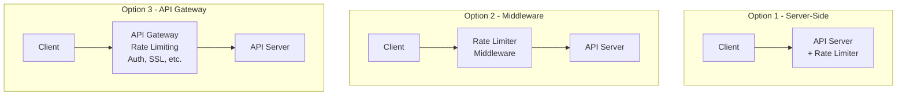
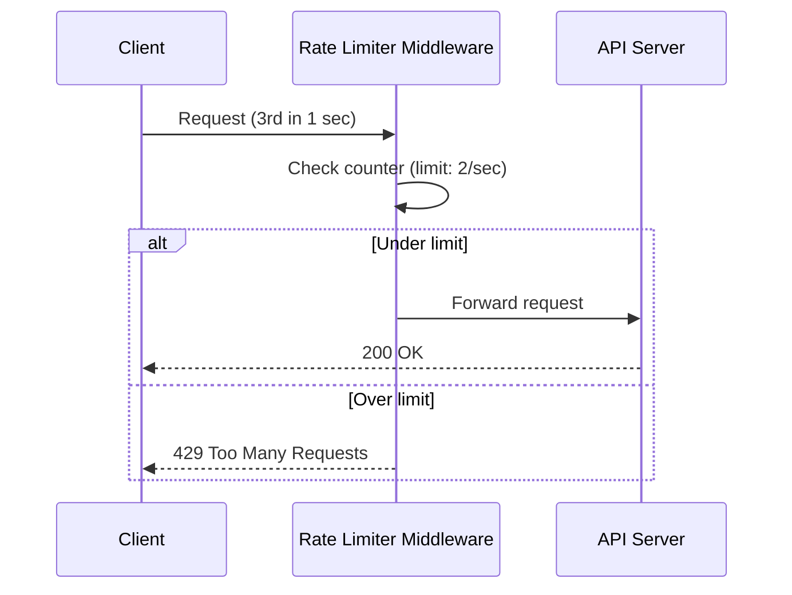

## Summary

A rate limiter can be placed client-side, server-side, or as middleware (API gateway). Client-side enforcement is unreliable because clients can be forged. Server-side or middleware placement is preferred. In microservice architectures, API gateways are a natural home for rate limiting alongside SSL termination, authentication, and IP whitelisting. The choice depends on your technology stack, engineering resources, and existing infrastructure.

## How It Works

### Placement Options

### How Middleware Rate Limiting Works

## When to Use

| Placement | When to Choose |
|-----------|----------------|
| **Server-side** | Full control over algorithm; simple architecture |
| **Middleware** | Separate concern from business logic; existing proxy layer |
| **API Gateway** | Already using microservices with a gateway; want managed solution |
| **Client-side** | Never as sole enforcement; only as a courtesy to reduce unnecessary calls |

## Trade-offs

| Placement | Benefit | Cost |
|-----------|---------|------|
| Server-side | Full control, custom algorithms | Tightly coupled to application code |
| Middleware | Separation of concerns, reusable | Additional hop, deployment complexity |
| API Gateway (managed) | No engineering effort, many features | Less control, vendor lock-in |
| Client-side | Reduces unnecessary traffic | Easily bypassed, not enforceable |

## Real-World Examples

- **AWS API Gateway:** Managed rate limiting with configurable throttle rules
- **Kong:** Open-source API gateway with rate limiting plugin
- **Envoy Proxy:** Service mesh sidecar with rate limiting filter
- **Nginx:** Can act as rate limiting middleware using `limit_req` module
- **Cloudflare:** Edge-based rate limiting at the CDN layer

## Common Pitfalls

- Relying on client-side rate limiting for security (clients can be modified)
- Implementing rate limiting in every service instead of centralizing it
- Not considering existing infrastructure (reinventing what an API gateway provides)
- Placing the rate limiter too far from the client (increases latency for rejected requests)

## See Also

- [[rate-limiting-algorithms]] -- The algorithms implemented at whatever placement you choose
- [[distributed-rate-limiting]] -- Challenges when rate limiters run across multiple servers
- [[rate-limiter-monitoring]] -- Monitoring applies regardless of placement
