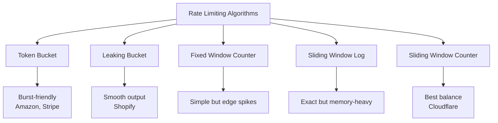

## Summary

Five main algorithms are used for rate limiting, each with different trade-offs for memory efficiency, accuracy, and burst handling. Token bucket and sliding window counter are the most commonly used in production. The choice depends on whether you need to allow bursts, require exact accuracy, or prioritize memory efficiency.

## How It Works

### Algorithm Overview

### Comparison Table

| Algorithm | Memory | Accuracy | Burst | Complexity | Used By |
|-----------|--------|----------|-------|------------|---------|
| **Token Bucket** | Low | Good | Allows bursts | Low | Amazon, Stripe |
| **Leaking Bucket** | Low | Good | Smooths output | Low | Shopify |
| **Fixed Window** | Very Low | Edge spikes (2x) | Poor at edges | Very Low | Simple APIs |
| **Sliding Window Log** | High | Exact | Perfect | Medium | High-accuracy needs |
| **Sliding Window Counter** | Low | ~99.997% | Good | Medium | Cloudflare |

### How Each Algorithm Works (Brief)

**Token Bucket:** Tokens refill at a fixed rate. Each request consumes a token. Bucket capacity allows short bursts.

**Leaking Bucket:** Requests enter a FIFO queue. Processed at a fixed outflow rate. Queue full = request dropped.

**Fixed Window Counter:** Time divided into fixed windows. Counter per window. Resets at window boundary. Problem: 2x burst at window edges.

**Sliding Window Log:** Stores timestamp of every request. Removes expired timestamps. Counts remaining. Exact but memory-hungry.

**Sliding Window Counter:** Weighted combination of current and previous window counts. Formula: `current + previous * overlap_pct`. Approximation with excellent accuracy.

## When to Use

| Requirement | Best Algorithm |
|-------------|---------------|
| Simple, allows bursts | Token Bucket |
| Smooth, fixed-rate output | Leaking Bucket |
| Simple, memory minimal | Fixed Window Counter |
| Exact accuracy required | Sliding Window Log |
| Good accuracy + low memory | Sliding Window Counter |

## Trade-offs

| Algorithm | Primary Benefit | Primary Cost |
|-----------|----------------|-------------|
| Token Bucket | Burst tolerance | Tuning bucket size + refill rate |
| Leaking Bucket | Predictable output rate | Recent requests delayed behind old |
| Fixed Window | Simplicity | 2x burst at window boundaries |
| Sliding Window Log | Perfect accuracy | O(n) memory per user |
| Sliding Window Counter | Best accuracy/memory ratio | Approximation (0.003% error) |

## Real-World Examples

- **Amazon API Gateway:** Token bucket
- **Stripe:** Token bucket
- **Shopify:** Leaking bucket
- **Cloudflare:** Sliding window counter (validated with 400M requests)
- **Redis-based rate limiters:** Often use fixed window or sliding window counter

## Common Pitfalls

- Using fixed window counter for security-critical rate limiting (edge burst vulnerability)
- Choosing sliding window log without considering memory cost at scale
- Not tuning token bucket parameters (bucket size and refill rate) for actual traffic patterns
- Assuming one algorithm fits all use cases (different endpoints may need different algorithms)

## See Also

- [[token-bucket]] -- Deep dive into the most popular algorithm
- [[sliding-window-counter]] -- Deep dive into the most balanced algorithm
- [[rate-limiter-placement]] -- Where to deploy whichever algorithm you choose
- [[distributed-rate-limiting]] -- Algorithmic challenges in distributed environments
